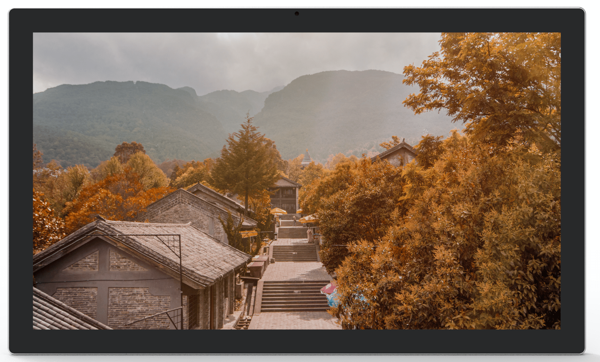
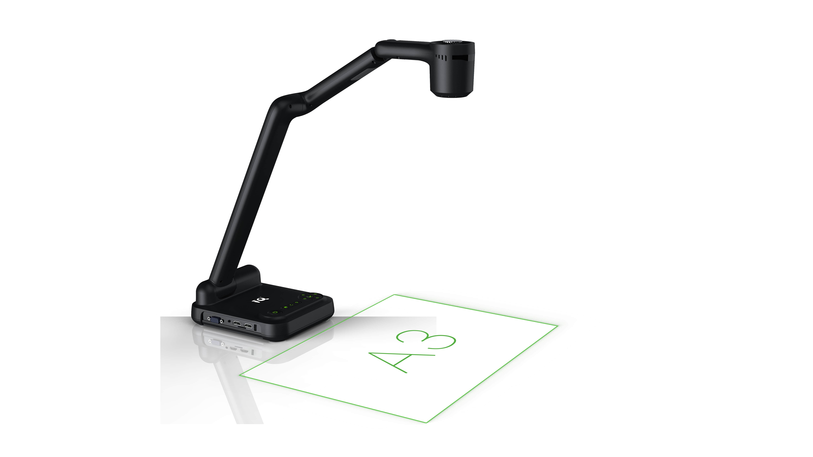

Q-NEX Networked Digital Podium

 
NDP100

 
—— Datasheet ——

# Product List

The Q-NEX Networked Digital Podium (NDP100) comes with a carefully selected set of components to support versatile classroom and presentation needs.

| Product                      | Model | Components                                                   |
| ---------------------------- | ----- | ------------------------------------------------------------ |
| Podium                       | -     | Podium Body * 1                                              |
| Interactive Pen Display      | -     | Interactive Pen Display PD150 * 1                            |
| Networked Media Processor    | -     | NMP211 * 1 Touch Panel * 1 Wireless Microphone * 2 |
| Built-in PC                  | -     | Built-in PC * 1                                              |
| Gooseneck Microphone         | -     | Gooseneck Microphone * 1                                     |
| Document Camera (Optional)   | E4521 | Document Camera E4521 * 1 (Optional)                         |
| Full Gigabit Switch          | -     | Full Gigabit Switch * 1                                      |
| Router (Optional)            | -     | Router * 1 (Optional)                                        |
| Lite Media Server (Optional) | -     | Lite Media Server * 1 (Optional)                             |

# Podium

## Dimension 

| No   | Name            | Description                                                  |
| ---- | --------------- | ------------------------------------------------------------ |
| 1    | Dimensions (mm) | 870(L) x 609(W) x 1212(H) (closed)   2162(L) x 609(W) x 1212(H) (fully extended) |
| 2    | Weight (kg)     | **Net Weight:** 90 kg   **Gross Weight:** 131 kg          |
| 3    | Materials       | Reinforced steel plate structure with powder-coated anti-rust paint on the metal surface |

## Podium Body

| No   | Name                              | Description                                                  |
| ---- | --------------------------------- | ------------------------------------------------------------ |
| 1    | Tabletop                          | Stable surface for teaching activities.                      |
| 2    | Wireless Microphones              | Two high-quality wireless microphones for flexible voice capture during lectures or presentations.  **Note**: Wireless receiver built into NMP for easy pairing. |
| 3    | Sliding Cover Panel               | Protective storage cover, made of eco-friendly material with improved durability. Supports up to 30kg weight. **Dimensions**: 870(L) x 600(W) x 18(H) mm |
| 4    | Wireless Keyboard and Mouse Combo | Providing control for the built-in PC during lectures and presentations. |
| 5    | Keyboard Tray                     | Space-efficient tray designed for the wireless keyboard and mouse, ensuring convenient access during use.  **Dimensions**: 507(L) x 180(W) mm |
| 6    | Front Drawer                      | Secure storage compartment with a combination lock and key, offering extra safety for sensitive devices or materials.  **Dimensions**: 480(L) x 220(W) x 100(H) mm |
| 7    | Rack/Shelf                        | Spacious storage area for the NMP, built-in PC, and other necessary equipment.  **Dimensions**: 500(L) x 490(W) x 590(H) mm |
| 8    | Foldable Stand                    | Versatile platform designed for supporting teaching equipment, such as document cameras or additional displays, with an ergonomic folding design for easy storage.  **Dimensions**: 575(L) x 545(W) mm, Weight Capacity: 15kg |

## Tabletop

| No   | Name                                        | Description                                                  |
| ---- | ------------------------------------------- | ------------------------------------------------------------ |
| 1    | Interactive Pen Display                     | Central touchscreen supporting both finger touch and electromagnetic pen input. Positioned for interaction during lectures. |
| 2    | Groove                                      | Holder for the Interactive Pen Display's active capacitive pen  **Dimensions**: 390(L) mm |
| 3    | Secure Drawer with Combination Lock and Key | Storage drawer equipped with both combination lock and key for secure storage of important items. |
| 4    | Wireless Charging                           | Integrated wireless charging pad for smartphones, with a 15W output. |
| 5    | Interface                                   | Input/output connections for device integration such as USB drives, laptops, or other peripherals. |
| 6    | Cabinet Antenna (5-in-1)                    | Antenna unit for Wi-Fi and UHF communications. Includes 2 antennas for built-in PC Wi-Fi, 2 antennas for NMP Wi-Fi, and 1 UHF antenna for wireless microphone. |
| 7    | Touch Panel                                 | Central control interface for managing classroom devices and settings. |
| 8    | Touch Panel Button                          | An extension of the Touch Panel's power button on the tabletop. A short press puts the screen into sleep mode or wakes it, while a long press (over 3 seconds) powers the device on or off. |
| 9    | Up/Down Buttons                             | Motorized control for adjusting display height, with limit switch functionality. Red and blue indicator lights show the status: red means the sliding cover is not fully latched and the buttons won’t respond, while blue allows normal operation. |
| 10   | Gooseneck Microphone                        | High-quality microphone for capturing clear audio during lectures.   |

# Interactive Pen Display

**Screen**

| No.  | Item           | Specification                     |
| ---- | -------------- | --------------------------------- |
| 1    | Panel Type     | TFT-LCD                           |
| 2    | Size           | 21.5 inch (16:9)                  |
| 3    | Resolution     | 250 cd/m²                         |
| 4    | Contrast Ratio | 1000:1                            |
| 5    | Surface        | 6H tempered explosion-proof glass |
| 6    | View Angle     | 178° (H), 178° (V)                |

**Touch**

| No.  | Item                | Specification   |
| ---- | ------------------- | --------------- |
| 1    | Technology          | Capacitive      |
| 2    | Pen                 | Active pen      |
| 3    | Scanning Resolution | 4096×4096       |
| 4    | Voltage             | DC+5V ±5%       |
| 5    | Touch Points        | 10 points touch |
| 6    | Response Time       | <15 ms          |

**Ports**

| No.  | Item                       | Specification |
| ---- | -------------------------- | ------------- |
| 1    | HDMI Input                 | 1             |
| 2    | VGA Input                  | 1             |
| 3    | VGA Audio Input            | 1             |
| 4    | DC 12V Input               | 1             |
| 5    | Capacitive Touch Interface | 1 set         |

**General Specifications**

| No.  | Item                | Specification                                                |
| ---- | ------------------- | ------------------------------------------------------------ |
| 1    | Built-in Speaker    | 4Ω 3W                                                        |
| 2    | Stand Adjustment    | 12° ~ 130°                                                   |
| 3    | Power Supply        | External Power Adapter (input 100-240V AC, 50/60Hz, output 12V DC 4A) |
| 4    | Weight              | 8.5KG                                                        |
| 5    | Dimension           | 523.6×315.1×48mm                                             |
| 6    | Working Environment | Working Temperature: 0~40℃; Working Humidity: 10~90%         |
| 7    | Storage Environment | Storage Temperature: -20~60℃; Storage Humidity: 10~90%       |

# Controller-NMP

The Networked Media Processor (NMP) serves as the central control unit responsible for managing and coordinating various functionalities of the digital podium.  

 

| No.  | Interface                                     | Description                                                  |
| ---- | --------------------------------------------- | ------------------------------------------------------------ |
| 1    | RJ45 * 4                                      | Ethernet ports (100Mbps, non-PoE) for NMP network connectivity; also enables NMP to function as a switch. |
| 2    | HDMI Matrix 3 * 3                             | Consists of 3 HDMI inputs and 3 HDMI outputs, forming the video matrix for NMP. |
| 3    | 2.4G Wi-Fi Antenna Interface * 2              | Built-in 2.4G Wi-Fi RP Transceiver within NMP, allowing wireless device integration and control expansion with Q-NEX's CBX component. |
| 4    | UHF Wireless Microphone Antenna Interface * 1 | Built-in receiver for UHF wireless microphones, supporting one-to-two wireless microphone setups for teaching/meeting scenarios. |
| 5    | Display (WAGO) * 1                            | Provides power output for connected devices, such as projectors, TVs, Interactive Flat Panels (IFP), and smart podiums. |
| 6    | UP-DOWN (WAGO) * 1                            | Offering up, pause, and down functions for connected devices like projector screens and motorized curtains. |
| 7    | RS232 * 1                                     | Allows connection to devices equipped with standard RS232 ports, such as Pan-Tilt-Zoom (PTZ) cameras and Interactive Flat Panels (IFP), etc. |
| 8    | Panel * 1                                     | Interface for connection to mechanical control panels, allowing direct control of basic devices and AV matix switching without the need for network connectivity. |
| 9    | IR * 2                                        | IR learner port * 1: Used for learning IR remote control codes. IR emitter port * 1: For infrared remote-control functionality. |
| 10   | USB * 2                                       | Reserved for card reader                                     |
| 11   | Touch USB * 3                                 | USB-Device OUT * 1, USB-HOST IN * 2 for NMP's touch-following feature. |
| 12   | 6.35mm Wired Microphone In * 1                | Interface for connecting a 6.35mm wired microphone.          |
| 13   | 3.5mm MIC Mixed Out * 1                       | Mixes audio from both the microphone input and the wireless microphones (handheld and lapel) for combined output. |
| 14   | Audio-IN * 2                                  | Two 3.5mm line-in interfaces for connecting external audio devices such as laptops, smartphones etc. |
| 15   | Audio Out                                     | Audio output interface for connecting to speakers or amplifiers. |
| 16   | External Speaker Output                       | The NMP includes an integrated power amplifier, capable of delivering 2*(40w+40w) output, designed to connect with passive speakers.  (Fixed impedance speakers only). |
| 17   | Built-in OPS Control (LOCK Interface) * 1     | Be used to monitor and control the OPS within the Digital Podium, synchronized with NDP power management. |
| 18   | Power Fuse * 1                                | Power fuse for protection against electrical faults.         |
| 19   | External Port (WAGO) * 1                      | External port interface for lighting control and other devices. there are two methods to control lighting and other devices: 1. **Direct Connection to NMP-External**: With this mode, users can directly manage lighting control using NMP. 2. **Integration with SPDT Switch**: By replacing the existing switch panel with a Single Pole Double Throw (SPDT) switch and connecting it to NMP, both NMP and the switch panel can control the lighting. |
| 20   | NMP Power Supply (WAGO) * 1                   | Power supply for NMP, supporting wide voltage range (110-240 V AC). |

**Media Server (Optional)**

**Note**:

 Media Server is a recommended option that works with NMP 211-G for AV Broadcasting and media files storage.

The table below shows the minimum recommended specifications::

| No.  | Item         | Specification       |
| ---- | ------------ | ------------------- |
| 1    | Storage Type | ECC                 |
| 2    | RAM          | 16G                 |
| 3    | HDD Storage  | 4T * 4 SATA         |
| 4    | CPU          | 4-core 8-thread CPU |
| 5    | System       | Windows Server OS   |

# Touch Panel

| No.  | Item             | Specification                                                |
| ---- | ---------------- | ------------------------------------------------------------ |
| 1    | Model            | CPL20                                                        |
| 2    | CPU              | Quad-core, Main frequency 1.6GHz                             |
| 3    | GPU              | Quad-core                                                    |
| 4    | RAM              | 2G                                                           |
| 5    | ROM              | 16G                                                          |
| 6    | O.S.             | Android 10                                                   |
| 7    | Screen           | 10-inch 1280*800 IPS                                         |
| 8    | Dimension (mm)   | 244*171.5*28mm (L*H*W)                                       |
| 9    | Touch            | Capacitive screen with tempered glass, 10-point touch   Optical bonding |
| 10   | I/O Port         | RJ45*1 (PoE supported)   USB2.0 *3   Type-C OTG *1   Audio (3.5mm) *1   DC (12V) *1 |
| 11   | Physical Button  | Power *1                                                     |
| 12   | IC               | Supported                                                    |
| 13   | Working          | -20°C to 70°C                                                |
| 14   | Working Humidity | <85%                                                         |
| 15   | Installation     | Desktop stand                                                |

# Built-in PC

| No.  | Item               | Specification                                                |
| ---- | ------------------ | ------------------------------------------------------------ |
| 1    | Processor          | Intel® Core™ i5 (11th Generation)                            |
| 2    | RAM                | 16GB   2x DDR4 slots, up to 32GB                          |
| 3    | Storage            | 1TB SSD                                                      |
| 4    | Graphics Card      | CPU Integrated Graphics, HD Graphics                         |
| 5    | Network Card       | 1 × RJ45 LAN 10/100/1000M                                    |
| 6    | WiFi               | IEEE 802.11 a/g/n/ac                                         |
| 7    | USB                | 3 × USB3.0   3 × USB2.0                                   |
| 8    | Power Button       | 1 × power button                                             |
| 9    | Audio              | 1 × LINE-OUT & MIC-IN                                        |
| 10   | LED Light          | 1 × Power light & 1 × Hard disk light                        |
| 11   | Power Supply Input | 19V                                                          |
| 12   | Dimension          | 180mm (L) x 195mm (W) x 42mm (H)                             |
| 13   | Temperature        | Operating temperature: 0°C ~ 50°C   Storage temperature: -20~70°C |
| 14   | Humidity           | 5%~90% No condensation                                       |

# Doc Camera-  E4521(Optional)

| No.  | Item                        | Specification                                                |
| ---- | --------------------------- | ------------------------------------------------------------ |
| 1    | Imaging Device              | 1/2.8 inch Sony CMOS                                         |
| 2    | Total Pixels                | 8 MP                                                         |
| 3    | Horizontal Resolution       | 1600 TV line                                                 |
| 4    | Zoom                        | 10X optical zoom, 10X digital zoom                           |
| 5    | Focus                       | Automatic / manual                                           |
| 6    | Aperture                    | Automatic                                                    |
| 7    | White Balance               | Automatic                                                    |
| 8    | Image Processing            | Color / black and white, mirroring, text / image, brightness adjustment, image freeze, zoom in / out |
| 9    | IR Remote Control           | Standard                                                     |
| 10   | VGA/HDMI Frame Rate         | 3840*2160P@20fps (maximum) 1080P@30fps                       |
| 11   | VGA Resolution              | XGA, SXGA, 1080P                                             |
| 12   | HDMI Resolution             | 4K, 1080P                                                    |
| 13   | Resolution                  | 4K (3840 * 2160) / 1920 * 1080                               |
| 14   | USB Video Stream Format     | 3840*2160 @ 15fps, 1080P@30fps                               |
| 15   | File Shooting Range         | A3 and below                                                 |
| 16   | Input Interface             | VGA *1, HDMI *1, Audio *1                                    |
| 17   | Output Interface            | VGA *1, HDMI *1, Audio *1, USB2.0 *1                         |
| 18   | TF Card                     | Support                                                      |
| 19   | USB Mouse                   | Support                                                      |
| 20   | Operation Function by Mouse | Annotation, Auto focus, Zoom in, Zoom out, Take photos, Video, Video playback, Split screen, Picture in picture, Freeze, Title, Rotate, Image, Text, etc. |
| 21   | Auxiliary Light             | LED lights, three-level dimming                              |
| 22   | Operating Voltage           | 12V (external DC12V power adapter)                           |
| 23   | Booth Volume                | Folding: 373.5 * 110 * 160mm   Unfolding: 448 * 385 * 160mm |
| 24   | Net Weight                  | 2.80 KG                                                      |
| 25   | Package Dimensions          | 400 * 755 * 208mm                                            |

# Microphone

## Handheld Microphone

| No.  | Item                       | Specification                  |
| ---- | -------------------------- | ------------------------------ |
| 1    | Receiving Sensitivity      | >=85dBm                        |
| 2    | Receiver Working Current   | 5V/180mA                       |
| 3    | Frequency Range            | 640MHz ~ 690MHz                |
| 4    | Sensitivity                | 51dB ± 3dB (0dB = 1V/Pa 1 KHz) |
| 5    | Frequency Response         | 50Hz ~ 15KHz                   |
| 6    | Microphone Type            | Dynamic cardioid microphone    |
| 7    | SNR                        | >=65dB                         |
| 8    | Transmit Power             | >20dBm                         |
| 9    | Distortion                 | <0.5%                          |
| 10   | Effective Distance         | <40m                           |
| 11   | Latency                    | <5ms                           |
| 12   | Operating Temperature      | -25°C ~ 60°C                   |
| 13   | Power Supply               | 2 * AA batteries               |
| 14   | Microphone Working Current | 100mA @ 3V                     |
| 15   | Battery Lifetime           | 12 Hours                       |

## Lapel Microphone

| No.  | Item                       | Specification                  |
| ---- | -------------------------- | ------------------------------ |
| 1    | Receiving Sensitivity      | >=85dBm                        |
| 2    | Receiver Working Current   | 5V/180mA                       |
| 3    | Frequency Range            | 640MHz ~ 690MHz                |
| 4    | Sensitivity                | 51dB ± 3dB (0dB = 1V/Pa 1 KHz) |
| 5    | Frequency Response         | 50Hz ~ 15KHz                   |
| 6    | Microphone Type            | Condenser microphone           |
| 7    | SNR                        | >=105dB                        |
| 8    | Transmit Power             | 16 ~ 25dBm                     |
| 9    | Distortion                 | <0.5%                          |
| 10   | Effective Distance         | <40m                           |
| 11   | Latency                    | <5ms                           |
| 12   | Operating Temperature      | -25°C ~ 60°C                   |
| 13   | Power Supply               | 2 * AA batteries               |
| 14   | Microphone Working Current | 200mA @ 3V                     |
| 15   | Battery Lifetime           | 5 Hours                        |

## Gooseneck Microphone

| No.  | Item                           | Specification                                                |
| ---- | ------------------------------ | ------------------------------------------------------------ |
| 1    | Polar Pattern                  | Supercardioid                                                |
| 2    | Frequency Response             | 70 ~ 20KHz                                                   |
| 3    | Sensitivity (0dB=1V/1Pa, 1KHz) | -45dB (±2dB)                                                 |
| 4    | Output Impedance               | 200 ohm Balanced                                             |
| 5    | Power Supply                   | External Power Adapter (Input 100-220V AC, 50/60Hz, Output 10V DC 350 mA) |
| 6    | Anti-interference              | Resistance to mobile phone interference and electromagnetic interference |
| 7    | Weight (g)                     | 200                                                          |

# Full Gigabit Switch

| No.  | Item                    | Specification                                                |
| ---- | ----------------------- | ------------------------------------------------------------ |
| 1    | RJ45 Ports              | 8 * 10/100/1000M self-adaptive Ethernet ports                |
| 2    | Standards               | IEEE802.3, IEEE802.3i, IEEE802.3u, IEEE802.3ab, IEEE802.3x   |
| 3    | Protocol                | CSMA/CD                                                      |
| 4    | Data Transfer Rate      | 2000Mbps (Full Duplex)                                       |
| 5    | Network Media           | Cat5e or above UTP/STP (<=100m)                              |
| 6    | Store and Forward       | Supported                                                    |
| 7    | Switching Capacity      | 16Gbps                                                       |
| 8    | MAC Address Table Depth | 4K                                                           |
| 9    | Power Input             | External Power Adapter (Input: 100~240V AC, 50/60Hz; Output: 9V DC, 0.6A) |

# Router (Optional)

| No.  | Item                        | Specification                                                |
| ---- | --------------------------- | ------------------------------------------------------------ |
| 1    | Protocol Standards          | IEEE 802.3, IEEE 802.3u, IEEE 802.3x                         |
| 2    | Ports                       | 4 x 10/100M RJ45 ports (with auto-flip)   1 x 10/100M RJ45 port (with auto-flip) |
| 3    | LEDs                        | LAN port status lights   WAN port status lights   System status light (SYS) |
| 4    | Buttons                     | Reset button                                                 |
| 5    | Dimensions                  | 158mm x 122mm x 34mm                                         |
| 6    | Power Input                 | External Power Adapter (Input: 100~240V AC, 50/60Hz; Output: 5V DC, 0.6A) |
| 7    | Working/Storage Environment | Temperature: 0°C ~ 40°C   Humidity: 10% ~ 90%RH (non-condensing)   Storage Temperature: -40°C ~ 70°C   Storage Humidity: 5% ~ 90%RH (non-condensing) |

# Lite Media Server(Optional)

| No.  | Item               | Specification                                                |
| ---- | ------------------ | ------------------------------------------------------------ |
| 1    | Processor          | Intel® Core™ i5 4200M 2.5GHz                                 |
| 2    | RAM                | 4GB DDR3                                                     |
| 3    | Storage            | 256G SSD                                                     |
| 4    | Network Card       | 1 × RJ45 LAN 10/100/1000M                                    |
| 5    | WiFi               | IEEE 802.11 a/g/n/ac                                         |
| 6    | Power Supply Input | 19V                                                          |
| 7    | Dimension          | 180mm (L) x 195mm (W) x 42mm (H)                             |
| 8    | Temperature        | Operating temperature: 0°C ~ 50°C   Storage temperature: -20°C ~ 70°C |
| 9    | Humidity           | 5% ~ 90% No condensation                                     |

**Note:** 

The Lite Media Server is intended for demonstration. For practical use, it is strongly recommended to choose a formal Media Server.

