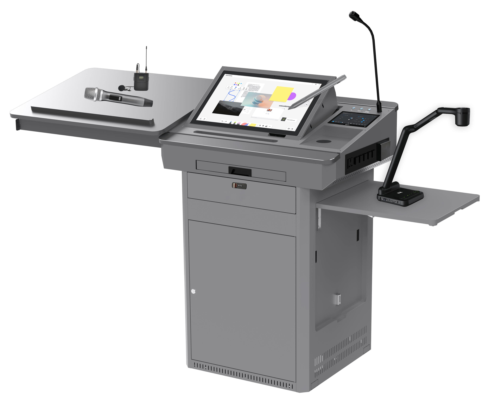

# Digital Podium NDP100

# Product List

# Podium Body

# Interactive Pen Display

## Screen

| Key            | Value                             |
| -------------- | --------------------------------- |
| Panel Type     | ？？？                            |
| Size           | 21.5 inch (16:9)                  |
| Resolution     | 250 cd/m2 ？？？                  |
| Contrast Ratio | 1000:1                            |
| Surface        | 6H tempered explosion-proof glass |
| View Angle     | 178° (H), 178° (V)                |

## Touch

| Key                 | Value           |
| ------------------- | --------------- |
| Technology          | Capacitive      |
| Pen                 | Active pen      |
| Scanning Resolution | 4096×4096       |
| Voltage             | DC+5V ±5%       |
| Touch Points        | 10 points touch |
| Response Time       | <15 ms          |

## Ports

| Key                        | Value |
| -------------------------- | ----- |
| HDMI Input                 | 1     |
| VGA Input                  | 1     |
| VGA Audio Input            | 1     |
| DC 12V Input               | 1     |
| Capacitive Touch Interface | 1 set |

## General Specifications

| Key                 | Value                                                        |
| ------------------- | ------------------------------------------------------------ |
| Built-in Speaker    | 4Ω 3W                                                        |
| Stand Adjustment    | 12° ~ 130°                                                   |
| Power Supply        | External Power Adapter (input 100-240V AC, 50/60Hz, output 12V DC 4A) |
| Weight              | 8.5KG                                                        |
| Dimension           | 523.6×315.1×48mm                                             |
| Working Environment | Working Temperature: 0~40℃; Working Humidity: 10~90%         |
| Storage Environment | Storage Temperature: -20~60℃; Storage Humidity: 10~90%       |

# NMP

| Key        | Value  |
| ---------- | ------ |
| Panel Type | ？？？ |
|            |        |

# Touch Panel

| Key  | Value |
| ---- | ----- |
|      |       |
|      |       |
|      |       |

# Built-in PC

|            |        |
| ---------- | ------ |
| Panel Type | ？？？ |
|            |        |

# Microphone

| Key        | Value  |
| ---------- | ------ |
| Panel Type | ？？？ |
|            |        |

# Full Gigabit Switch

| Key        | Value  |
| ---------- | ------ |
| Panel Type | ？？？ |
|            |        |

# Router (Optional)

| Key        | Value  |
| ---------- | ------ |
| Panel Type | ？？？ |
|            |        |

# Lite Media Server(Optional)

| Key        | Value  |
| ---------- | ------ |
| Panel Type | ？？？ |
|            |        |

# Doc Camera(Optional)

| Key        | Value  |
| ---------- | ------ |
| Panel Type | ？？？ |
|            |        |