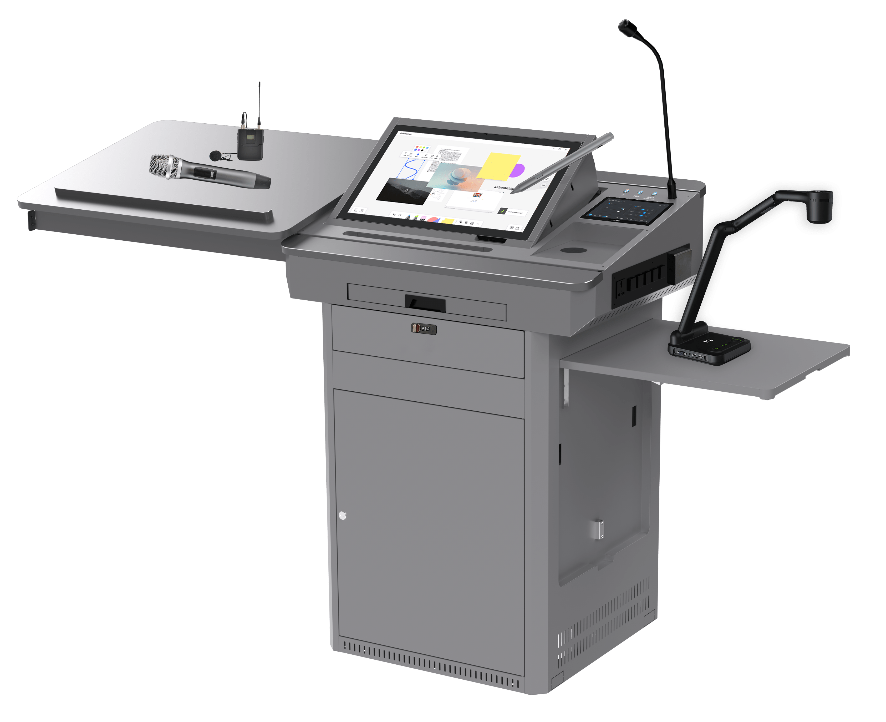
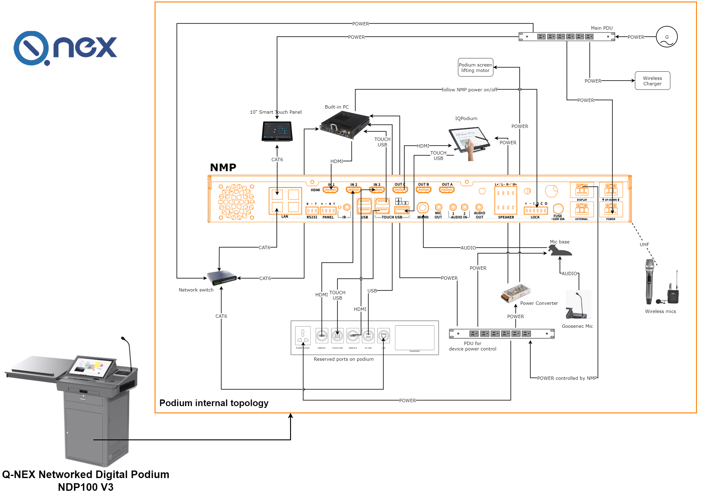
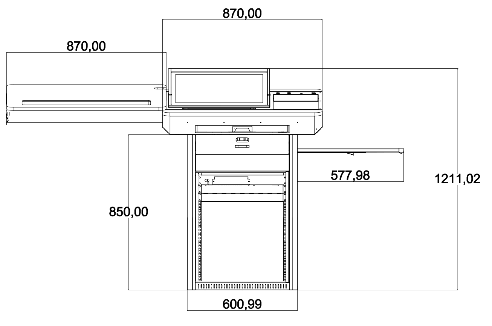
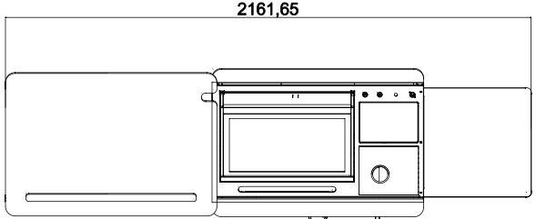
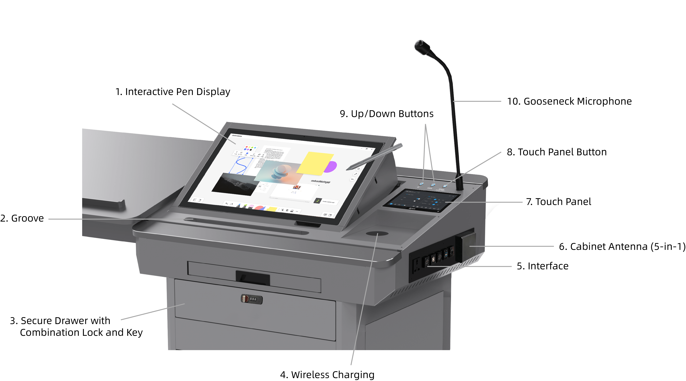
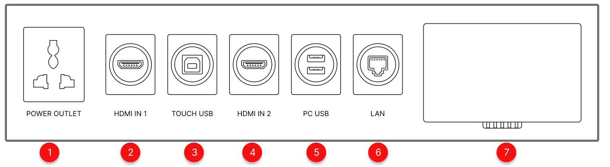
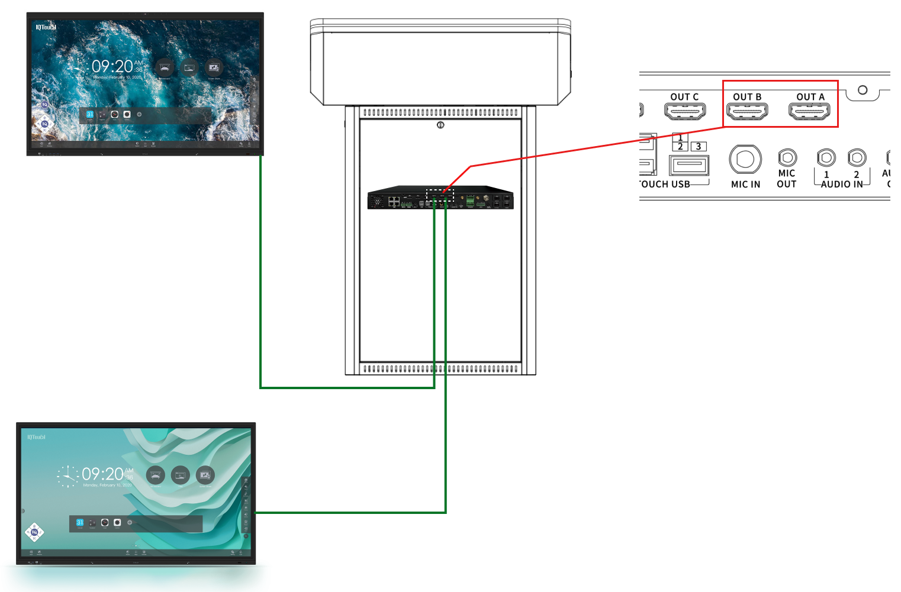

# 1. Introduction 

This Quick Guide provides a concise overview of the NDP100, offering users a quick introduction to its basic functionalities and setup. For a more detailed understanding of the NDP100, please refer to the "Q-NEX Networked Digital Podium NDP100 User Manual".

## 1.1 Topology Diagram 

 

## 1.2 Device Connection Diagram

For references:

 

# 2. Understanding the Podium

## 2.1 Dimensions

 

| No   | Name     | Description                     |
| ---- | -------- | ------------------------------- |
| 1    | Body     | 870(L) x 609(W) x 1211.02(H) mm |
| 2    | Tabletop | 2161.65(L) x 609(W)             |

## 2.2 Overview of Networked Digital Podium

 

Descriptions:

| No   | Name                              | Description                                                  |
| ---- | --------------------------------- | ------------------------------------------------------------ |
| 1    | Tabletop                          | Stable surface for teaching activities.                      |
| 2    | Wireless Microphones              | Two high-quality wireless microphones for flexible voice capture during lectures or presentations.  **Note**: Wireless receiver built into NMP for easy pairing. |
| 3    | Sliding Cover Panel               | Protective storage cover, made of eco-friendly material with improved durability. Supports up to 30kg weight. **Dimensions**: 870(L) x 600(W) x 18(H) mm |
| 4    | Wireless Keyboard and Mouse Combo | Providing control for the built-in PC during lectures and presentations. |
| 5    | Keyboard Tray                     | Space-efficient tray designed for the wireless keyboard and mouse, ensuring convenient access during use.  **Dimensions**: 507(L) x 180(W) mm |
| 6    | Front Drawer                      | Secure storage compartment with a combination lock and key, offering extra safety for sensitive devices or materials.  **Dimensions**: 480(L) x 220(W) x 100(H) mm |
| 7    | Rack/Shelf                        | Spacious storage area for the NMP, built-in PC, and other necessary equipment.  **Dimensions**: 500(L) x 490(W) x 590(H) mm |
| 8    | Foldable Stand                    | Versatile platform designed for supporting teaching equipment, such as document cameras or additional displays, with an ergonomic folding design for easy storage.  **Dimensions**: 575(L) x 545(W) mm, Weight Capacity: 15kg |

## 2.3 Tabletop Introduction

| No   | Name                                        | Description                                                  |
| ---- | ------------------------------------------- | ------------------------------------------------------------ |
| 1    | Interactive Pen Display                     | Central touchscreen supporting both finger touch and electromagnetic pen input. Positioned for interaction during lectures. |
| 2    | Groove                                      | Holder for the Interactive Pen Display's active capacitive pen  **Dimensions**: 390(L) mm |
| 3    | Secure Drawer with Combination Lock and Key | Storage drawer equipped with both combination lock and key for secure storage of important items. |
| 4    | Wireless Charging                           | Integrated wireless charging pad for smartphones, with a 15W output. |
| 5    | Interface                                   | Input/output connections for device integration such as USB drives, laptops, or other peripherals. |
| 6    | Cabinet Antenna (5-in-1)                    | Antenna unit for Wi-Fi and UHF communications. Includes 2 antennas for built-in PC Wi-Fi, 2 antennas for NMP Wi-Fi, and 1 UHF antenna for wireless microphone. |
| 7    | Touch Panel                                 | Central control interface for managing classroom devices and settings. |
| 8    | Touch Panel Button                          | An extension of the Touch Panel's power button on the tabletop. A short press puts the screen into sleep mode or wakes it, while a long press (over 3 seconds) powers the device on or off. |
| 9    | Up/Down Buttons                             | Motorized control for adjusting display height, with limit switch functionality. Red and blue indicator lights show the status: red means the sliding cover is not fully latched and the buttons won’t respond, while blue allows normal operation. |
| 10   | Gooseneck Microphone                        | High-quality microphone for capturing clear audio during lectures.  **Dimensions**: 600(L) mm |

## 2.4 Podium's Interface Introduction

 

| No.  | Interface Name         | Description                                                  |
| ---- | ---------------------- | ------------------------------------------------------------ |
| 1    | Power Outlet           | Provides power supply for the lecturer's laptop or other low-powered devices.  **Note**: Avoid connecting high-powered appliances to this port to prevent potential damage to the Networked Digital Podium. |
| 2    | HDMI IN 1              | Connects the lecturer’s laptop or other HDMI source as input for display on the Networked Digital Podium. |
| 3    | Touch USB              | Enables touch control functionality for the lecturer’s laptop when connected, allowing interaction with the podium’s display. |
| 4    | HDMI IN 2              | An additional HDMI input port for connecting secondary input devices like a camera or another laptop. |
| 5    | PC USB                 | Two USB ports extending the built-in PC's connectivity, allowing external devices such as USB flash drives or peripherals. |
| 6    | LAN                    | Provides network connectivity for the lecturer’s laptop via a wired Ethernet connection. |
| 7    | 5-in-1 Cabinet Antenna | Combines multiple antennas for enhanced communication:  (1) 2 * 2.4 GHz and 5 GHz dual-band Wi-Fi for the built-in PC.   (2) 2 * 2.4GHz Wi-Fi for NMP to connect external CBXs.   (3) 1 * UHF antenna for the wireless mic receiver built into the NMP. |

# 3. Getting Started 

## 3.1 Unlock Networked Digital Podium

1. Insert the key into the keyhole on the left side of the Networked Digital Podium, and the sliding cover panel can be withdrawn.

    

    

## 3.2 Power and Network Access

  

1. The NDP100 is equipped with an integrated switch and power strip.
2. Upon arrival in the classroom, connect the NDP100's power strip to the general power supply within the classroom to provide power to the NDP100. (Grounding work inside the NDP100 has been completed before shipment.)
3. Prepare a network cable with sufficient length. Connect one end to the NDP100 switch and the other end to the router in the classroom.

### 3.2.1 Connect Touch Panel to NMP

The Touch Panel is a 10-inch Android touchscreen device, custom-designed to work with the NMP (a core component of NDP100). Its applications are tailored specifically for controlling various functions of the NDP100, such as video matrix switching, volume, and microphone control, as well as infrared and RS232 control, etc.

1. After purchasing, you’ll receive your account details from our sales team via email or other methods (e.g., WhatsApp, phone).

2. Log in to the Web-Console at https://mg.qnextech.com/console/login.

3. In Web-Console, use the "Dashboard" button to access the Dashboard platform. For platform roles, see "1.3 Terminology" in the User Manual.

   

4. IP Address Retrieval: Referencing the '***Devices >> Processor Manage***' page, locate and retrieve the NMP IP address. Input this address on the Touch Panel interface and click 'Connect.'

     

5. Enter IP Address: After connecting to the network, input the NMP IP address on the Touch Panel.

    

   **Note**：

   If connection issues arise, use the router device or NMP config Tool.exe to identify the correct IP address, particularly in situations where DHCP changes may not be immediately reflected in the web-based backend.

6. Unlock the Touch Panel  to activate the Q-NEX Networked Digital Podium.

    

   Turning on the NDP100’s main power via the Touch Panel automatically powers on:

   - Interactive Pen Display /Built-in PC (OPS)  / UP-Down Button / Gooseneck Mic / Tabletop Power Outlet

7. Use the **UP / DOWN** buttons on the tabletop, to elevate the Networked Digital Podium's display to the desired angle.

    **Note**: 

   If the display screen doesn't raise when pressing "UP / DOWN," ensure the sliding cover is fully to the left.  

## 3.3 Connecting IFPs to NDP100

 

1. **Prepare HDMI Cable**: Ensure you have a sufficiently long HDMI cable to connect the IFPs to the NDP100.
2. **Connect HDMI Cable**: Plug one end into IFP and the other into NDP100's HDMI Out port, preferably HDMI Out A.

