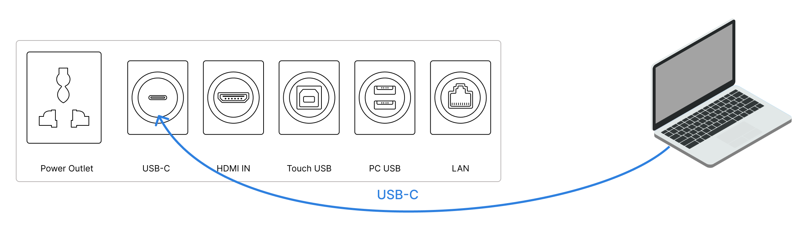
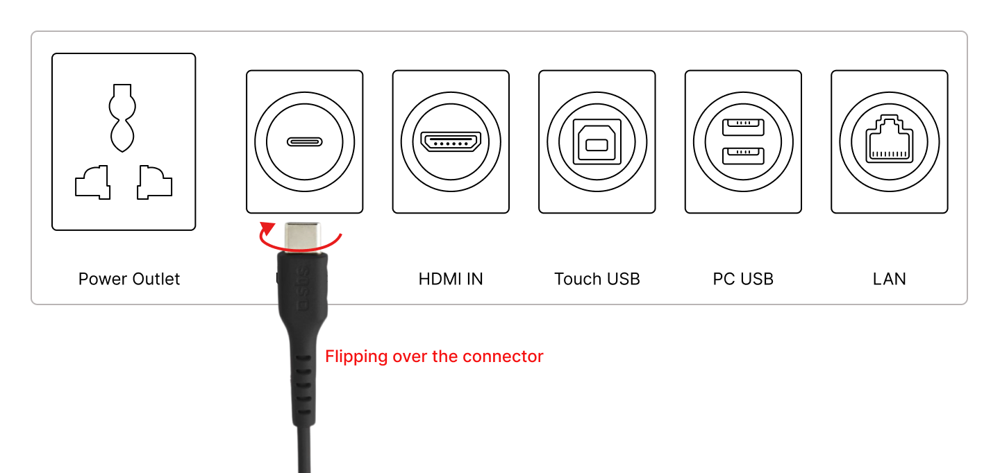
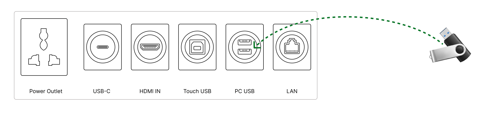
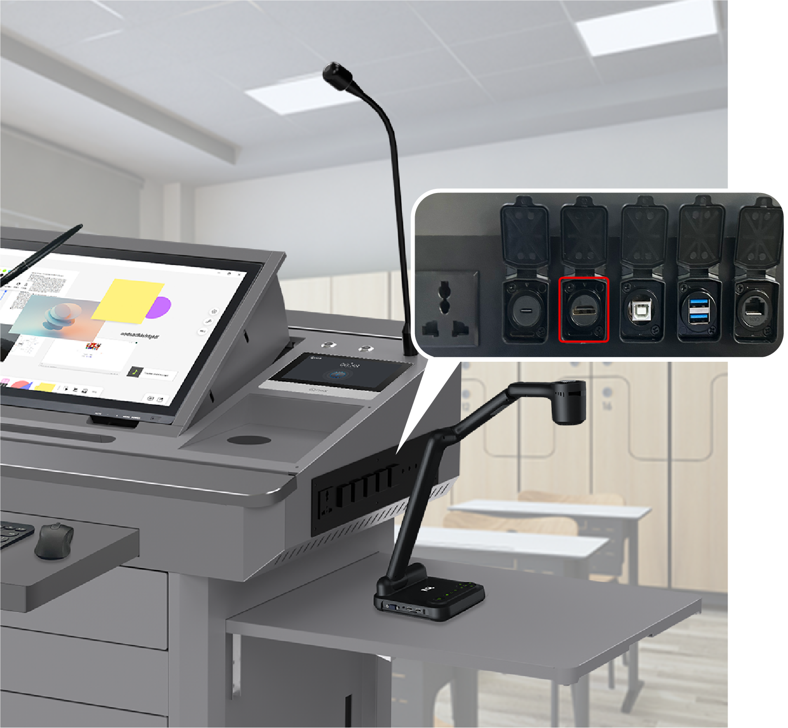

[toc]

# 1. Introduction 

This Quick Guide provides a concise overview of the NDP100, offering users a quick introduction to its basic functionalities and setup. For a more detailed understanding of the NDP100, please refer to the "Q-NEX Digital Podium NDP100 User Manual".

## 1.1 Topology Diagram 

 

## 1.2 Device Connection Diagram

For references:

 

# 2. Understanding the Podium

## 2.1 Dimensions

 

 

## 2.2 Overview for Digital Podium

 

| No   | Name                                         | Description                                                  |
| ---- | -------------------------------------------- | ------------------------------------------------------------ |
| 1    | Overall                                      | Dimensions: 820(L) x 611(W) x 1123(H) mm  Materials: Reinforced steel structure with powder-coated anti-rust paint |
| 2    | Tabletop                                     | Stable surface for teaching activities, adjustable for different scenarios. Dimensions: 820(L) x 273(W) x 610(H) mm (closed), 1620(L) x 273(W) x 610(H) mm (fully extended) |
| 3    | Sliding Cover Panel                          | Protective storage cover, eco-friendly material, weight capacity: 30kg. Dimensions: 820(L) x 600(W) x 18(H) mm, Corner radius: R40 |
| 4    | Keyboard Tray                                | Convenient space for wireless keyboard and mouse. Dimensions: 420(L) x 180(W) mm |
| 5    | Wireless Keyboard and Mouse Combo (Optional) | Convenient input accessories for PC-based lectures.          |
| 6    | Front Drawer                                 | Hidden compartment for standard-sized devices, with security lock. Dimensions: 480(L) x 220(W) x 100(H) mm |
| 7    | Rack/Shelf                                   | Storage for NMP, Built-in PC, power supply, and microphone base. Dimensions: 500(L) x 490(W) x 590(H) mm |
| 8    | Foldable Stand                               | Versatile platform for teaching devices, ergonomic design. Dimensions: 400(L) x 450(W) mm, Corner radius: R40, Weight Capacity: 15kg |

## 2.3 Tabletop Introduction

| No   | Name                    | Description                                                  |
| ---- | ----------------------- | ------------------------------------------------------------ |
| 1    | Interactive Pen Display | Central touchscreen supports finger touch or electromagnetic pen input. Positioned for student interaction. |
| 2    | Groove                  | Holder for 1 electromagnetic pen. Dimensions: 390(L) mm.     |
| 3    | Wireless Charging       | Charges smartphones wirelessly with 15W output.              |
| 4    | Interface               | Input/output connections for device integration like USB flash drives or notebooks. |
| 5    | Antenna                 | Enhances Wi-Fi signals for Built-in PC (2 antennas) and NMP (3 antennas). |
| 6    | Touch Panel             | Central control hub for classroom devices.                   |
| 7    | Gooseneck Microphone    | Captures high-quality audio during lectures. Dimensions: 600(L) mm. |
| 8    | Up/Down Buttons         | Motorized control for Display height adjustment. Includes Limit Switch for obstruction prevention. |

## 2.4 Podium's Interface Introduction

 

| No.  | Interface Name | Description                                                  |
| ---- | -------------- | ------------------------------------------------------------ |
| 1    | Power Outlet   | To connect lecturer’s laptop for power supply.  Note: Do not connect high-powered appliances to this port to avoid potential damage to the Digital Podium. |
| 2    | USB-C          | Supports charging, Internet connectivity, and HDMI signal transmission for the teacher's laptop.  Note: Ensure the USB-C cable used complies with HDMI transmission requirements. |
| 3    | HDMI           | An extended HDMI-IN port is provided for connecting lecturer’s  laptop as an input source. |
| 3    | Touch USB      | By connecting lecturer’s laptop to the Touch USB port, it enables lecturer to touch control their laptop on Digital Podium's display screen. |
| 5    | PC USB         | Two USB ports extend the built-in PC's connectivity, allowing connection of external devices like USB flash drives. |
| 6    | LAN            | The LAN port on Digital Podium is used to provide network connectivity for lecturer’s laptop. |

# 3. Getting Started 

## 3.1 Unlock Digital Podium

1. Insert the key into the keyhole on the left side of the Digital Podium, and the sliding cover panel can be withdrawn.

    

2. Use the **up / down** buttons on the tabletop, to elevate the Digital Podium's display to the desired angle.

    **Note**: 

   If the display screen doesn't raise when pressing "Up," ensure the sliding cover is fully to the left.  

3. Unlock the Touch Panel  to activate the Q-NEX Digital Podium.

   After turning on the main power of Digital Podium on the Touch Panel, the following power sources will automatically turn on:

   - Phantom power(Gooseneck microphone)
   - Tabletop power outlet 
   - Switching Power Supply, which includes:
     - Interactive Pen Display power
     - Built-in PC (OPS) power
     - Motor power (Interactive Pen Display elevation and descent)

   When the main power supply of the NDP100 is turned off, these devices will be automatically powered off as well. It simplifies the operation of controlling NDP100's devices by one-touch control on Touch Panel.

    

## 3.2 Power and Network Access

  

1. The NDP100 is equipped with an integrated switch and power strip.
2. Upon arrival in the classroom, connect the NDP100's power strip to the general power supply within the classroom to provide power to the NDP100. (Grounding work inside the NDP100 has been completed before shipment.)
3. Prepare a network cable with sufficient length. Connect one end to the switch of the NDP100 and the other end to the router in the classroom.

### 3.2.1 Connect Touch Panel to NMP

The Touch Panel is a 7-inch Android touchscreen device, custom-designed to work with the NMP (a core component of NDP100). Its applications are tailored specifically for controlling various functions of the NDP100, such as video matrix switching, volume and microphone control, as well as infrared and RS232 control, etc.

1. Enter IP Address: After connecting to the network, input the NMP IP address on the Touch Panel.

    

2. IP Address Retrieval: Referencing the '***Devices >> Processor Manage***' page, locate and retrieve the NMP IP address. Input this address on the Touch Panel interface and click 'Connect.'

     

   **Note**：

   If connection issues arise, use the router device or NMP config Tool.exe to identify the correct IP address, particularly in situations where DHCP changes may not be immediately reflected in the web-based backend.

## 3.3 Connecting IFPs to NDP100

 

1. **Prepare HDMI Cable**: Ensure you have a sufficiently long HDMI cable to connect the IFPs to the NDP100.
2. **Connect HDMI Cable**: Plug one end into IFP and the other into NDP100's HDMI Out port, preferably HDMI Out B.

## 3.4 NDP100 Connectivity Options

### 3.4.1 Using the Built-in PC

The NDP100 comes with a built-in PC, tailored to enhance teaching and operational experiences. The built-in PC is pre-installed the Windows 11 Pro operating system. 

**Note**：

Please note that the operating system requires to purchase license from Microsoft separately.

The built-in PC serves as one of the default input sources for the NDP100 and can be switched using Q-NEX software such as Touch Panel, Q-NEX App and Q-NEX Web-console. 

Each NDP100 comes with proprietary software developed by IQ&Q-NEX, including:

- [IQClass One](https://www.iqboard.net/iqclassone.php): 

  IQClass One is interactive teaching software with split-screen writing and 40-point interaction. It features gesture recognition and easy access to teaching resources. Review lessons conveniently with screen recording and QR code sharing. Enjoy simultaneous student interaction and unlimited writing space

- [JoinMemos](https://www.iqboard.net/jms.php)：

  JoinMemos is a meeting room software with tools like pens, sticky notes, and annotations. It offers brainstorming templates, sticky notes, and allows annotations on any content. Meeting content can be recorded and exported, and it features an advanced object recognition algorithm for hand and pen interaction.

- [IQ KitsMemos](https://www.iqboard.net/kitsmemos)：

  IQ KitsMemos is educational software featuring an interactive whiteboard, supporting document camera images. It offers engaging class activities and a desktop mode for presentation integration.

### 3.4.2 Connecting your laptop by HDMI

 

By connecting the HDMI interface, LAN port, and Touch USB interface to the corresponding ports on the Digital Podium, you can achieve functions such as screen synchronization, touch control, and internet access for your laptop on the Digital Podium.

Switch the input source  to ***PC*** by Touch Panel, Web-Console or Q-NEX App.

### 3.4.3 Connecting your laptop by USB-C

 

Connect the laptop directly to the Digital Podium's USB-C port for power supply, network connection, and HDMI transmission.

Switch the input source  to ***USB-C*** by Touch Panel, Web-Console or Q-NEX App. 

**Note**：

- If the USB-C doesn't respond, try flipping the orientation of the USB-C connector of the USB-Cable.

   

  

- In addition, some laptops come with their own USB-C data cables primarily for charging purposes. To enable network connection and video signal transmission, you may need to purchase a USB-C data cable that specifically supports these functions

### 3.4.4 Connecting USB Flash Drive

 

The Digital Podium's USB ports are linked to the built-in PC. Simply insert a USB flash drive into the port to access and operate its contents directly on the Interactive Pen Display.

### 3.4.5 Using Document Camera (Optional)

Connect the Document Camera to the HDMI and Power Supply port.

 

