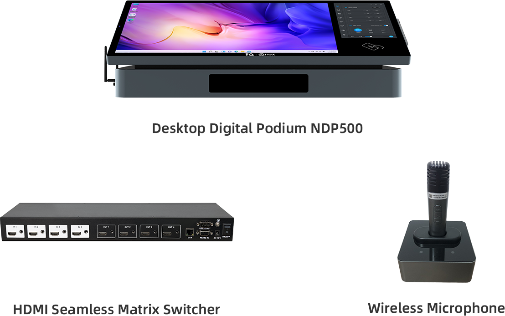
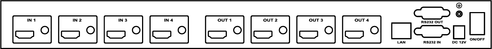

Q-NEX Desktop Digital Podium

 
NDP500 Gen 2.1

 
—— Datasheet ——

<!-- break -->

## 1. Product List

  

<!-- break -->

## 2. Desktop Digital Podium 

<table class="tbw">
    <tr class="tbody-tr">
        <td class="tbody-td"> </td>
        <td class="tbody-td"> Item </td>
        <td class="tbody-td"> Specification </td>
    </tr>
    <!-- Display Screen -->
    <tr class="tbody-tr">
        <td class="tbody-td" rowspan="11"> Display Screen </td>
        <td class="tbody-td"> Panel Type </td>
        <td class="tbody-td"> IPS (TFT-LCD) </td>
    </tr>
    <tr class="tbody-tr">
        <td class="tbody-td"> Effective Screen Size </td>
        <td class="tbody-td"> 23.8 inch </td>
    </tr>
    <tr class="tbody-tr">
        <td class="tbody-td"> Resolution </td>
        <td class="tbody-td"> 1920(H) x 1080 (V) </td>
    </tr>
    <tr class="tbody-tr">
        <td class="tbody-td"> Colors </td>
        <td class="tbody-td"> 16.7M </td>
    </tr>
    <tr class="tbody-tr">
        <td class="tbody-td"> Brightness </td>
        <td class="tbody-td"> 300 cd/m² </td>
    </tr>
    <tr class="tbody-tr">
        <td class="tbody-td"> Contrast Ratio </td>
        <td class="tbody-td"> 1000:1 </td>
    </tr>
    <tr class="tbody-tr">
        <td class="tbody-td"> Surface </td>
        <td class="tbody-td"> 3mm Hardened Anti-Reflection Safety Glass (7 H);  AG+AF Optical Bonding
            technology </td>
    </tr>
    <tr class="tbody-tr">
        <td class="tbody-td"> Viewing Angles </td>
        <td class="tbody-td"> 178° (H), 178° (V) </td>
    </tr>
    <tr class="tbody-tr">
        <td class="tbody-td"> Touch </td>
        <td class="tbody-td"> Capacitive, 10-point multi-touch, 4096x4096 resolution, Windows 7/8/10/11 compatible
        </td>
    </tr>
    <tr class="tbody-tr">
        <td class="tbody-td"> Handwriting </td>
        <td class="tbody-td"> Active capacitive pen, 4096 pressure levels, ±0.25mm accuracy, < 5mm detection height,
                Windows Ink, Windows 7/8/10/11 compatible </td>
    </tr>
    <tr class="tbody-tr">
        <td class="tbody-td"> Control Panel </td>
        <td class="tbody-td"> 10.1-inch Touch Control Panel for acessing NDP500 functions.  RAM: 2G ROM:
            16G CPU:
            Quad-cord,
            1.6GHz NFC: Supported </td>
    </tr>
    <!-- Interface -->
    <tr class="tbody-tr">
        <td class="tbody-td" rowspan="6">Interface</td>
        <td class="tbody-td">LAN switch</td>
        <td class="tbody-td">10M / 100M / 1000M RJ45 *2</td>
    </tr>
    <tr class="tbody-tr">
        <td class="tbody-td">Audio</td>
        <td class="tbody-td">3.5mm audio in *1;  3.5mm audio out *1</td>
    </tr>
    <tr class="tbody-tr">
        <td class="tbody-td">Mic</td>
        <td class="tbody-td">6.35mm wired MIC in *1;  UHF wireless MIC (Built-in receiver);  3.5mm MIC
            mixed out *1</td>
    </tr>
    <tr class="tbody-tr">
        <td class="tbody-td">HDMI Port</td>
        <td class="tbody-td">HDMI 2.0 in *5 HDMI 2.0 out *1</td>
    </tr>
    <tr class="tbody-tr">
        <td class="tbody-td">Touch USB</td>
        <td class="tbody-td">Touch USB *2</td>
    </tr>
    <tr class="tbody-tr">
        <td class="tbody-td">Communication interface</td>
        <td class="tbody-td">RS232 *2 (RS232, CONTROL);  IR-In *1;  IR-Out *1</td>
    </tr>
</table>

<!-- break -->
<!-- 这里增加一个跨页 -->
<table class="tbw">
<tr class="tbody-tr">
        <td class="tbody-td"> </td>
        <td class="tbody-td"> Item </td>
        <td class="tbody-td"> Specification </td>
    </tr>
    <tr class="tbody-tr">
        <td class="tbody-td" rowspan="4">Interface</td>
        <td class="tbody-td">Power amplifier</td>
        <td class="tbody-td">2*(40W+40W), supports up to 4 passive speakers (2 pairs, fixed impedance)</td>
    </tr>
    <tr class="tbody-tr">
        <td class="tbody-td">Power control</td>
        <td class="tbody-td">Light control port (EXTERNAL port) *1  Power output and control for display or
            others (Display port) *1 Projector / Curtain screen control (UP-DOWN port) *1</td>
    </tr>
    <tr class="tbody-tr">
        <td class="tbody-td">Power</td>
        <td class="tbody-td">Power supply for NDP500 *1 (POWER port)</td>
    </tr>
    <tr class="tbody-tr">
        <td class="tbody-td">Antenna</td>
        <td class="tbody-td">Integrated hidden antennas (wireless mic & 2.4G Wi-Fi) *1</td>
    </tr>
    <!-- Built-in PC -->
    <tr class="tbody-tr">
        <td class="tbody-td" rowspan="6">Built-in PC</td>
        <td class="tbody-td"> CPU </td>
        <td class="tbody-td">Intel ® Core™ i5 </td>
    </tr>
    <tr class="tbody-tr">
        <td class="tbody-td">RAM </td>
        <td class="tbody-td">8GB </td>
    </tr>
    <tr class="tbody-tr">
        <td class="tbody-td">Storage </td>
        <td class="tbody-td">512 SSD </td>
    </tr>
    <tr class="tbody-tr">
        <td class="tbody-td">Graphics Card</td>
        <td class="tbody-td">Intel® Iris® Xe Graphics eligible </td>
    </tr>
    <tr class="tbody-tr">
        <td class="tbody-td">Network Card </td>
        <td class="tbody-td">1 x 10/100/1000M self-adaptive Ethernet LAN port </td>
    </tr>
    <tr class="tbody-tr">
        <td class="tbody-td">WIFI </td>
        <td class="tbody-td">Supports 802.11ac/a/b/g/n; BT </td>
    </tr>
    <!-- Wireless Mic Receiver -->
    <tr class="tbody-tr">
        <td class="tbody-td" rowspan="11">Wireless Mic Receiver</td>
        <td class="tbody-td">Power Supply </td>
        <td class="tbody-td">12V </td>
    </tr>
    <tr class="tbody-tr">
        <td class="tbody-td"> Frequency Bandwidth </td>
        <td class="tbody-td">300 kHz </td>
    </tr>
    <tr class="tbody-tr">
        <td class="tbody-td"> Frequency Response </td>
        <td class="tbody-td">30 Hz - 16 kHz </td>
    </tr>
    <tr class="tbody-tr">
        <td class="tbody-td"> Frequency Range </td>
        <td class="tbody-td">Low: 642 MHz - 672 MHz  High: 674 MHz - 702 MHz</td>
    </tr>
    <tr class="tbody-tr">
        <td class="tbody-td"> Maximum Channels </td>
        <td class="tbody-td">40 channels (20 per band) </td>
    </tr>
    <tr class="tbody-tr">
        <td class="tbody-td"> Receiving Sensitivity </td>
        <td class="tbody-td">-96 dBm </td>
    </tr>
    <tr class="tbody-tr">
        <td class="tbody-td"> SNR </td>
        <td class="tbody-td">94 dB </td>
    </tr>
    <tr class="tbody-tr">
        <td class="tbody-td"> Audio Output Level </td>
        <td class="tbody-td">Max 0.9 Vrms </td>
    </tr>
    <tr class="tbody-tr">
        <td class="tbody-td"> Distortion (THD+N) </td>
        <td class="tbody-td">
            < 0.1% </td>
    </tr>
    <tr class="tbody-tr">
        <td class="tbody-td"> Latency </td>
        <td class="tbody-td">4 ms (2.2 ms with frequency shift off) </td>
    </tr>
    <tr class="tbody-tr">
        <td class="tbody-td"> Operating Temperature </td>
        <td class="tbody-td">-20°C to 80°C </td>
    </tr>
</table>
<!-- 这里增加一个跨页 -->

<!-- break -->
<table class="tbw">
    <!-- General Specification -->
    <tr class="tbody-tr">
        <td class="tbody-td"> </td>
        <td class="tbody-td"> Item </td>
        <td class="tbody-td"> Specification </td>
    </tr>
    <tr class="tbody-tr">
        <td class="tbody-td" rowspan="8">General Specification</td>
        <td class="tbody-td"> AV Decoder-Media Content </td>
        <td class="tbody-td">Protocol: RTMP Resolution: 720p@30fps (recommended), up to 1080p@30fps  Sources:
            Media server Audio Formats Supported: MP3, WAV, FLAC, Ogg, Opus, and other mainstream audio
            formats. Video Formats Supported: MP4, MKV, RMVB, RM, MOV, AVI, FLV, WMV, and other mainstream video
            formats. </td>
    </tr>
    <tr class="tbody-tr">
        <td class="tbody-td"> AV Decoder-Live Streaming</td>
        <td class="tbody-td">Protocol: RTMP Resolution: 720p@30fps (recommended), up to 1080p@30fps  Sources:
            From
            IP cameras, smartphones, PCs, etc., through a media server with Q-NEX Streaming Service System built-in,
            delivering content to classroom media devices. </td>
    </tr>
    <tr class="tbody-tr">
        <td class="tbody-td"> Stand Adjustment </td>
        <td class="tbody-td">30°-50° </td>
    </tr>
    <tr class="tbody-tr">
        <td class="tbody-td"> Power Supply </td>
        <td class="tbody-td">100V~240V AC 50 / 60Hz </td>
    </tr>
    <tr class="tbody-tr">
        <td class="tbody-td"> Temperature </td>
        <td class="tbody-td">During use: +0 - +40°C; in storage: -15- +60°C </td>
    </tr>
    <tr class="tbody-tr">
        <td class="tbody-td"> Humidity </td>
        <td class="tbody-td">During use: 20-80% (no condensation); in storage: 10-90% (no condensation) </td>
    </tr>
    <tr class="tbody-tr">
        <td class="tbody-td"> Net Weight </td>
        <td class="tbody-td">25 kg </td>
    </tr>
    <tr class="tbody-tr">
        <td class="tbody-td"> Product Size (mm) </td>
        <td class="tbody-td">716(L) * 350(W) * 242(H) </td>
    </tr>
</table>

<!-- break -->

## 3. HDMI Seamless Matrix Switcher

<table class="tbw">
    <tr class="tb-tr">
        <td class="tbody-td"> Item </td>
        <td class="tbody-td"> Specification</td>
    </tr>
    <tr class="tb-tr">
        <td class="tbody-td"> HDM HD Matrix </td>
        <td class="tbody-td">HDM High Definition Matrix </td>
    </tr>
    <tr class="tb-tr">
        <td class="tbody-td">
            Input Ports </td>
        <td class="tbody-td">4x HDMI </td>
    </tr>
    <tr class="tb-tr">
        <td class="tbody-td"> Output Ports </td>
        <td class="tbody-td">4x HDMI </td>
    </tr>
    <tr class="tb-tr">
        <td class="tbody-td"> Device Height </td>
        <td class="tbody-td">1U </td>
    </tr>
    <tr class="tb-tr">
        <td class="tbody-td"> Supported Video Resolutions</td>
        <td class="tbody-td">480i, 576i, 480p, 576p, 720p, 1080i, 1080p@24/30/50/60 Hz, 1080P3D@60Hz, 4K*2K@30Hz </td>
    </tr>
    <tr class="tb-tr">
        <td class="tbody-td"> Control Interfaces </td>
        <td class="tbody-td">1x RS232 IN, 1x RS232 OUT, 1x RJ45 LAN </td>
    </tr>
    <tr class="tb-tr">
        <td class="tbody-td"> Protocol Standards </td>
        <td class="tbody-td">Supports 4K30Hz, EDID management and erasable, HDCP decoding (HDMI 1.4) </td>
    </tr>
    <tr class="tb-tr">
        <td class="tbody-td"> Color Spaces </td>
        <td class="tbody-td">Supports RGB444, YUV444, YUV422 color spaces, supports x.v.Color extended color gamut
            standard
        </td>
    </tr>
    <tr class="tb-tr">
        <td class="tbody-td"> Electrostatic Protection </td>
        <td class="tbody-td">Human body discharge mode: ± 6kV (air discharge) ±4kV (contact discharge) </td>
    </tr>
    <tr class="tb-tr">
        <td class="tbody-td"> Control Methods </td>
        <td class="tbody-td">Standard buttons, RS232, remote switching; optional WEB, APP control </td>
    </tr>
    <tr class="tb-tr">
        <td class="tbody-td"> Power Supply </td>
        <td class="tbody-td">AC110V-240V 50/60Hz </td>
    </tr>
    <tr class="tb-tr">
        <td class="tbody-td"> Input Voltage </td>
        <td class="tbody-td">Power supply 12V/2A </td>
    </tr>
    <tr class="tb-tr">
        <td class="tbody-td"> Power Consumption </td>
        <td class="tbody-td">8W </td>
    </tr>
    <tr class="tb-tr">
        <td class="tbody-td"> Dimensions (mm) </td>
        <td class="tbody-td">430mm x 45mm x 150mm </td>
    </tr>
    <tr class="tb-tr">
        <td class="tbody-td"> Operating Temperature </td>
        <td class="tbody-td">0°C~40°C / 32°F~104°F </td>
    </tr>
    <tr class="tb-tr">
        <td class="tbody-td"> Storage Temperature </td>
        <td class="tbody-td">-20°C~60°C / -4°F~140°F </td>
    </tr>
    <tr class="tb-tr">
        <td class="tbody-td"> Weight </td>
        <td class="tbody-td">2.45Kg </td>
    </tr>
</table>

<!-- break -->

## 4. Wireless Microphone WX-D11

<table class="tbw">
    <tr class="tb-tr">
        <td class="tbody-td"> Item </td>
        <td class="tbody-td"> Specification</td>
    </tr>
    <tr class="tb-tr">
        <td class="tbody-td"> Receiving Sensitivity </td>
        <td class="tbody-td">-96 dBm </td>
    </tr>
    <tr class="tb-tr">
        <td class="tbody-td"> Receiver Working Current </td>
        <td class="tbody-td">150 mA </td>
    </tr>
    <tr class="tb-tr">
        <td class="tbody-td"> Frequency Range </td>
        <td class="tbody-td">Low: 642 MHz - 672 MHz / High: 674 MHz - 702 MHz </td>
    </tr>
    <tr class="tb-tr">
        <td class="tbody-td"> Sensitivity </td>
        <td class="tbody-td">-96 dBm </td>
    </tr>
    <tr class="tb-tr">
        <td class="tbody-td"> Frequency Response </td>
        <td class="tbody-td">30 Hz - 16 kHz </td>
    </tr>
    <tr class="tb-tr">
        <td class="tbody-td"> Microphone Type </td>
        <td class="tbody-td">Unidirectional </td>
    </tr>
    <tr class="tb-tr">
        <td class="tbody-td"> SNR </td>
        <td class="tbody-td">94 dB </td>
    </tr>
    <tr class="tb-tr">
        <td class="tbody-td"> Transmit Power </td>
        <td class="tbody-td">10 dBm </td>
    </tr>
    <tr class="tb-tr">
        <td class="tbody-td"> Distortion (THD+N) </td>
        <td class="tbody-td">
            < 0.1% </td>
    </tr>
    <tr class="tb-tr">
        <td class="tbody-td"> Effective Distance </td>
        <td class="tbody-td">≤30 m </td>
    </tr>
    <tr class="tb-tr">
        <td class="tbody-td"> Latency </td>
        <td class="tbody-td">3 ms </td>
    </tr>
    <tr class="tb-tr">
        <td class="tbody-td"> Operating Temperature </td>
        <td class="tbody-td">-20°C to 80°C </td>
    </tr>
    <tr class="tb-tr">
        <td class="tbody-td"> Power Supply </td>
        <td class="tbody-td">4.2V 800mAh 14500 Li-ion Battery </td>
    </tr>
    <tr class="tb-tr">
        <td class="tbody-td"> Microphone Working Current</td>
        <td class="tbody-td">120 mA </td>
    </tr>
    <tr class="tb-tr">
        <td class="tbody-td"> Battery Runtime </td>
        <td class="tbody-td">Up to 6 hours </td>
    </tr>
</table>

## 5. Media Server (Optional)

### 5.1 Enterprise Media Server

**Note**:

The Media Server is an optional component for the NDP500, providing AV broadcasting and media file storage. It is placed under the campus core router and supports broadcasting to multiple devices, including NMP, NDP100, NDP500, and Media Box.

The table below shows the minimum recommended specifications:

<table class="tbw">
    <tr class="tb-tr">
        <td class="tbody-td"> Item </td>
        <td class="tbody-td"> Specification</td>
    </tr>
    <tr class="tb-tr">
        <td class="tbody-td"> Storage Type </td>
        <td class="tbody-td"> ECC </td>
    </tr>
    <tr class="tb-tr">
        <td class="tbody-td"> RAM </td>
        <td class="tbody-td"> 16G </td>
    </tr>
    <tr class="tb-tr">
        <td class="tbody-td"> HDD Storage </td>
        <td class="tbody-td"> 4T * 4 SATA </td>
    </tr>
    <tr class="tb-tr">
        <td class="tbody-td"> CPU </td>
        <td class="tbody-td"> 4-core 8-thread CPU </td>
    </tr>
    <tr class="tb-tr">
        <td class="tbody-td"> System </td>
        <td class="tbody-td"> Windows Server OS </td>
    </tr>
</table>

### 5.2 Lite Media Server

<table class="tbw">
<tr class="tb-tr">
        <td class="tbody-td"> Item </td>
        <td class="tbody-td"> Specification</td>
    </tr>
    <tr class="tb-tr">
        <td class="tbody-td"> Processor </td>
        <td class="tbody-td">Intel® Core™ i5 4200M 2.5GHz </td>
    </tr>
    <tr class="tb-tr">
        <td class="tbody-td"> RAM </td>
        <td class="tbody-td">4GB DDR3 </td>
    </tr>
    <tr class="tb-tr">
        <td class="tbody-td"> Storage </td>
        <td class="tbody-td">256G SSD </td>
    </tr>
    <tr class="tb-tr">
        <td class="tbody-td"> Network Card </td>
        <td class="tbody-td">1 x RJ45 LAN 10/100/1000M </td>
    </tr>
    <tr class="tb-tr">
        <td class="tbody-td"> WiFi </td>
        <td class="tbody-td">IEEE 802.11 a/g/n/ac </td>
    </tr>
    <tr class="tb-tr">
        <td class="tbody-td"> Power Supply Input</td>
        <td class="tbody-td">19V </td>
    </tr>
    <tr class="tb-tr">
        <td class="tbody-td"> Dimension </td>
        <td class="tbody-td">180mm (L) x 195mm (W) x 42mm (H) </td>
    </tr>
    <tr class="tb-tr">
        <td class="tbody-td"> Temperature </td>
        <td class="tbody-td">Operating temperature: 0°C ~ 50°C   Storage temperature: -20°C ~ 70°C </td>
    </tr>
    <tr class="tb-tr">
        <td class="tbody-td"> Humidity </td>
        <td class="tbody-td">5% ~ 90% No condensation </td>
    </tr>
</table>

**Note:** 

The Lite Media Server is intended for demonstration. For practical use, it is strongly recommended to choose a formal Media Server.

<!-- break -->

## 6. Control Box (Optional)

The Control Box (CBX) wirelessly connects to an NDP500 using Wi-Fi 2.4G. Placed near devices like air conditioners, displays, lights, or smart curtains, the CBX acts as a bridge, enabling wired control of these devices without extensive cabling.

<table class="tbw">
    <tr class="tb-tr">
        <td class="tbody-td"> Item </td>
        <td class="tbody-td"> Specification</td>
    </tr>
    <tr class="tb-tr">
        <td class="tbody-td"> Power Supply (DC)</td>
        <td class="tbody-td">12V,1A </td>
    </tr>
    <tr class="tb-tr">
        <td class="tbody-td"> Reset Button </td>
        <td class="tbody-td">Resets the CBX to its default factory settings </td>
    </tr>
    <tr class="tb-tr">
        <td class="tbody-td"> Link Indicator </td>
        <td class="tbody-td">Displays the connection status between the CBX and the NMP </td>
    </tr>
    <tr class="tb-tr">
        <td class="tbody-td"> DIP Switch </td>
        <td class="tbody-td">Used for configuration settings and adjustments of the CBX </td>
    </tr>
    <tr class="tb-tr">
        <td class="tbody-td"> RS232 </td>
        <td class="tbody-td">Allows wired communication and control with RS232-compatible devices. </td>
    </tr>
    <tr class="tb-tr">
        <td class="tbody-td"> IR </td>
        <td class="tbody-td">Enables IR communication for controlling devices with infrared signals. </td>
    </tr>
    <tr class="tb-tr">
        <td class="tbody-td"> Relay </td>
        <td class="tbody-td">Provides control over devices using relay switches for on/off functions. </td>
    </tr>
</table>
