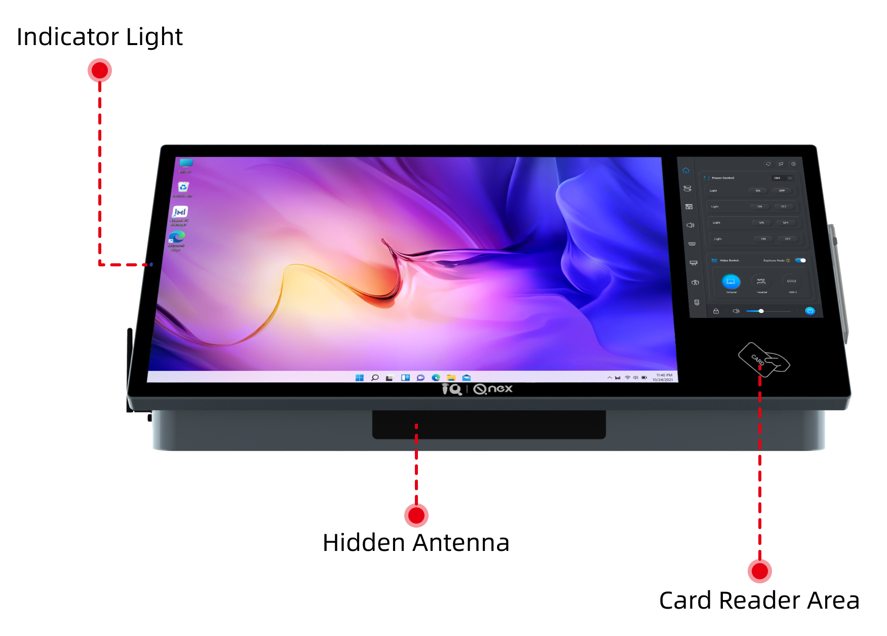

Q-NEX Networked Digital Podium

 
NDP500 GEN2.1

 
—— Datasheet ——

## 1. Product List //少图

## 2. Desktop Digital Podium 

### 2.1 Display Screen

**General Specification**

| Item                      | Specification                                                |
| ------------------------- | ------------------------------------------------------------ |
| **Panel Type**            | IPS (TFT-LCD)                                                |
| **Effective Screen Size** | 23.8 inch                                                    |
| **Resolution**            | 1920(H) x 1080 (V)                                           |
| **Colors**                | 16.7M                                                        |
| **Brightness**            | 300 cd/m²                                                    |
| **Contrast Ratio**        | 1000:1                                                       |
| **Surface**               | 3mm Hardened Anti-Reflection Safety Glass (7 H); AG+AF, Optical Bonding technology |
| **Viewing Angles**        | 178° (H), 178° (V), Optical Bonding technology               |

**Touch Specification**

Supports up to 10 touch points with a 4096 x 4096 resolution, compatible with Windows 7/8/10/11.

| Item                             | Specification        |
| -------------------------------- | -------------------- |
| **Technology**                   | Capacitive           |
| **Touch Points**                 | 10-point multi-touch |
| **Resolution**                   | 4096 x 4096          |
| **Compatible Operating Systems** | Windows 7/8/10/11    |

**Handwriting Specification**

Uses an active capacitive pen with 4096 pressure levels, supporting Windows Ink.

| Item                             | Specification     |
| -------------------------------- | ----------------- |
| **Technology**                   | Capacitive        |
| **Pen**                          | Active pen        |
| **Pen Pressure**                 | 4096 levels       |
| **Reading Accuracy**             | ±0.25 mm (center) |
| **Identification Height**        | <5mm              |
| **Windows INK**                  | YES               |
| **Compatible Operating Systems** | Windows 7/8/10/11 |

### 2.2 Touch Panel

The Touch Panel allows users to access NDP500 functionalities such as power control, matrix switching, volume adjustment.

| Item                      | Specification                                                |
| ------------------------- | ------------------------------------------------------------ |
| **Panel Type**            | IPS (TFT-LCD)                                                |
| **Effective Screen Size** | 10.1 inch                                                    |
| **Resolution**            | 1200(H) x 1920 (V)                                           |
| **Brightness**            | 300 cd/m²                                                    |
| **Contrast Ratio**        | 1000:1                                                       |
| **Surface**               | 3mm Hardened Anti-Reflection Safety Glass (7 H); AG+AF, Optical Bonding technology |
| **Viewing Angles**        | 178° (H), 178° (V)                                           |
| **Connection Type**       | Built-in                                                     |

### 2.3 Interface

**Front View** 

| No.  | Interface        | Description                                                  |
| ---- | ---------------- | ------------------------------------------------------------ |
| 1    | Indicator Light  | Display the operational status of the NDP500. The indicator has two states: - Red (No signal source) - Green (Signal source present) |
| 2    | Card Reader Area | Allows users to authenticate using a swipe card for access control and logging in. |
| 3    | Hidden Antenna   | UHF for wireless microphones 2.4G Wi-Fi for CBX         |

**Left View**

| No.  | Interface    | Description                                                  |
| ---- | ------------ | ------------------------------------------------------------ |
| 1    | OPS Slot * 1 | Supports the insertion and removal of Euro-standard OPS (Open Pluggable Specification) modules. |

**Right View**

| No.  | Interface        | Description                                                  |
| ---- | ---------------- | ------------------------------------------------------------ |
| 1    | HDMI IN 1        | Connects to devices such as laptops. For Interactive Pen Display and IFP reverse touch control, USB HOST connection is also required. |
| 2    | USB-HOST         | USB-TYPE B 2.0. Paired with HDMI IN 1 to enable reverse touch control and other interactive functions. |
| 3    | HDMI IN 2        | Acts as the third input source for the NDP500.               |
| 4    | MIC IN-2 (3.5mm) | Line-in interface for connecting external microphones or audio devices. |

**Rear View**

 

 

| No.  | Interface             | Description                                                  |
| ---- | --------------------- | ------------------------------------------------------------ |
| 1    | **IN 1**              | Connected to HDMI Seamless Matrix Switcher (IN 1) for seamless input switch. The source is from NDP500's HDMI IN 1; for example, if a laptop is connected to HDMI IN 1, switching to IN 1 will display the laptop's content. |
| 2    | **IN 2**              | Connected to HDMI Seamless Matrix Switcher (IN 2) for seamless input switch. Similar to IN 1, used for different video sources like a document camera, laptop, etc. |
| 3    | **IN 3**              | Connected to HDMI Seamless Matrix Switcher (IN 3). The input source is from the built-in PC of NDP500. |
| 4    | **IN 4**              | Connected to HDMI Seamless Matrix Switcher (IN 4), used for NDP500's broadcast functionality. |
| 5    | **OUT 3**             | Output connected to the Seamless Matrix Switcher's OUT 3, used to switch content for NDP500's Interactive Pen Display. |
| 6    | **MIC BASE** (LAN)    | Reserved interface.                                          |
| 7    | **LAN** (Ethernet) *2 | Standard Ethernet port for network connectivity (1000Mbps, non-PoE). |
| 10   | **Touch USB 1**       | Works with OUT 1 of the Seamless Matrix for bidirectional touch control on devices (e.g., IFP) and Interactive Pen Display. |
| 11   | **Touch USB 2**       | Works with OUT 2 of the Seamless Matrix for bidirectional touch control on devices (e.g., IFP) and Interactive Pen Display. |
| 12   | **RS232**             | For serial communication to other devices, typically for control or configuration purposes. Pinout sequence is R-G-T. |
| 13   | **CONTROL**           | Dedicated RS232 port for communication between NDP500 and the Seamless Matrix Switcher. Pinout sequence is G-R-T. |
| 14   | **IR-IN**             | NDP500 uses this port to learn infrared control codes from devices. |
| 15   | **IR-OUT**            | IR port for controlling compatible devices remotely (e.g., projector, screen). |
| 16   | **MIC IN 1**          | Input port for microphones or audio sources, supporting various microphone models. |
| 17   | **MIC OUT**           | Output port for routing audio from microphones to other systems or devices. |
| 18   | AUDIO OUT             | 3.5mm port for audio output to speakers or amplifiers.       |
| 19   | SPEAKER * 2           | Terminal block with 4-pin for connecting two pairs of passive speakers. Integrated dual-channel amplifier, with 40W and 4-8Ω load per channel. |
| 20   | UP-DOWN               | C13 outlet offering up, pause, and down functions for connected devices like projector screens and motorized curtains.  (110~220V AC, 300W) |
| 21   | DISPLAY               | C13 outlet used for power control of connected display devices like IFPs and projectors, supporting delayed power off. (110~220V AC, 1200W) |
| 22   | EXTERNAL              | C13 outlet, acts as a switch for controlling external devices such as lighting. Can be directly connected to NDP500-External or integrated with an SPDT switch. (110~220V AC, 1200W, This power does not count towards Digital's total power consumption) |
| 23   | POWER                 | C14 inlet for powering the entire NDP500 unit, including the 23.8-inch display, 10.1-inch control screen, and internal OPS. (110~220V AC, 2000W) |
| 24   | POWER SWITCH          | Switch for powering the NDP500 unit on and off.              |

### 2.4 Built-in PC

| Item              | Specification                                    |
| ----------------- | ------------------------------------------------ |
| **CPU**           | Intel ® Core™ i5                                 |
| **RAM**           | 8GB                                              |
| **Storage**       | 512 SSD                                          |
| **Graphics Card** | Intel® Iris® Xe Graphics eligible                |
| **Network Card**  | 1 × 10/100/1000M self adaptive Ethernet LAN port |
| **WIFI**          | Supports 802.11ac/a/b/g/n; BT                    |

### 2.5 General Specification

| Item                  | Specification                                                |
| --------------------- | ------------------------------------------------------------ |
| **Stand Adjustment**  | 30°-60°                                                      |
| **Power Supply**      | 100V~240V AC 50 / 60Hz                                       |
| **Temperature**       | During use: +0 – +40°C; in storage: -15– +60°C               |
| **Humidity**          | During use: 20-80% (no condensation); in storage: 10-90% (no condensation) |
| **Net Weight**        | 25 kg                                                        |
| **Product Size (mm)** | 716(L) * 350(W) * 242(H)                                     |

## 3. HDMI Seamless Matrix Switcher

| Sequence | Name                        | Description                                                  |
| -------- | --------------------------- | ------------------------------------------------------------ |
| 1        | HDM HD Matrix               | HDM High Definition Matrix                                   |
| 2        | Input Ports                 | 4x HDMI                                                      |
| 3        | Output Ports                | 4x HDMI                                                      |
| 4        | Device Height               | 1U                                                           |
| 5        | Supported Video Resolutions | 480i, 576i, 480p, 576p, 720p, 1080i, 1080p@24/30/50/60 Hz, 1080P3D@60Hz, 4K*2K@30Hz |
| 6        | Control Interfaces          | 1x RS232 IN, 1x RS232 OUT, 1x RJ45 LAN                       |
| 7        | Protocol Standards          | Supports 4K30Hz, EDID management and erasable, HDCP decoding (HDMI 1.4) |
| 8        | Color Spaces                | Supports RGB444, YUV444, YUV422 color spaces, supports x.v.Color extended color gamut standard |
| 9        | Electrostatic Protection    | Human body discharge mode: ± 6kV (air discharge) ±4kV (contact discharge) |
| 10       | Control Methods             | Standard buttons, RS232, remote switching; optional WEB, APP control |
| 11       | Power Supply                | AC110V-240V 50/60Hz                                          |
| 12       | Input Voltage               | Power supply 12V/2A                                          |
| 13       | Power Consumption           | 8W                                                           |
| 14       | Dimensions (mm)             | 430mm x 45mm x 150mm                                         |
| 15       | Operating Temperature       | 0°C~40°C / 32°F~104°F                                        |
| 16       | Storage Temperature         | -20°C~60°C / -4°F~140°F                                      |
| 17       | Weight                      | 2.45Kg                                                       |

## 4. Microphone 

### 4.1 Wireless Mic Receiver (Built-in NDP500)

| No.  | Item                  | Specification                                        |
| ---- | --------------------- | ---------------------------------------------------- |
| 1    | Power Supply          | 12V                                                  |
| 2    | Frequency Bandwidth   | 300 kHz                                              |
| 3    | Frequency Response    | 30 Hz – 16 kHz                                       |
| 4    | Frequency Range       | Low: 642 MHz – 672 MHz  High: 674 MHz – 702 MHz |
| 5    | Maximum Channels      | 40 channels (20 per band)                            |
| 6    | Receiving Sensitivity | -96 dBm                                              |
| 7    | SNR                   | 94 dB                                                |
| 8    | Audio Output Level    | Max 0.9 Vrms                                         |
| 9    | Distortion (THD+N)    | < 0.1%                                               |
| 10   | Latency               | 4 ms (2.2 ms with frequency shift off)               |
| 11   | Operating Temperature | -20°C to 80°C                                        |

### 4.2 Wireless Microphone WX-D11

| No.  | Item                       | Specification                                    |
| ---- | -------------------------- | ------------------------------------------------ |
| 1    | Receiving Sensitivity      | -96 dBm                                          |
| 2    | Receiver Working Current   | 150 mA                                           |
| 3    | Frequency Range            | Low: 642 MHz – 672 MHz / High: 674 MHz – 702 MHz |
| 4    | Sensitivity                | -96 dBm                                          |
| 5    | Frequency Response         | 30 Hz – 16 kHz                                   |
| 6    | Microphone Type            | Unidirectional                                   |
| 7    | SNR                        | 94 dB                                            |
| 8    | Transmit Power             | 10 dBm                                           |
| 9    | Distortion (THD+N)         | < 0.1%                                           |
| 10   | Effective Distance         | ≤30 m                                            |
| 11   | Latency                    | 3 ms                                             |
| 12   | Operating Temperature      | -20°C to 80°C                                    |
| 13   | Power Supply               | 4.2V 800mAh 14500 Li-ion Battery                 |
| 14   | Microphone Working Current | 120 mA                                           |
| 15   | Battery Runtime            | Up to 6 hours                                    |

## 5. Live Streaming

### 5.1 Networked AV Decoder

Requires a media server to decode and play networked media content on classroom devices, supporting both scheduled and instant playback.

| No.  | Item                    | Specification                                                |
| ---- | ----------------------- | ------------------------------------------------------------ |
| 1    | Decoding Protocol       | RTMP                                                         |
| 2    | Resolution              | 720p@30fps (recommended), up to 1080@30fps                   |
| 3    | Media Source            | Media server with Q-NEX streaming service system             |
| 4    | Playback Options        | Instant playback or scheduled playback on classroom media devices |
| 5    | Audio Formats Supported | MP3, WAV, FLAC, Ogg, Opus, and other mainstream audio formats |
| 6    | Video Formats Supported | MP4, MKV, RMVB, RM, MOV, AVI, FLV, WMV, and other mainstream video formats |

### 5.2 Live AV Streaming

Supports live video streaming from various sources, including IP cameras, smartphones, PCs (using third-party software like OBS), and audio/video encoders. The RTMP protocol is used to transmit streams to the media server, which the NMP decodes for playback on display devices in classrooms and other locations.

| No.  | Item               | Specification                                                |
| ---- | ------------------ | ------------------------------------------------------------ |
| 1    | Streaming Protocol | RTMP                                                         |
| 2    | Resolution         | 720p@30fps (recommended), up to 1080@30fps                   |
| 3    | Source             | IP cameras, smartphones with broadcasting software (e.g., OBS), PCs with OBS, audio/video encoders |

### 5.3 Media Server (Optional)

**Note**:

The Media Server is an optional component for the NDP500, providing AV broadcasting and media file storage. It is placed under the campus core router and supports broadcasting to multiple devices, including NMP, NDP100, NDP500, and Media Box.

The table below shows the minimum recommended specifications:

| No.  | Item         | Specification       |
| ---- | ------------ | ------------------- |
| 1    | Storage Type | ECC                 |
| 2    | RAM          | 16G                 |
| 3    | HDD Storage  | 4T * 4 SATA         |
| 4    | CPU          | 4-core 8-thread CPU |
| 5    | System       | Windows Server OS   |

### 5.4 Lite Media Server (Optional)

| No.  | Item               | Specification                                                |
| ---- | ------------------ | ------------------------------------------------------------ |
| 1    | Processor          | Intel® Core™ i5 4200M 2.5GHz                                 |
| 2    | RAM                | 4GB DDR3                                                     |
| 3    | Storage            | 256G SSD                                                     |
| 4    | Network Card       | 1 × RJ45 LAN 10/100/1000M                                    |
| 5    | WiFi               | IEEE 802.11 a/g/n/ac                                         |
| 6    | Power Supply Input | 19V                                                          |
| 7    | Dimension          | 180mm (L) x 195mm (W) x 42mm (H)                             |
| 8    | Temperature        | Operating temperature: 0°C ~ 50°C   Storage temperature: -20°C ~ 70°C |
| 9    | Humidity           | 5% ~ 90% No condensation                                     |

**Note:** 

The Lite Media Server is intended for demonstration. For practical use, it is strongly recommended to choose a formal Media Server.

## 6. Control Box

The Control Box (CBX) wirelessly connects to a NDP500 using Wi-Fi 2.4G. Placed near devices like air conditioners, displays, lights, or smart curtains, the CBX acts as a bridge, enabling wired control of these devices without extensive cabling.

| No.  | Interface         | Description                                                  |
| ---- | ----------------- | ------------------------------------------------------------ |
| 1    | Power Supply (DC) | 12V,1A                                                       |
| 2    | Reset Button      | Resets the CBX to its default factory settings               |
| 3    | Link Indicator    | Displays the connection status between the CBX and the NMP   |
| 4    | DIP Switch        | Used for configuration settings and adjustments of the CBX   |
| 5    | RS232             | Allows wired communication and control with RS232-compatible devices. |
| 6    | IR                | Enables IR communication for controlling devices with infrared signals. |
| 7    | Relay             | Provides control over devices using relay switches for on/off functions. |

###  6.1 Wireless Reciver Module

| No.  | Specification             | Details                                                      |
| ---- | ------------------------- | ------------------------------------------------------------ |
| 1    | **RF Transceiver**        | “Wi-Fi friendly” 2.4 GHz spread spectrum 2-way RF (2400 to 2483 MHz) |
| 2    | **RF Transmitting Power** | 13.5dBm                                                      |
| 3    | **Range**                 | < 30 m, support to connect up to 4 units of control box for extended RS232/IR/Relay control |

