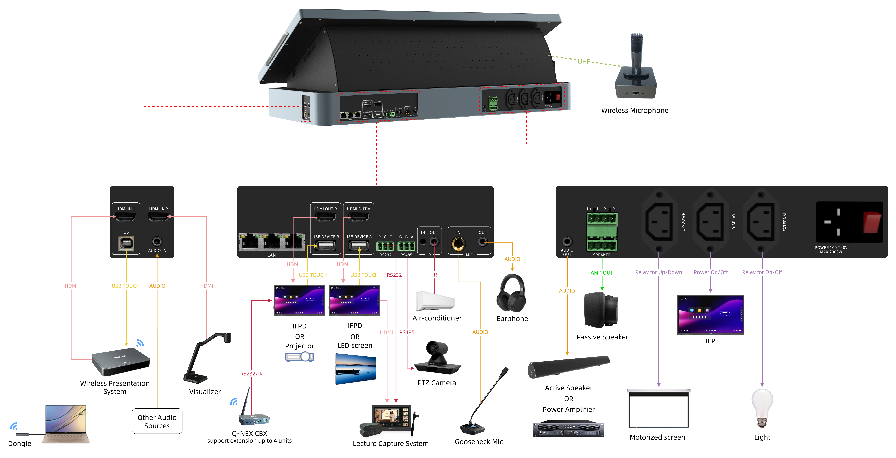
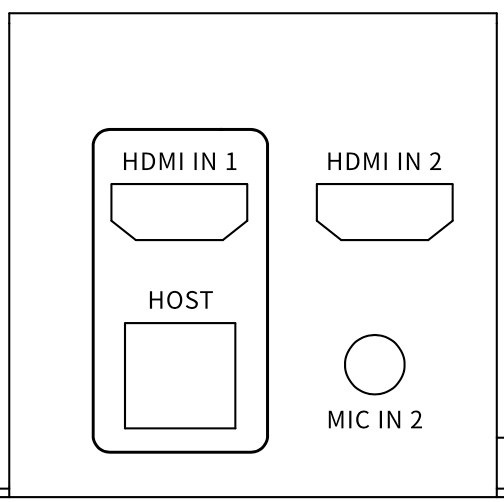
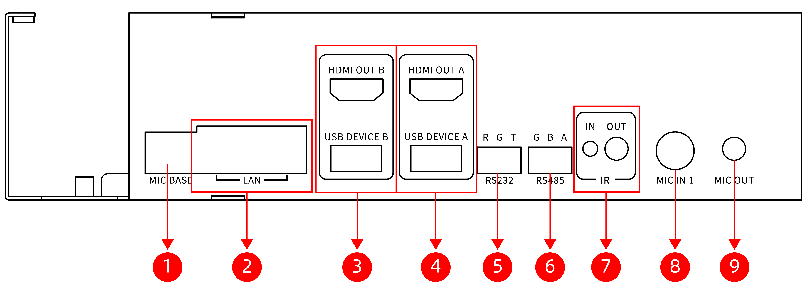

Q-NEX Desktop Digital Podium

 
NDP500 GEN2.0

 
—— Quick Guide ——

 

# 1. Introduction 

## 1.1 Device Connection Diagram 

# 2. Understanding the Podium

## 2.1 Dimensions

## 2.2 Overview for NDP500

## 2.3 NDP500 Interface Introduction 

### Front View

| No.  | Interface                | Description                                                  |
| ---- | ------------------------ | ------------------------------------------------------------ |
| 1    | Display Indicator        | Display status of the NDP500. The indicator has two states: - Red (No signal source) - Green (Signal source present) |
| 2    | Card Reader Area         | Allows users to authenticate using a swipe card for access control and logging in. |
| 3    | Hidden Antenna           | UHF for wireless microphones 2.4G Wi-Fi for CBX         |
| 4    | Mic Pairing Indicator    | Wireless microphone receiver indicator. Blinks during pairing, solid when paired. |
| 5    | IR Pairing Receiver      | Infrared pairing receiver for wireless microphones.          |
| 6    | Active Capacitive Stylus | Active capacitive stylus for NDP500. Magnetically attaches to the right-side slot for storage. |

### Left View

| No.  | Interface    | Description                                                  |
| ---- | ------------ | ------------------------------------------------------------ |
| 1    | OPS Slot * 1 | Supports the insertion and removal of Euro-standard OPS (Open Pluggable Specification) modules. |

### Right View

| No.  | Interface        | Description                                                  |
| ---- | ---------------- | ------------------------------------------------------------ |
| 1    | HDMI IN 1        | Connects to devices such as laptop. For Interactive Pen Display and IFP reverse touch control, USB HOST connection is also required. |
| 2    | USB-HOST         | USB-TYPE B 2.0. Paired with HDMI IN 1 to enable reverse touch control and other interactive functions. |
| 3    | HDMI IN 2        | Acts as the third input source for the NDP500.               |
| 4    | MIC IN-2 (3.5mm) | Line-in interface for connecting external audio devices.     |

### Rear View

**Left** 

| No.  | Interface                      | Description                                                  |
| ---- | ------------------------------ | ------------------------------------------------------------ |
| 1    | MIC BASE (LAN)                 | Reserved interface.                                          |
| 2    | LAN (Ethernet) *2              | Standard Ethernet port for network connectivity (1000Mbps, non-PoE). |
| 3    | HDMI OUT B & USB DEVICE B Pair | HDMI OUT B outputs video/audio from the NDP500 to classroom IFPs or displays, while USB DEVICE B (Type A 2.0) enables touch control. Must be paired for interactive touch functionality on IFPs. |
| 4    | HDMI OUT A & USB DEVICE A Pair | HDMI OUT A[^1] outputs video/audio from the NDP500 to classroom IFPs or large displays, while USB DEVICE A (Type A 2.0) enables touch control. Must be paired for interactive touch functionality on IFPs. |
| 5    | RS232                          | 3-pin (R, G, T) for controlling devices like PTZ cameras, IFPs, and recording cameras. |
| 6    | RS485                          | 3-pin (G, B, A) for controlling devices with RS485 interface, such as PTZ cameras. |
| 7    | IR                             | IR IN: Infrared learning port for capturing IR control codes from devices like air conditioners and TVs. IR OUT:Infrared control port for sending IR signals to control devices like air conditioners and TVs. |
| 8    | MIC IN 1 (6.35mm)              | Connects a wired microphone for clear audio reinforcement during instruction or conferences. |
| 9    | MIC OUT                        | Outputs combined audio from MIC IN 1, MIC IN 2, and wireless microphones. |

[^1]: Special feature:  1.The display on the NDP500 (Interactive Pen Display) is always synchronized with HDMI OUT A (firmware-level binding)  2. Can separate digital audio signal for IFPs with built-in speakers.

**Right**:

| No.  | Interface    | Description                                                  |
| ---- | ------------ | ------------------------------------------------------------ |
| 1    | AUDIO OUT    | 3.5mm port for audio output to speakers or amplifiers.       |
| 2    | SPEAKER * 2  | Terminal block with 4-pin for connecting two pairs of passive speakers. Integrated dual-channel amplifier, with 40W and 4-8Ω load per channel. |
| 3    | UP-DOWN      | C13 outlet offering up, pause, and down functions for connected devices like projector screens and motorized curtains.  (110~220V AC, 300W) |
| 4    | DISPLAY      | C13 outlet used for power control of connected display devices like IFPs and projectors, supporting delayed power off. (110~220V AC, 1200W) |
| 5    | EXTERNAL     | C13 outlet, acts as a switch for controlling external devices such as lighting. Can be directly connected to NDP500-External or integrated with an SPDT switch. (110~220V AC, 1200W, This power does not count towards Digital's total power consumption) |
| 6    | POWER        | C14 inlet for powering the entire NDP500 unit, including the 23.8-inch display, 10.1-inch control screen, and internal OPS. (110~220V AC, 2000W) |
| 7    | POWER SWITCH | Switch for powering the NDP500 unit on and off.              |

