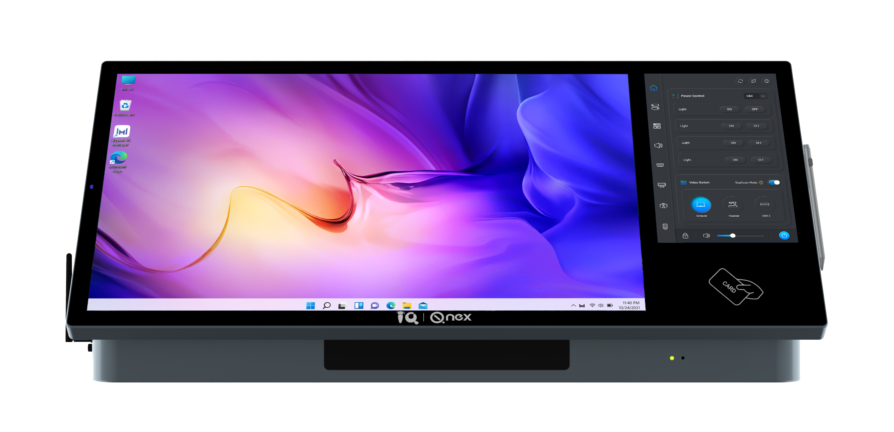
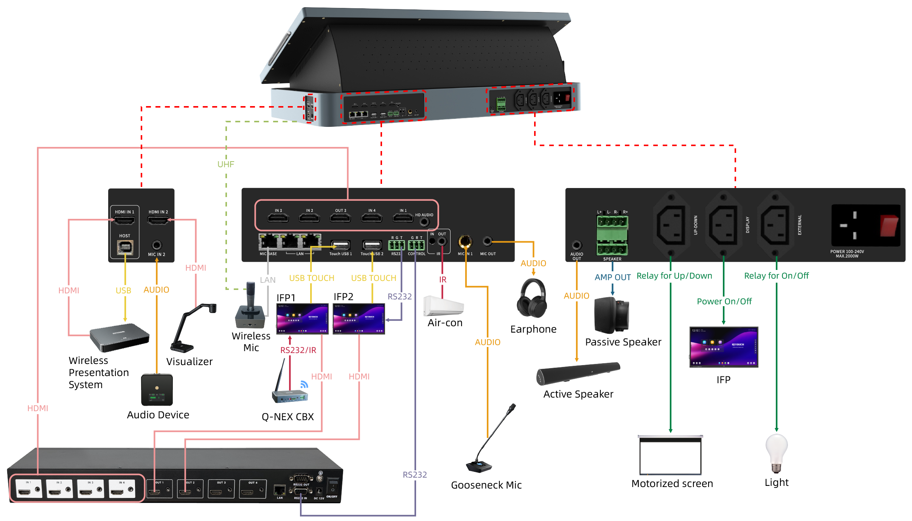
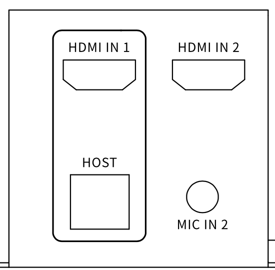
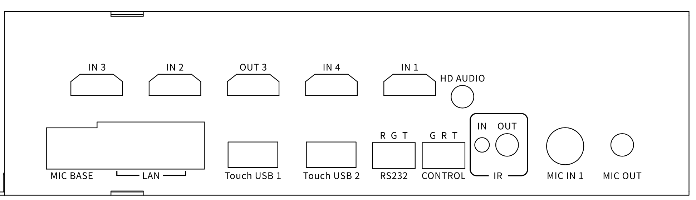

Q-NEX Desktop Digital Podium

 
NDP500 GEN2.1

 
—— User Manual ——

# 1. Introduction

NDP500是一款多功能讲台，专为各类专业和教育环境无缝集成而设计。本快速指南将概述设备结构、连接方式和关键接口，帮助用户完成初始设置并快速理解设备功能。

## 1.1 Device Connection Diagram

下图展示了NDP500与外部设备的典型连接方式，通过视觉化呈现输入/输出端口及其对应连接关系供参考：

# 2. Understanding the Podium

本章节全面解析NDP500的物理特性、核心功能及各接口用途。

## 2.1 Dimensions //等待诗雨

## 2.2 Overview for NDP500 //等待诗雨

## 2.3 Interface

本小节详细说明NDP500前/左/右/后视图的接口布局及功能：

### Front View  //等待诗雨

 

| No. | Interface                 | Description                                                  |
|-----|---------------------------|--------------------------------------------------------------|
| 1   | Display Indicator         | 状态指示灯： - 红色（无信号源） - 绿色（信号源就绪）  |
| 2   | Card Reader Area          | 刷卡认证区域，用于访问控制与登录                            |
| 3   | Hidden Antenna            | 双频天线： - UHF（无线麦克风） - 2.4G Wi-Fi（CBX）    |
| 4   | Mic Pairing Indicator     | 无线麦克风配对指示灯： - 闪烁（配对中） - 常亮（已配对） |
| 5   | IR Pairing Receiver       | 红外接收器，用于无线麦克风配对                              |
| 6   | Active Capacitive Stylus  | 主动式电容触控笔，可通过磁吸方式收纳于右侧槽位              |

### Left View

| No. | Interface    | Description                           |
|-----|--------------|----------------------------------------|
| 1   | OPS Slot *1  | 支持插入/取出符合欧规的OPS模块        |

### Right View

  

| No. | Interface          | Description                                                  |
|-----|--------------------|--------------------------------------------------------------|
| 1   | HDMI IN 1          | 连接笔记本电脑等设备，需配合USB HOST实现交互式触控           |
| 2   | USB-HOST           | USB-TYPE B 2.0接口，与HDMI IN 1配合实现反向触控功能          |
| 3   | HDMI IN 2          | 第三路视频输入源接口                                        |
| 4   | MIC IN-2 (3.5mm)   | 3.5mm音频输入接口，支持外接麦克风或音频设备                 |

### Rear View

 

 

| No. | Interface           | Description                                                  |
|-----|---------------------|--------------------------------------------------------------|
| 1   | IN 1                | 连接HDMI无缝矩阵切换器输入1（信号源来自HDMI IN 1）           |
| 2   | IN 2                | 连接HDMI无缝矩阵切换器输入2（支持文档相机/笔记本等信号源）   |
| 3   | IN 3                | 矩阵切换器输入3（信号源来自NDP500内置PC）                    |
| 4   | IN 4                | 矩阵切换器输入4（用于NDP500广播功能）                        |
| 5   | OUT 3               | 连接矩阵切换器输出3（控制交互式电子白板内容切换）            |
| 6   | MIC BASE (LAN)      | 预留接口                                                    |
| 7   | LAN (Ethernet) *2   | 千兆以太网口（非PoE供电）                                   |
| 10  | Touch USB 1         | 配合矩阵OUT 1实现双向触控（IFP/交互式显示屏等）              |
| 11  | Touch USB 2         | 配合矩阵OUT 2实现双向触控                                   |
| 12  | RS232               | 串行通信接口（针脚顺序R-G-T）                               |
| 13  | CONTROL             | 专用RS232接口（针脚顺序G-R-T），用于与矩阵切换器通信         |
| 14  | IR-IN               | 红外学习端口（用于接收设备控制代码）                        |
| 15  | IR-OUT              | 红外输出端口（控制投影仪/幕布等设备）                       |
| 16  | MIC IN 1            | 麦克风输入接口（支持多型号麦克风）                          |
| 17  | MIC OUT             | 麦克风音频输出接口                                         |
| 18  | AUDIO OUT           | 3.5mm音频输出接口                                         |
| 19  | SPEAKER *2          | 4针端子接口（支持双通道无源音箱），集成双40W功放（4-8Ω）    |
| 20  | UP-DOWN             | C13电源口（110~220V AC/300W），控制电动幕布升降/暂停        |
| 21  | DISPLAY             | C13电源口（110~220V AC/1200W），带延迟断电功能（显示设备）  |
| 22  | EXTERNAL            | C13电源口（110~220V AC/1200W），外接设备独立控制（不计入总功耗） |
| 23  | POWER               | C14电源输入口（110~220V AC/2000W），整机供电                |
| 24  | POWER SWITCH        | 总电源开关                                                 |