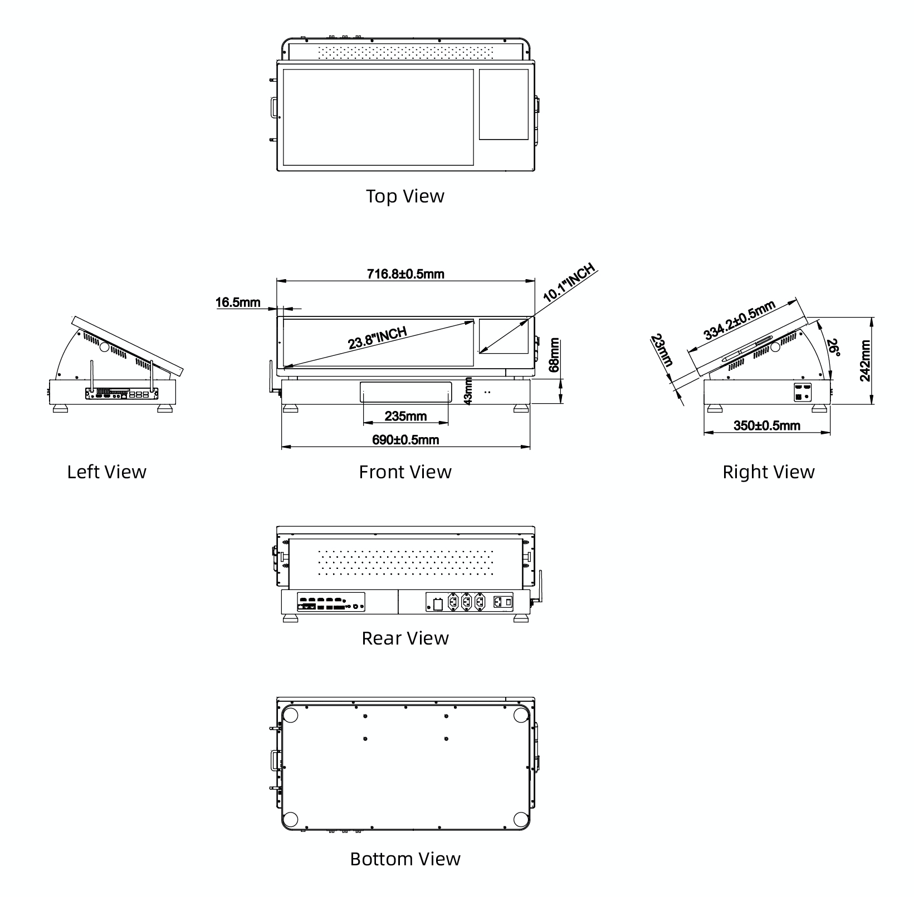
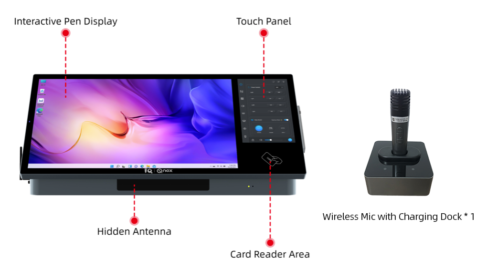
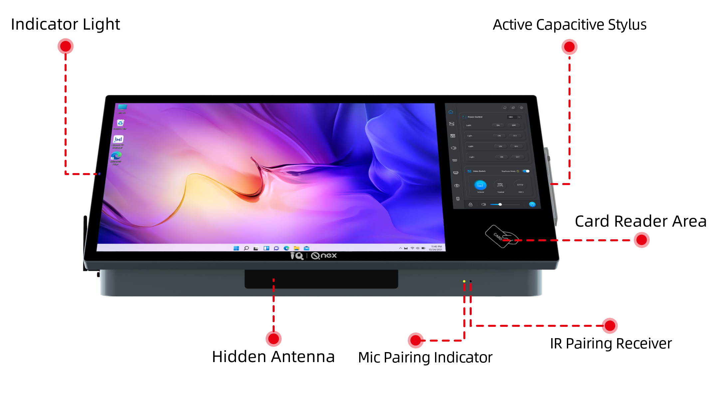
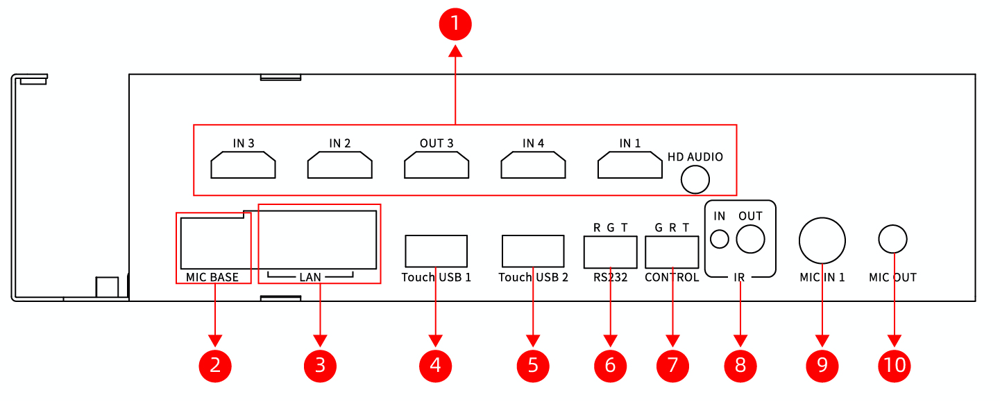
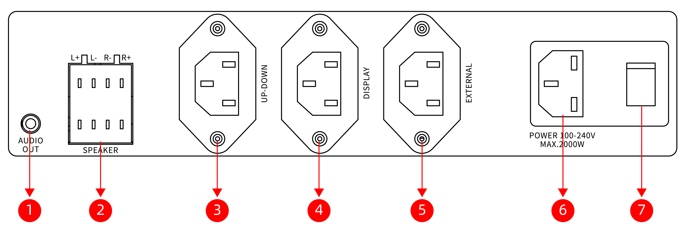
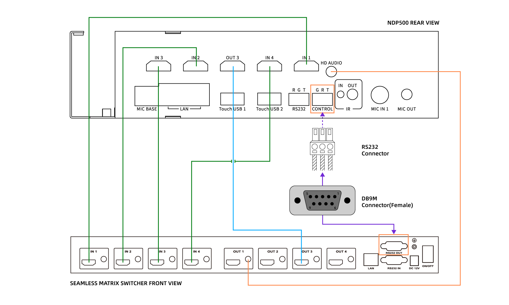

Q-NEX 桌面数字讲台

NDP500 GEN2.1

—— 快捷手册 ——

# 1. 产品概述 

NDP500 是一款多功能讲台，适用于各类专业及教育场景。本指南提供设备连接示意图与关键接口说明，便于用户快速建立系统认知。

## 1.1 设备连接示意图 

下图展示了NDP500与外部设备的典型连接方式，各输入/输出端口功能对应关系可参考此示意图进行理解。

# 2. 设备详解

本章详细说明NDP500的物理参数、功能特性及各接口定义。

## 2.1 尺寸规格 

## 2.2 整体布局

## 2.3 接口定义

### 前视图 

| 序号 | 接口             | 功能说明                                                     |
| ---- | ---------------- | ------------------------------------------------------------ |
| 1    | 显示屏状态指示灯 | 双色指示： - 红色（无信号输入） - 绿色（信号正常）     |
| 2    | 刷卡感应区       | 支持IC卡身份认证与设备登录                                   |
| 3    | 隐藏式天线       | UHF频段（无线麦克风接收） 2.4G Wi-Fi（CBX通信）           |
| 4    | 麦克风配对指示灯 | 无线麦克风接收状态： - 闪烁（配对中） - 常亮（已连接） |
| 5    | 红外配对接收器   | 无线麦克风红外配对接口                                       |
| 6    | 主动式电容触控笔 | 支持磁吸式收纳（右侧插槽）                                   |

### 左视图

| 序号 | 接口       | 功能说明              |
| ---- | ---------- | --------------------- |
| 1    | OPS插槽 ×1 | 支持欧标OPS模块热插拔 |

### 右视图

| 序号 | 接口             | 功能说明                                               |
| ---- | ---------------- | ------------------------------------------------------ |
| 1    | HDMI输入1        | 外接设备（如笔记本） 需配合USB HOST实现触控回传功能 |
| 2    | USB-HOST         | TYPE B 2.0接口 与HDMI输入1配合使用                  |
| 3    | HDMI输入2        | 第三路信号输入源                                       |
| 4    | 音频输入2(3.5mm) | 外接麦克风/音频设备接口                                |

### 后视图

**左侧区域**

| 序号 | 接口            | 技术参数                                                     |
| ---- | --------------- | ------------------------------------------------------------ |
| 1    | HDMI矩阵组      | 输入×4 / 输出×1 / 音频输出×1 详见[2.4 矩阵系统接线规范](#2.4-矩阵系统接线规范) |
| 2    | 麦克风基座(LAN) | 预留接口                                                     |
| 3    | 千兆网口×2      | 10/100/1000M自适应（非PoE供电）                              |
| 4    | 触控USB1        | 对应矩阵输出1的触控回传通道                                  |
| 5    | 触控USB2        | 对应矩阵输出2的触控回传通道                                  |
| 6    | RS232           | 串行通信接口（引脚顺序：R-G-T）                              |
| 7    | 矩阵控制端口    | 专用通信接口（引脚顺序：G-R-T）                              |
| 8    | 红外控制端口    | IR-IN：红外学习功能 IR-OUT：设备控制输出                  |
| 9    | 麦克风输入1     | 支持多种麦克风型号接入                                       |
| 10   | 麦克风输出      | 音频信号输出接口                                             |

**右侧区域**

| 序号 | 接口            | 电气参数                                                     |
| ---- | --------------- | ------------------------------------------------------------ |
| 1    | 音频输出(3.5mm) | 线路电平输出                                                 |
| 2    | 扬声器端子×2    | 4pin端子座 双通道功放（40W×2，4-8Ω负载）                  |
| 3    | 升降控制插座    | C13接口（AC 110~220V/300W） 控制投影幕/电动窗帘等升降设备 |
| 4    | 显示设备插座    | C13接口（AC 110~220V/1200W） 支持延迟断电功能             |
| 5    | 扩展设备插座    | C13接口（AC 110~220V/1200W） 独立供电不计入总功率         |
| 6    | 电源输入        | C14接口（AC 110~220V/2000W） 整机供电包含显示屏及OPS模块  |
| 7    | 电源总开关      | 设备主电源控制                                               |

## 2.4 矩阵系统接线规范

NDP500与无缝矩阵切换器的系统接线示意图如下：

接线对应关系如下表：

| **NDP500端**    | **矩阵切换器端** | **信号定义**                      |
| --------------- | ---------------- | --------------------------------- |
| IN1             | IN1              | 接入HDMI输入1信号源（如笔记本）   |
| IN2             | IN2              | 接入HDMI输入2信号源（如实物展台） |
| IN3             | IN3              | 内置PC信号输入                    |
| IN4             | IN4              | 广播功能专用通道                  |
| OUT3            | OUT3             | 交互式数位屏显示通道              |
| HD AUDIO        | OUT1-AUDIO       | 模拟音频信号输出                  |
| CONTROL (G R T) | RS232 OUT        | 专用通信接口（引脚顺序：G-R-T）   |