
Q-NEX Desktop Digital Podium

 
NDP500

 
—— User Manual ——

 

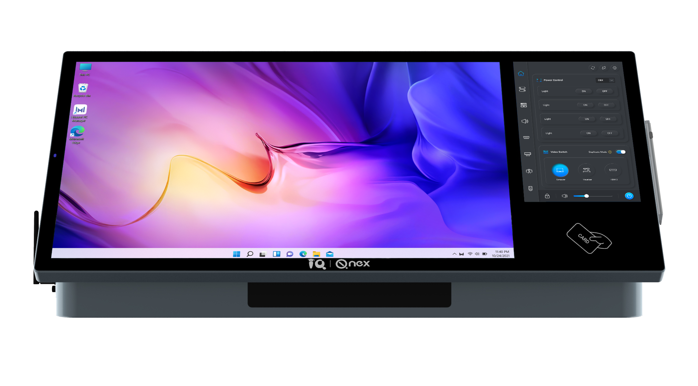

Returnstar Interactive Technology Group Co., Ltd.

<!-- break -->

[toc]

# Safety Instructions

To ensure the safe and effective operation of this equipment, please read the following instructions carefully. Failure to comply with these guidelines may result in serious injury or damage to the device.

## 1. General Safety Instructions

- **Power Source**: To safely disconnect the equipment from power,  remove the power cord from the unit or the power source. The power plug serves as the disconnect device and should remain easily accessible.
- **No User-Serviceable Parts**: There are no user-serviceable parts inside this equipment. Do not open the device. All servicing should be performed by qualified personnel. Removing the cover may expose you to dangerous voltages and will void the warranty.
- **Ventilation**: Ensure proper ventilation to avoid overheating. Do not block any ventilation openings. Install the equipment in accordance with the manufacturer's instructions. Avoid placing the device in a confined space without sufficient airflow.

## 2. Placement

- **Stable Surface**: Place the equipment on a stable surface to prevent it from tipping over. Avoid placing it on an unstable cart, stand, tripod, or table.
- **Heat Sources**: Keep the equipment away from direct sunlight, radiators, heat registers, stoves, or other heat-producing devices.
- **Water and Moisture**: Do not expose the equipment to rain, moisture, or any type of liquid. Avoid placing liquid-filled objects, such as vases, on or near the equipment.
- **Magnetic Fields**: Keep the device away from strong magnetic fields that could interfere with its operation.

## 3. Power Supply

- **Voltage Compatibility**: Ensure the operating voltage of the equipment matches the local power supply. Using incorrect voltage may damage the device and void the warranty.
- **Storm Precautions**: During thunderstorms or when the equipment is not in use for an extended period, unplug the power cord and any connected cables to protect the device from power surges.
- **Power Cord Care**: Handle the power cord with care. Avoid pinching, bending, or placing heavy objects on it. Only use the power cord provided with the equipment, and do not modify or extend it.
- **Grounding**: Ensure that the power outlet used is properly grounded to prevent electric shock.
- **Power Outages**: Sudden power failures may damage the equipment. If a power outage occurs, turn off the device and unplug the power cord to protect it from potential damage.

## 4. LCD Screen Care

- **Cleaning**: Unplug the power cord before cleaning the screen. Use a soft, dry, lint-free cloth to clean the display. Avoid using water, spray cleaners, or abrasive materials that could scratch or damage the screen.
- **Pressure Avoidance**: Do not apply excessive pressure to the LCD screen. Interact with the touchscreen using the provided stylus or a soft, non-abrasive object.
- **Image Retention Prevention**: To prevent image retention or screen burn-in, avoid displaying static images on the LCD screen for extended periods. Use a screen saver or regularly change the displayed content.

# 1. Introduction

This guide provides essential information to set up and use the NDP500 digital podium, a network-based solution designed for modern classrooms and presentations. 

## 1.1 Device Connection Diagram

## 1.2 Terminology

| Term                                                 | Descriptions                                                 |
| ---------------------------------------------------- | ------------------------------------------------------------ |
| Touch Panel                                          | The Touch Panel serves as the primary controlling interface, providing intuitive touch-based controls for operation of the NDP. |
| [Web-console](https://mg.qnextech.com/console/)      | Web-console is a web-based platform for remote device management of NDP, constituting a part of NDP. This platform enables operations similar to the Touch Panel for individual devices and also allows simultaneous operations on multiple NDPs. Additionally, it provides functions such as scheduling device controls, broadcasting, and live streaming. |
| Q-NEX App                                            | A mobile application for controlling Q-NEX systems           |
| [Dashboard](https://mg.qnextech.com/dashboard/index) | The Dashboard is the backend management system of the Q-NEX platform, constituting a part of NDP. Basic configurations such as [IP lookup](#3.4 NDP500 Initial Setup) for the Touch Panel during the initial stage, or login information for Web-Console and Q-NEX App, as well as operations related to learning and utilizing the [infrared code library](#4.3.2 IR Control) mentioned in this document, all rely on the support of the Dashboard system. |
| Device Connection Diagram                            | Illustrates the physical connections and layout between devices, emphasizing direct connections and interface relationships. Helps understand specific device connections, including ports, cables, and physical details of the connections. |
| Topology Diagram                                     | Depicts the overall architectures and logical relationships between devices. Emphasizes the roles and positions of devices within the network, as well as data flow and transmission paths. Helps understand the structure and operation of the network. |

# 2. Understanding the Podium

## 2.1 Dimensions

 

## 2.2 Overview of NDP500

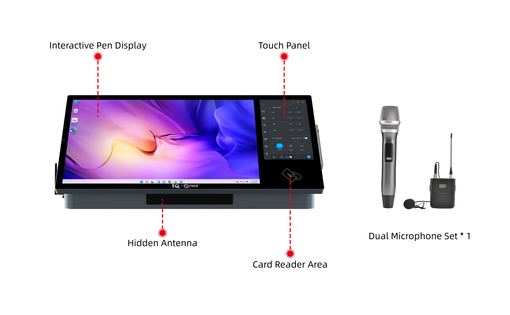 

| **Component**               | **Description**                                              |
| --------------------------- | ------------------------------------------------------------ |
| **Interactive Pen Display** | A high-resolution display that allows for interactive pen input, enhancing the presentation and teaching experience. |
| **Touch Panel**             | A responsive touch interface for controlling various functions of the NDP500, including navigation and input selection. |
| **Hidden Antenna**          | An integrated antenna within the NDP500 for wireless communication, ensuring a clean design without external protrusions. |
| **Card Reader Area**        | A designated area for card reading, supporting secure login and authentication methods. |
| **Dual Microphone Set**     | A wireless microphone system included with the NDP500, providing clear audio input for presentations and lectures. |

### 2.2.1 Handheld Microphone

 

| No.  | Description  |
| ---- | ------------ |
| 1    | LCD Screen   |
| 2    | Power Button |

**Handheld Microphone Usage:**

- Press the power button to turn on the microphone; long press to turn off.
- Press **once** to switch channels; press **three** times quickly to enter pairing mode, , and press **once more** to exit pairing mode.

**Paring Instructions**:

Please note that the microphones are pre-configured before shipping. Unless necessary, there is no need to repair them.

1. Bring the handheld microphone close to NDP500 for pairing. Ensure the microphone is horizontally aligned with the NDP500's hidden antenna, as the transmitter is located in the middle of the microphone. Monitor the microphone's display to confirm successful pairing.

   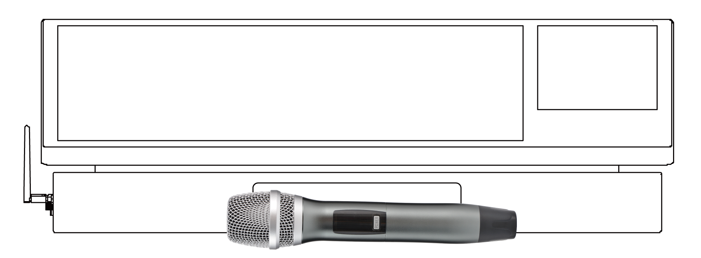 

    

   **Note** :

   Avoid vertical alignment of the microphone with the NDP500's hidden antenna during pairing, as this may cause the pairing to fail.

2. Before paring, turn the NDP main power off by tapping the power button on the Touch Panel.

    

3. Press the power button **three** times quickly to enter pairing mode.

4. Immediately power on NDP using the Touch Panel, then the microphone will automatically pair with NDP (the NDP has a built-in receiver).

5. Successful pairing indicated by solid green MIC 1 light on MMP.

**Note**:

- Ensure NDP main power is off before starting pairing.
- To ensure successful pairing, bring the microphone close to the NDP's antenna during the pairing process. 

### 2.2.2 Lapel Microphone

 

| No.  | Description           |
| ---- | --------------------- |
| 1    | Lapel Mic Port        |
| 2    | Power Switch (Slider) |
| 3    | Antenna               |
| 4    | LCD screen            |
| 5    | Volume Adjust         |
| 6    | Channel Button        |

**Usage Instructions:**

- Slide the power button to the left to turn on the power, and slide it to the right to turn off the power.
- Channel Button: Press **once** to switch channels; press **three** times quickly to enter the pairing mode, and press **once more** to exit pairing mode.

**Pairing Instructions:**

Please note that the microphones are pre-configured before shipping. Unless necessary, there is no need to re-pair them.

1. Before paring, turn the NDP main power off by tapping the power button on the Touch Panel.

2. With the lavalier microphone powered on, quickly press the paring button **three** times to enter pairing mode.

3. Immediately proceed to power on the NDP main power via the Touch Panel, then the lavalier microphone will automatically pair with the NDP (the NDP has a built-in receiver)

4. Upon successful paring, the MIC 2 indicator light on the front of the NDP will remain solid (green).

**Note** :

- Ensure NDP main power is off before starting pairing.
- To ensure successful pairing, bring the microphone close to the NDP's antenna during the pairing process. 

## 2.3 Device Connection Diagram 

## 2.4 NDP500 Interface Introduction 

### 2.4.1 Front View 

 

| No.  | Interface        | Description                                                  |
| ---- | ---------------- | ------------------------------------------------------------ |
| 1    | Indicator Light  | Display the operational status of the NDP500. The indicator has two states: - Red (No signal source) - Green (Signal source present) |
| 2    | Card Reader Area | Allows users to authenticate using a swipe card for access control and logging in. |
| 3    | Hidden Antenna   | UHF for wireless microphones 2.4G Wi-Fi for CBX         |

### 2.4.2 Left View

| No.  | Interface    | Description                                                  |
| ---- | ------------ | ------------------------------------------------------------ |
| 1    | OPS Slot * 1 | Supports the insertion and removal of Euro-standard OPS (Open Pluggable Specification) modules. |

### 2.4.3 Right View

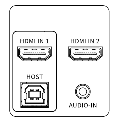  

| No.  | Interface        | Description                                                  |
| ---- | ---------------- | ------------------------------------------------------------ |
| 1    | HDMI IN 1        | Connects to devices such as laptops. For Interactive Pen Display and IFP reverse touch control, USB HOST connection is also required. |
| 2    | USB-HOST         | USB-TYPE B 2.0. Paired with HDMI IN 1 to enable reverse touch control and other interactive functions. |
| 3    | HDMI IN 2        | Acts as the third input source for the NDP500.               |
| 4    | AUDIO-IN (3.5mm) | Line-in interface for connecting external audio devices.     |

### 2.4.5 Rear View

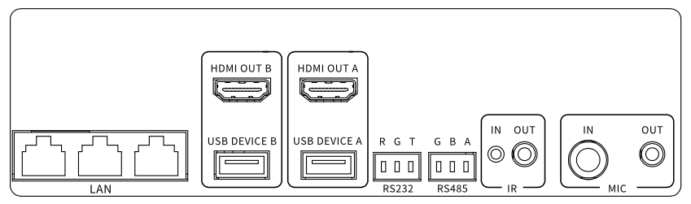 

 

| No.  | Interface    | Description                                                  |
| ---- | ------------ | ------------------------------------------------------------ |
| 1    | LAN * 3      | 10M / 100M RJ45 ports for network connectivity. Does not support PoE. Can be used for connecting external devices like laptops. One port must be connected to a router to assign an IP address to the NDP500. |
| 2    | HDMI OUT B   | Serves as an output source for the NDP500. Can be connected to classroom IFPs or other display devices. For interactive touch functionality on IFPs, it must be paired with USB DEVICE B. |
| 3    | USB DEVICE B | USB Type A 2.0 port for touch control of external display devices. Works with HDMI OUT B as an output pair. |
| 4    | HDMI OUT A   | Serves as an output source for the NDP500. Can be connected to classroom IFPs or other large display devices. For interactive touch functionality on IFPs, it must be paired with USB DEVICE A  Special feature:  1. The display on the NDP500 (Interactive Pen Display) is always synchronized with HDMI OUT A (firmware-level binding)  2. Can separate digital audio signal for IFPs with built-in speakers. |
| 5    | USB DEVICE A | USB Type A 2.0 port for touch control of external display devices. Works with HDMI OUT A as an output pair. |
| 6    | RS232        | 3-pin (R, G, T) for controlling devices like PTZ cameras, IFPs, and recording cameras. |
| 7    | RS485        | 3-pin (G, B, A) for controlling devices with RS485 interface, such as PTZ cameras. |
| 8    | IR IN        | Infrared learning port for capturing IR control codes from devices like air conditioners and TVs. |
| 9    | IR OUT       | Infrared control port for sending IR signals to control devices like air conditioners and TVs. |
| 10   | MIC IN       | 6.35mm port for connecting a wired microphone for clear audio reinforcement during instruction or conferences. |
| 11   | MIC OUT      | 3.5mm port for mixing audio from both the microphone input and wireless microphones for combined output. |
| 12   | AUDIO OUT    | 3.5mm port for audio output to speakers or amplifiers.       |
| 13   | SPEAKER * 2  | Terminal block with 4-pin for connecting two pairs of passive speakers. Integrated dual-channel amplifier, with 40W and 4-8Ω load per channel. |
| 14   | UP-DOWN      | C13 outlet offering up, pause, and down functions for connected devices like projector screens and motorized curtains.  (110~220V AC, 300W) |
| 15   | DISPLAY      | C13 outlet used for power control of connected display devices like IFPs and projectors, supporting delayed power off. (110~220V AC, 1200W) |
| 16   | EXTERNAL     | C13 outlet, acts as a switch for controlling external devices such as lighting. Can be directly connected to NDP500-External or integrated with an SPDT switch. (110~220V AC, 1200W, This power does not count towards Digital's total power consumption) |
| 17   | POWER        | C14 inlet for powering the entire NDP500 unit, including the 23.8-inch display, 10.1-inch control screen, and internal OPS. (110~220V AC, 2000W) |
| 20   | POWER SWITCH | Switch for powering the NDP500 unit on and off.              |

# 3. Preparation

## 3.1 C14 Plug Installation Guide

 **Caution: Electrical Installation Requires Qualified Personnel**

**The installation and wiring of components such as "DISPLAY", "UP-DWON", and "EXTERNAL" interfaces involve working with high-voltage systems. To ensure safety and compliance with industry standards, these tasks must only be performed by licensed electricians or qualified technical personnel.** 

### 3.1.1 Understanding NDP500 Power Control Interfaces

The NDP500 is equipped with several power interfaces that require proper wiring, including the **POWER**, **DISPLAY**, **UP-DOWN**, and **EXTERNAL** interfaces.

While the **POWER** interface is pre-configured before shipment, the other three interfaces need to be wired on-site according to the specific layout and requirements of your installation environment.

| No.  | Interface Name | Interface Type | Function                                                     |
| ---- | -------------- | -------------- | ------------------------------------------------------------ |
| 1.   | POWER          | C14 Inlet      | Used to power the entire NDP500 unit, requires a C13 connector cable ( pre-configured before shipment). |
| 2.   | UP-DOWN        | C13 Outlet     | Provides power to external devices, such as motorized projection screens. |
| 3.   | DISPLAY        | C13 Outlet     | Provides power to connected display devices, such as IFPs or projectors. |
| 4.   | EXTERNAL       | C13 Outlet     | Provides power to external devices, such as lighting systems or other peripherals. |

 

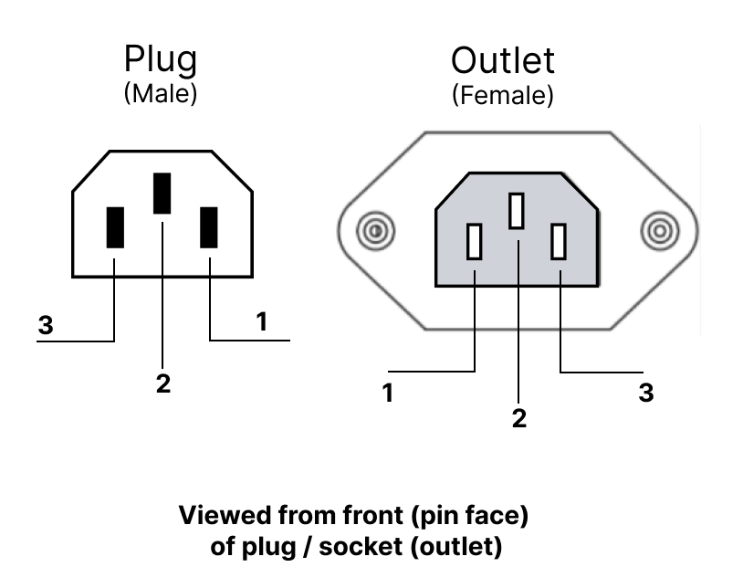 

While the C14 plug features three pins, their use varies depending on the specific interface type. 

For example, in the DISPLAY port, the pins follow the standard neutral, live, and ground configuration. However, in other interfaces like EXTERNAL or UP-DOWN, the pin assignments differ. Refer to the specific sections for detailed wiring instructions based on the interface type.

### 3.1.2 Installation Guide

- Refer to the video at [4:35](https://www.youtube.com/watch?v=kHRZHC7xY_I&t=275s) for instructions on making a C14 cable and connecting it to the External, Display, and Up-Down ports.

Follow the steps below to correctly install these connectors:

**Note**:

This section outlines the general procedure for handling C14 plugs. However, when installing specific NDP500 interfaces, the wiring requirement for each interface may vary.

Please refer to the relevant sections for details on the correct connections for neutral, live, and ground wires for each specific interface.

| Step | Screenshot                                       | Instructions                                                 |
| ---- | ------------------------------------------------ | ------------------------------------------------------------ |
| S1   | 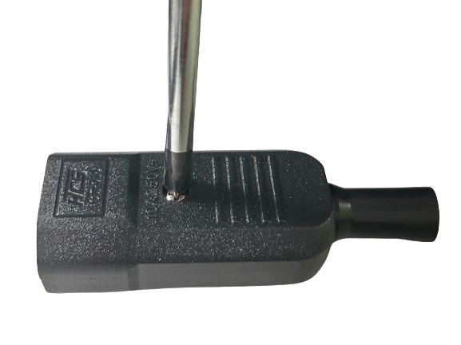 | Remove the outer casing of the C14 connector to expose the internal wiring points. |
| S2   | 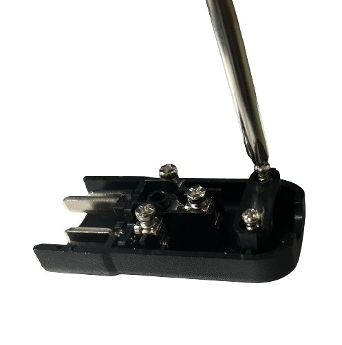 | Open the internal wire clamps by unscrewing them, preparing to insert the wires |
| S3   | 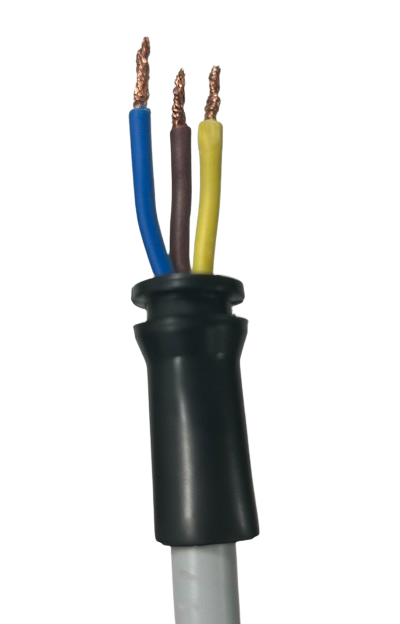 | Strip the outer insulation of the power cable, revealing the internal wires (blue, brown, and yellow/green). Make sure to use the strain relief bushing provided with the C14 connector to secure the cable and prevent it from being pulled out. |
| S4   | 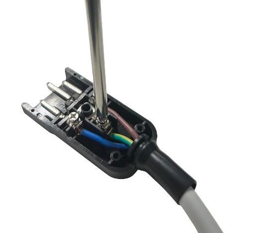 | Insert the stripped wires into the corresponding clamps inside the C14 connector and securely tighten the screws to hold the wires in place. |
| S5   | 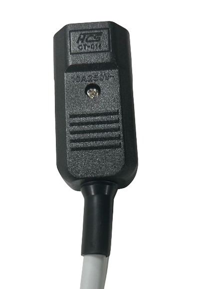 | Reassemble the outer casing of the C14 connector, ensuring that all parts are securely fastened and the wiring is properly enclosed. |

## 3.2 Terminal Block Installation Guide
The NDP500 features several terminal block interfaces that also require proper wiring, these include interfaces for RS232, PANEL, SPEAKER, and LOCK.

These terminal block connections need to be configured on-site, tailored to the specific size and requirements of the installation environment. 

Follow these steps to install the terminal blocks:

| Step | Screenshot                                                   | Instructions                                                |
| ---- | ------------------------------------------------------------ | ----------------------------------------------------------- |
| S1   |  | Turn the screwdriver counter-clockwise to loosen the screw. |
| S2   |  | Insert the bare wire into the hole of the terminal block    |
| S3   |  | Turn the screwdriver clockwise to tighten the screw.        |

## 3.3 Connecting IFPs to NDP500

 

Ensure that both your USB and HDMI cables are of sufficient length. Following the diagram provided:

1. **HDMI Connection**:
   - Connect one end of the HDMI cable to the NDP500's HDMI OUT port.
   - Connect the other end to the HDMI port of the IFP.
2. **USB Connection**:
   - To enable the touch functionality, also connect the USB cable from the NDP500 to the IFP.

## 3.4 NDP500 Initial Setup

- Refer to the [installation guide video](https://www.youtube.com/watch?v=kHRZHC7xY_I&t=0s) for instructions on powering on the NDP500, binding it to the Q-NEX Console, and accessing the network.

To ensure a smooth initial setup, follow these steps to power on the NDP500, connect it to the network, and establish control via the Q-NEX Console.

1. Power on the NDP500. A "beep" sound indicates that the machine has successfully started.

2. Connect the NDP500 to a router using an Ethernet cable. This ensures that the NDP500 acquires an IP address.

   **Note**: 

   If your location has network restrictions, contact your network administrator for assistance with this step. Refer to the "[Appendix - Network Environment Requirement](#5.1 Network Environment Requirement)" section for specific network requirements for the NDP500.

3. Retrieve the NDP IP address by logging into the [Dashboard](https://mg.qnextech.com/dashboard/index) and visiting the  '***Devices >> Processor Manage***' page. Identify your NDP500 and note the IP address from the 'IP Address' column.

   Enter this IP on the Touch Panel and click 'Connect'." to establish a connection with the NDP500.

   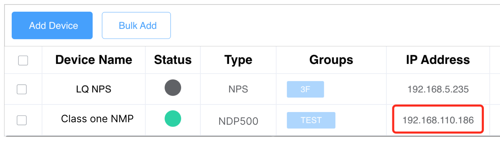 

4. Input the NDP IP address on the Touch Panel. Click the "Connect" button to connect NDP by Touch Panel.

   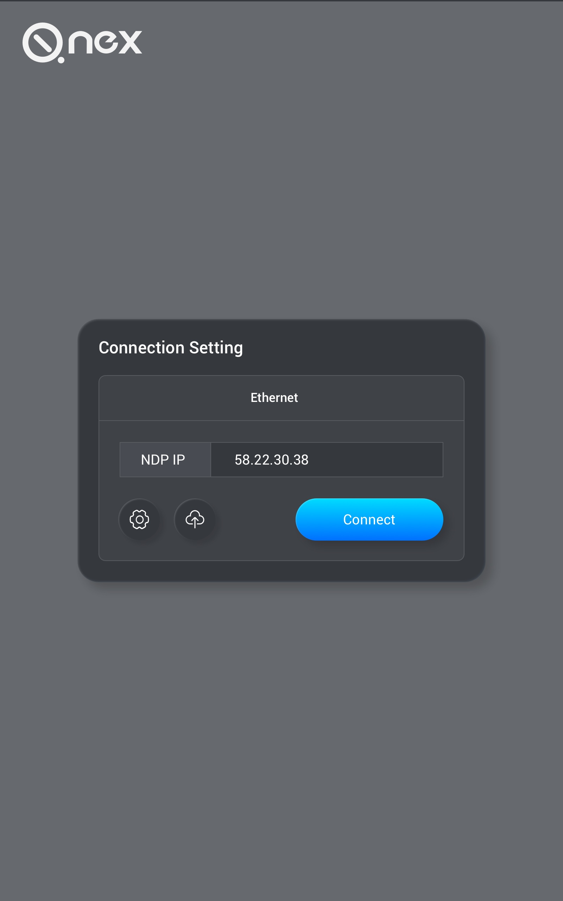 

   **Note**: 

   1. If connection issues arise, use the router device or NDP config Tool.exe to identify the correct IP address, particularly in situations where DHCP changes may not be immediately reflected in the web-based backend.
   2. For consistent access, consider using the Q-NEX Config tool to set a static IP for the NDP500, preventing IP changes post-reboot or network alterations.

## 3.5 NDP500 Input Source Connection

### 3.5.1 Built-in OPS 

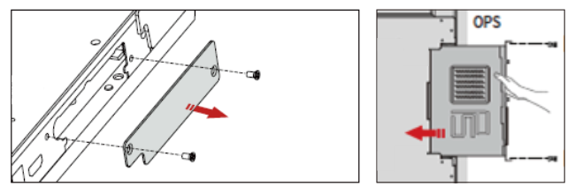 

The NDP500 allows for one built-in OPS (Open Pluggable Specification) module, which serves as one of the three input sources. The OPS module comes with built-in touch functionality.

**Note**: 

Please note that while the OPS is one of the input sources for the NDP500, if you want the OPS to have network access, you should connect it separately via a wireless network or by running an Ethernet cable directly from a router or switch to the OPS. 

### 3.5.2 External Input Source Configuration

- Refer to the [video at 1:08](https://www.youtube.com/watch?v=kHRZHC7xY_I&t=68s) for guidance on connecting HDMI inputs and configuring the NDP500 matrix switch function.

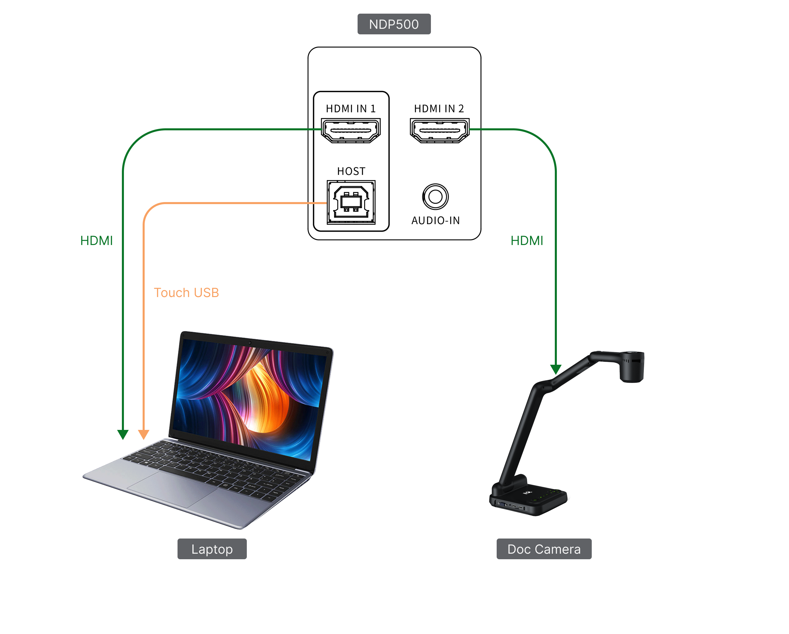 

1. **Laptop Connection**:

   Connect the laptop to the NDP500 using the **HDMI IN 1** port and the **HOTS** (USB) port. This configuration is necessary to ensure proper functionality during the upcoming 2x2 Matrix Touch Control testing.

2. **Document Camera Connection**

   Connect the document camera to the NDP500 using the **HDMI IN 2** port. This will serve as a supplemental input source and does not require touch functionality.

# 4. Wiring and Setup

This section outlines the key steps for wiring and configuring the NDP500 system. It covers AV control, audio setup, device management, and broadcasting connections. Follow these instructions to ensure all components are properly connected and ready for use.

## 4.1 AV Control 

- Refer to the video at [1:08](https://www.youtube.com/watch?v=kHRZHC7xY_I&t=68s) for instructions on connecting HDMI inputs and configuring the NDP500 matrix switch function. 

### 4.1.1 Video Matrix Switch

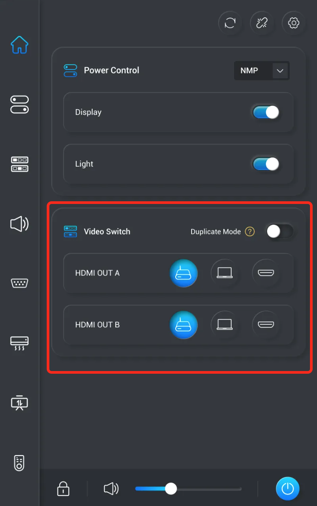 

The NDP500's Video Matrix Switch allows the routing of video signals to multiple displays, such as interactive flat panels. 

It supports switching between input sources, ensuring the correct content is shown on the desired screens. 

Users can manage outputs via the Touch Panel, Web-Console, and Q-NEX APP, including enabling duplicate mode for simultaneous display on both screens.

You can find the Video Switch module on the Touch Panel. Exit the "Duplicate Mode," then proceed with matrix switching.

### 4.1.2 Synchronization of primary screen

This feature ensures that the NDP500's Primary Screen (HDMI OUT A) displays the same content as the Interactive Pen Display, crucial for delivering a cohesive visual experience across the Interactive Pen Display screen and IFP.

### 4.1.3 2x2 Matrix Touch Control

2x2 Matrix Touch Control allows the teacher to interact with OPS and Laptop content on the Interactive Pen Display, as well as on two large IFP screens. 

## 4.2 Audio Control

- Refer to the video at [3:04](https://www.youtube.com/watch?v=kHRZHC7xY_I&t=184s) for instructions on connecting audio cables, including Audio In, Audio Out, Mic In, and Speaker ports. 

### 4.2.1 SPEAKER

The diagram illustrates the audio signal topology for the NDP500, specifically focusing on the SPEAKER output.

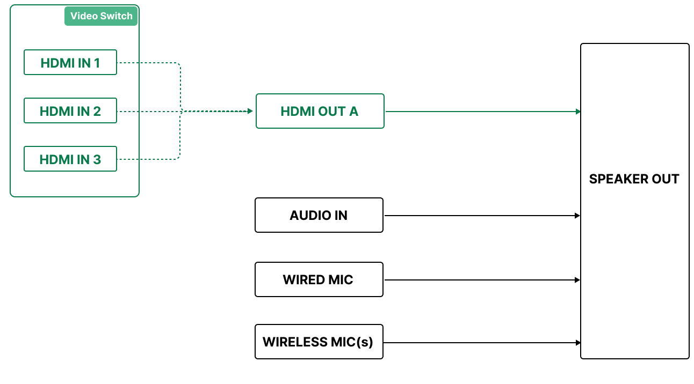 

**Line Type Representation: **

| Lines                                                        | Descriptions                                                 |
| ------------------------------------------------------------ | ------------------------------------------------------------ |
|  | **Arrow Direction**: indicates the direction of audio signal flow through the connections. |
|  | **Solid line**: indicates the ability to output multiple audio signal simultaneously. |
|  | **Dashed line**: only ONE audio source can be input to the speaker at a time. |

**Key Points:**

1. **HDMI IN 1, 2, 3**: Only one input source can output audio to the speaker at a time, controlled via a software platform like the Touch Panel's matrix switching.
2. **HDMI OUT A**: Has the capability to convert digital signals into analog output.
3. **Other Inputs** (Audio IN, Wired MIC, Wireless MIC): These inputs can simultaneously output audio to the SPEAKER OUT.

### 4.2.2 Audio

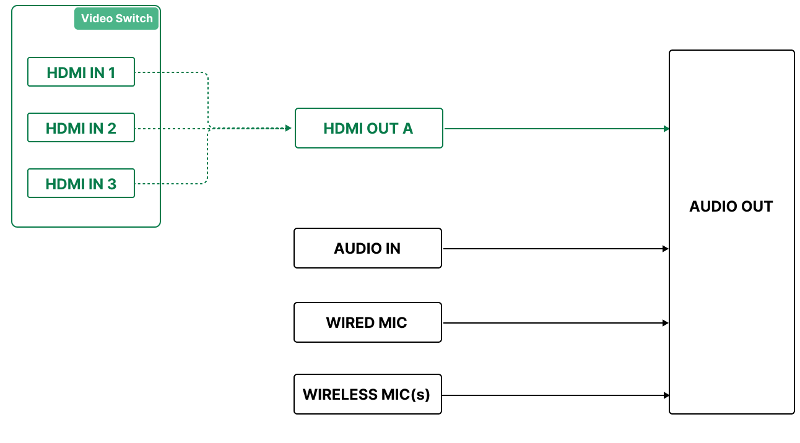 

**Line Type Representation: **

| Lines                                                        | Descriptions                                                 |
| ------------------------------------------------------------ | ------------------------------------------------------------ |
|  | **Arrow Direction**: indicates the direction of audio signal flow through the connections. |
|  | **Solid line**: indicates the ability to output multiple audio signal simultaneously. |
|  | **Dashed line**: only ONE audio source can be input to the speaker at a time. |

The **AUDIO OUT** port functions similarly to the **SPEAKER OUT** port, with both handling audio signals from various sources. 

## 4.3 Device Control

### 4.3.1 Power control

This section governs the power management and operational control of connected devices through interfaces like Display, Up-Down, and External connectors. Users can regulate power distribution and device states by NDP500.

- Refer to the video at [4:35](https://www.youtube.com/watch?v=kHRZHC7xY_I&t=275s) for instructions on making a C14 cable and connecting it to the External, Display, and Up-Down ports.
- Follow the steps outlined in section "[3.1 C14 Plug Installation Guide](#3.1 C14 Plug Installation Guide)" to properly install the C14 power connector.

**Power Specifications**: 

1. NDP500 maximum power: 2000W.
2. DISPALY port maximum power: 1200W.
3. UP-DOWN port maximum power: 300W 
4. EXTERNAL port maximum power: 1200W. (Acts as a switch, the power does not count towards NDP500's total power consumption)

 **Caution: Electrical Installation Requires Qualified Personnel**

**The installation and wiring of components such as "DISPLAY", "UP-DWON", and "EXTERNAL" interfaces involve working with high-voltage systems. To ensure safety and compliance with industry standards, these tasks must only be performed by licensed electricians or qualified technical personnel.** 

**Warning: Power Off During Wiring**

To ensure safety during wiring, make sure the NDP500 is completely powered off, and the power plug is disconnected from the outlet. Only after completing the wiring tasks for the DISPLAY, UP-DOWN, and EXTERNAL interfaces, should you reconnect the power and proceed with testing.

#### 1. DISPLAY

The DISPLAY interface serves to provide power to display devices such as IFPs and projectors. Additionally, it facilitates controlled shutdown procedures (with RS232 port) for these devices to mitigate the risk of damage caused by sudden power loss.

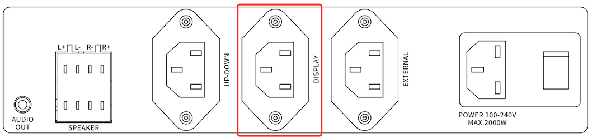 

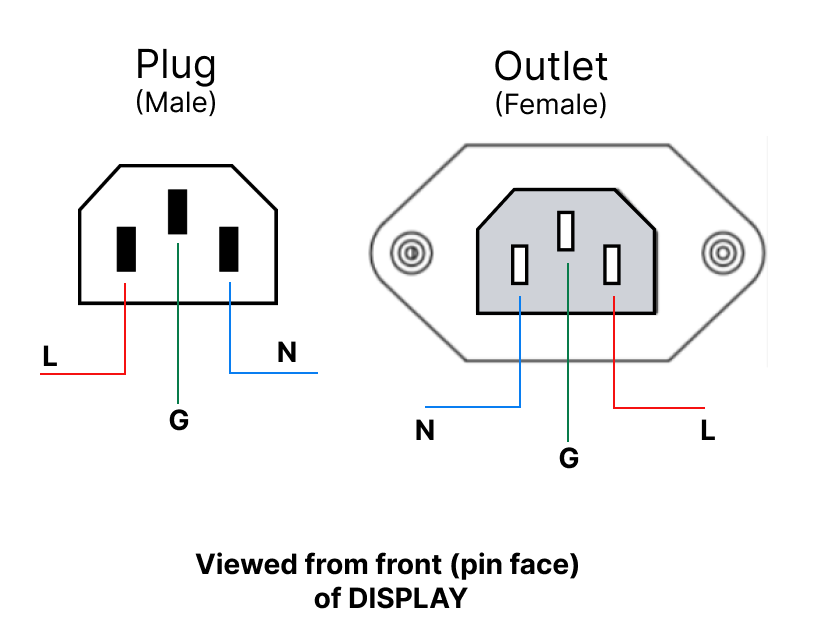 

The diagram above illustrates the correct wiring for the NDP500's DISPLAY interfaces. It is crucial to connect the neutral (N), live (L), and ground (G) wires correctly to ensure safe operation.

**Connection Steps:**

1. Replace the device plug with the C14 connector. Refer to [3.1 C14 Connector Installation Guide](#3.1 C14 Connector Installation Guide) for C14 connector installation instructions.
2. Connect the C14 connector to the DISPLAY port of the NDP500.
3. Devices can still be powered on of off by solely connecting to the DISPLAY port.

Note:

For devices requiring controlled shutdown and delayed power-off settings (For example: IFP, projector), connect them to the NDP500's RS232 port. This ensures that devices receive proper shutdown instructions before power is cut off, and allows for adequate cooling before shutting down completely.

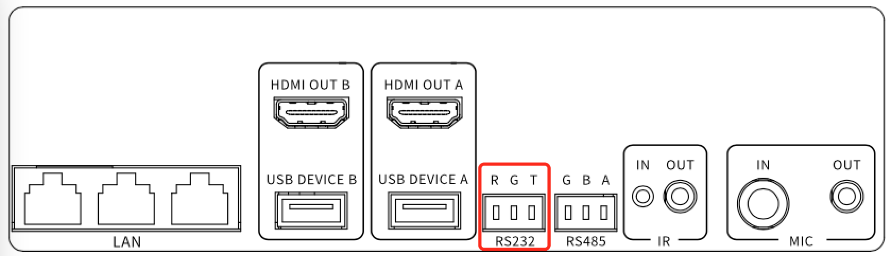 

To configure the power settings, log in to the Dashboard and navigate to "***Device >> Processor Manager.***" Select the appropriate device and click "Edit." In the edit page, scroll down to find the "Power Settings" tab. 

In the "**\* Power off delay**" field, enter a value in seconds as shown in the example image: 

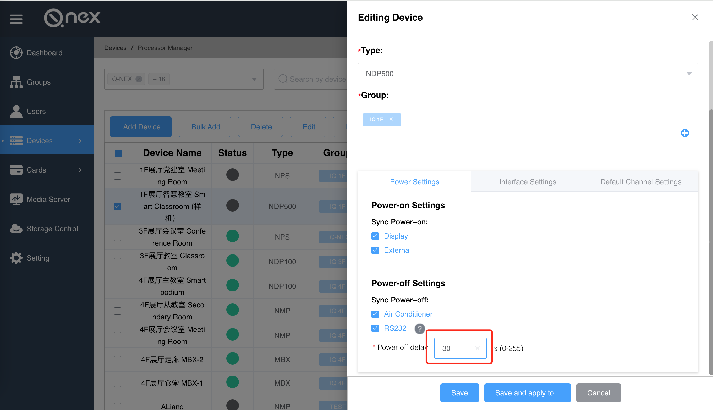 

After completing the wiring, you can use the Q-NEX software platform (such as the Touch Panel) to control the DISPLAY port: 

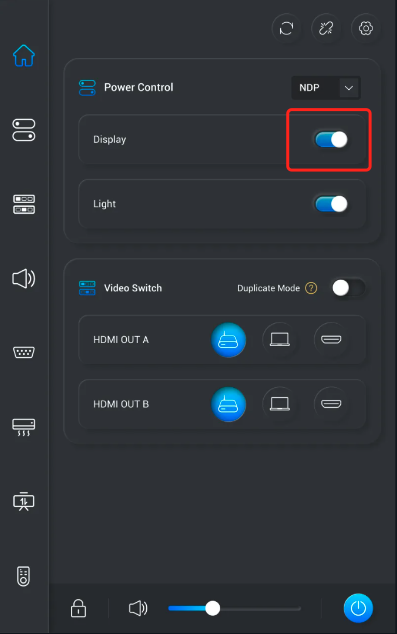 	 

####  2. UP-DOWN 

The UP-DOWN interface on the NDP500 is designed specifically for controlling motorized projection screens, allowing users to raise or lower the screen remotely via the NDP's control options, including the Q-NEX Console, mobile app, or Touch Panel.

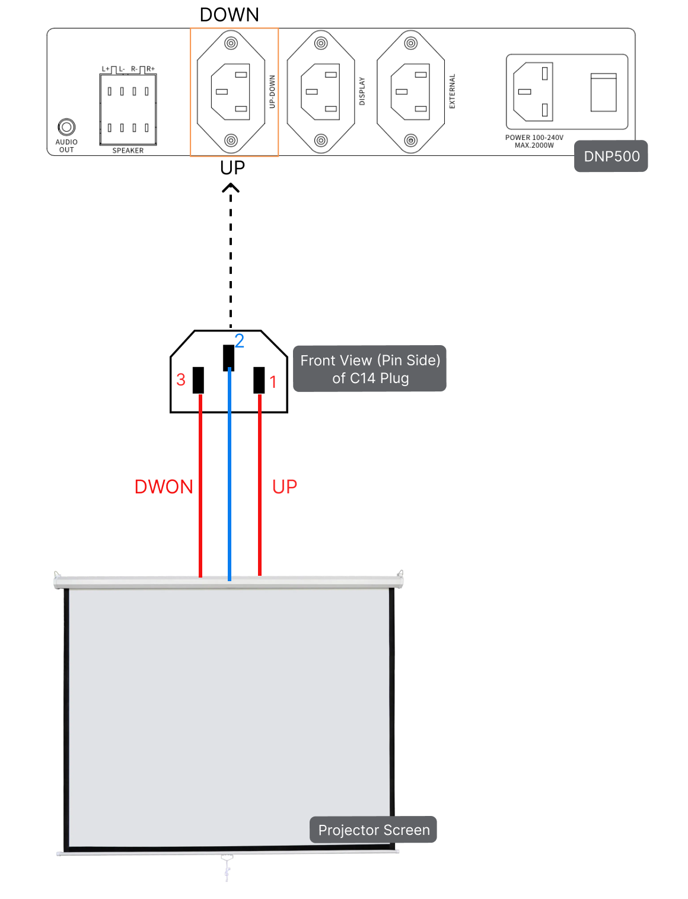 

**Connection Steps:**

1. Replace the existing plug of the projection screen with the provided C14 plug. Refer to [3.1 C14 Plug Installation Guide](#3.1 C14 Plug Installation Guide) for detailed instructions.
2. Wire Configuration:
   - Connect the "UP" wire to the **1** pin of the C14 plug.
   - Connect the "DOWN" wire to the **3** pin of the C14 plug.
   - Connect the "Neutral" (N) wire to the **2** pin of the C14 plug.
3. Connect to the UP-DWON port. 
4. Connect the other end of the wires to the corresponding terminals on the projection screen curtains.

**Note**: This wiring configuration is exclusively for use with projection screen curtains.

After completing the required wiring setup, users can perform up and down operations using the Touch Panel, Web Console, or Q-NEX APP. 

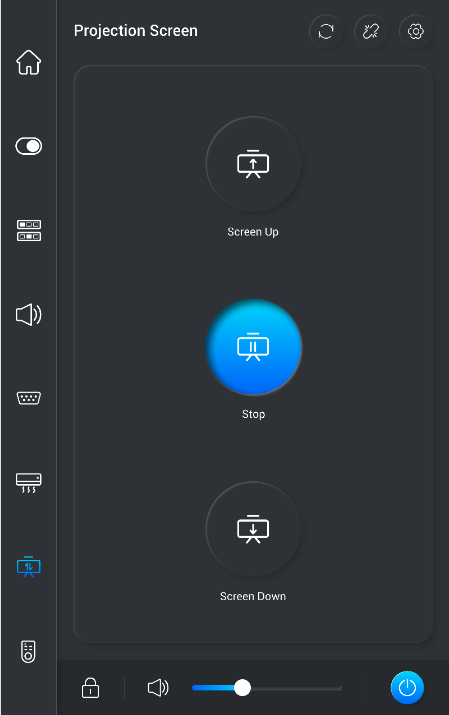 

**Note: about electric curtains control**

Users should be aware that NDP500 also supports the control of electric curtains for raising and lowering. 

However, this connection method can be much more complex, different products and scenarios may require different wiring configurations to achieve control. 

Therefore, we recommend consulting our professional consulting team for assistance.

#### 3. EXTERNAL

The EXTERNAL interface on the NDP500 enables flexible lighting control. Users can directly manage lighting or integrate it with an SPDT switch for customized automation and centralized control. Control settings can be adjusted via the Touch Panel and Web Console.

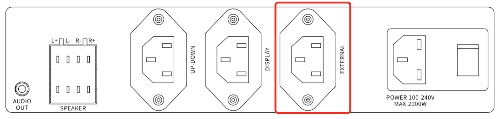 

After completing the wiring for the external port, you can control it on the Touch Panel and Web-Console. 

There are two methods to achieve lighting control with NDP: direct connection and integration with an SPDT switch.

**1. Direct Connection to NDP:** 

In this mode, the user gains the ability to manage the lighting control by NDP.

   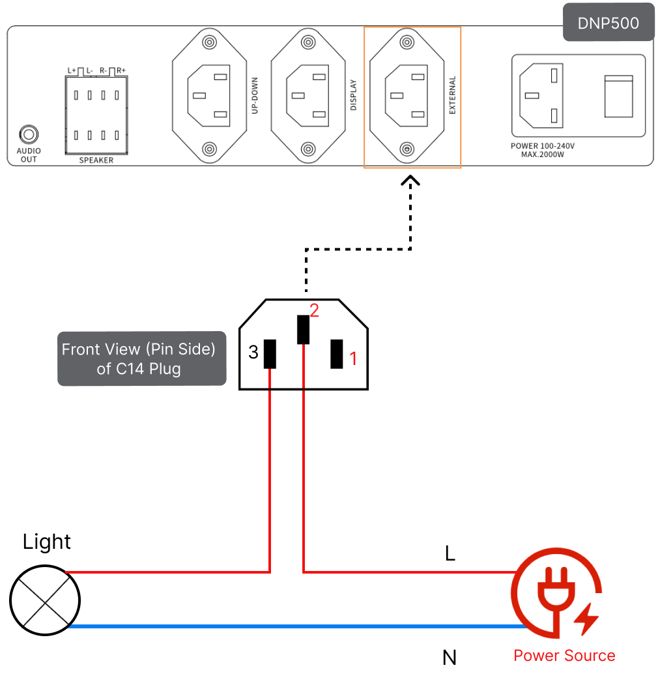 

**Note**: The current-carrying capacity of the "EXTERNAL" should not exceed 1200W

**2. Integration with SPDT Switch:** 

By replacing the existing switch panel with a Single Pole Double Throw (SPDT) switch and connecting it to NDP, both NDP and the switch panel gain control over the light.

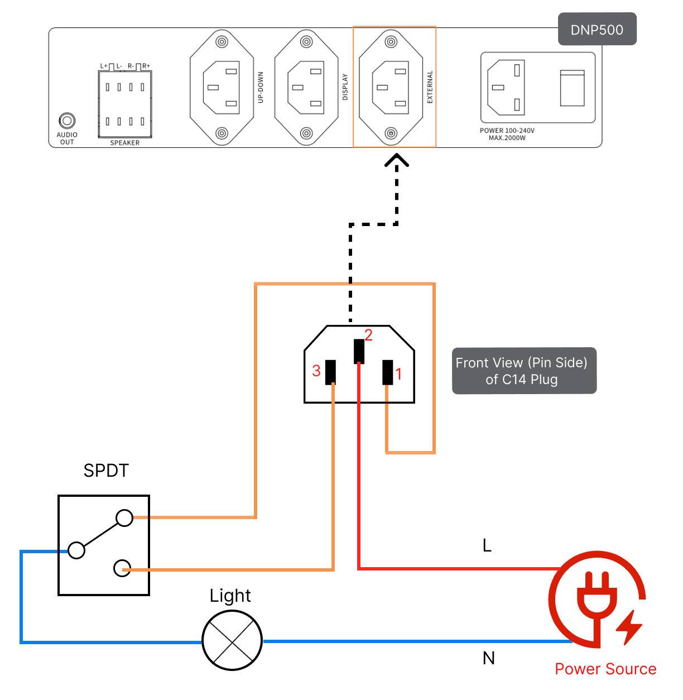 

**Note**: The current-carrying capacity of the "EXTERNAL" should not exceed 1200W

After completing the wiring for the external port, you can control it on the Touch Panel and Web-Console. 

### 4.3.2 IR Control

- Refer to the video at [5:28](https://www.youtube.com/watch?v=kHRZHC7xY_I&t=328s) for instructions on connecting IR ports, learning IR codes, and binding IR devices, including air conditioners and other IR-enabled devices. 

The NDP500 is equipped with both an IR IN and an IR OUT interface, allowing users to manage IR devices efficiently.

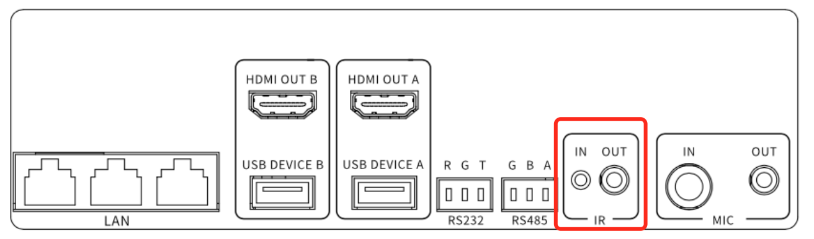 

To control IR-enabled devices (e.g., air conditioner, TV, projector), NDP500 supports batch application of infrared control codes, enabling efficient control without repetitive learning. 

Here's a simplified guide for using IR functionality with an air conditioning unit:

1. Check if your air conditioner brand is in the Q-NEX database. If your air conditioner is recognized in the Q-NEX database, identify the control codes to manage and control it through the Touch Panel or Web-console.
2. If not in the database, use IR Learning on the Touch Panel or Web-console for control.

#### 1. Air Conditioner-Identified in the code database 

Follow these steps:

1. Log in to  Dashboard -> Devices -> Processor Manager. Choose your NDP device, in the 'IR Control' module, click on the 'Edit' button:

    

2. Follow these steps:

   | Step | Screenshot                                                   | Instructions                                                 |
   | ---- | ------------------------------------------------------------ | ------------------------------------------------------------ |
   | S1   |  | In the IR control page, click "Identify New A/C control code" |
   | S2   |  | Click the "Start" button                                     |
   | S3   | 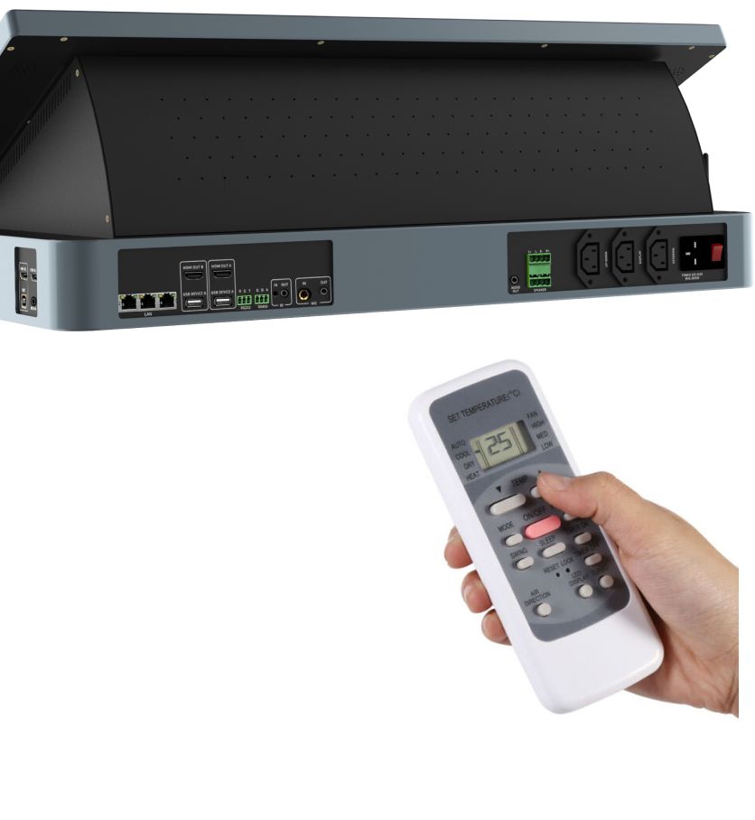  | Align the remote control with the IR interface, press the power button, and the system will automatically identify the remote control code. |
   | S4   |  | Upon successful identification, it will display " Identify successfully." |
   | S5   |  | After identification, enter the air conditioner's brand and category, then click Save. |
   | S6   |  | You will be redirected to the IR Control Setting page. Select the newly added air conditioner name and click Save. |

3. After successful saving, control the air conditioner on the Touch Panel or Web-console

#### 2. Air Conditioner-Unable to Identify in the Code Database
IR remote control module is available for unrecognized air conditioners or other devices using infrared remote control. Connect the infrared transmitter to the "IR" port of NDP500, aim the transmitter at the device, and ensure there will be no blocks in between the transmitter and the device.

1. Log in to the "Dashboard -> Devices -> Processor manager". Select your NDP500 device, and in the "Infrared Control" module, click the "Edit" button. Follow the instructions below:

   | Step | Screenshot                                                   | Instructions                                                 |
   | ---- | ------------------------------------------------------------ | ------------------------------------------------------------ |
   | S1   |  | In the IR control interface, click "New remote control code." button |
   | S2   |  | Select A/C click "Next".                                     |
   | S3   |  | Click "Start to learn"                                       |
   | S4   |   | 1. On the remote control, select the desired mode, such as setting the temperature to 25 degrees and choosing the cooling mode. 2. Power off the remote, then aim the remote at NDP500's "IR IN" port and press the remote's power button again. 3. The system will start learning the selected air-conditioning mode. : To learn the power-off function, aim the remote at the IR port and power off directly. |
   | S5   |  | After successful learning, a "Success" prompt will  appear. Then click the "Next" button |
   | S6   |  | Enter the corresponding function name here                   |
   | S7   |  | Then you will be redirected to the "IR Control Setting" page. Then, select the newly added function name and click Save. |

2. After successfully saving, you can operate the device on the Touch Panel or Web-Console 

**Note**: 

To learn additional modes for the air conditioner, follow steps S1 through S7. Additionally, note that the process for learning codes on other infrared devices is similar to the above steps

#### 3. Operating IR-Controlled Devices through Q-NEX Platforms

After learning and saving IR codes, you can control your devices using the Q-NEX APP, Web-Console, or Touch Panel. This section provides a quick guide on how to manage your devices efficiently through these platforms.

1. Connect the infrared emitter to the 'IR' port on NDP, and aim it at the air conditioner, ensuring no obstacles between the emitter and the air conditioner:

   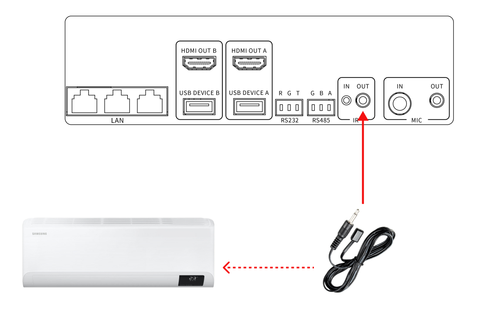 

2. Touch Panel: On the Touch Panel, select the air conditioner, then use the displayed controls to adjust the temperature, mode, and other settings as needed.

    

3. **Web-Console**: To control the air conditioner via the Web-Console, log in and select the NDP. On the right side, in the "Control Center," find the "Air Conditioner" section. 

   Use the available options to adjust settings or activate pre-learned presets with the "Action" button under "Remote Control."
    

4. **Q-NEX APP**: In the Q-NEX APP, select your device, go to the "Control Panel," switch to "External," and adjust the air conditioner settings as needed.

    

### 4.4.3 Serial Control 

#### 1. RS232 Control 

- Refer to the video at [8:16](https://www.youtube.com/watch?v=kHRZHC7xY_I&t=496s) for a demonstration on connecting RS232 ports to external devices, including controlling a lecture capture system. 

NDP500 provides one RS232 interface, enabling control of devices such as IFP, projectors, and PTZ cameras.

1. Prepare cable for RS232 connection

    

2. If your device uses a DB9 connector (Interactive Flat Panel, for example), connect one end of the cable to the RS232 connector, with the R, G, T pins corresponding to the RS232 connector. Connect the other end to the DB9 connector.

    

   - Connect the RS232 connector's T (transmit) pin to the DB9's RX (Pin 2).
   - Connect the RS232 connector's R (receive) pin to the DB9's TX (Pin 3).
   - Connect the RS232 connector's G (ground) pin to the DB9's GND (Pin 5).

   

   **Note**: 

   Our accessory box includes both DB9M (DB9 Male) and DB9F (DB9 Female) connectors. Use the appropriate connector based on your device's requirements.

   

3. IInsert the RS232 connector into the RS232 interface on the NDP500. Connect the DB9 connector to the corresponding device (e.g., Interactive Flat Panel), as shown in the following diagram:

   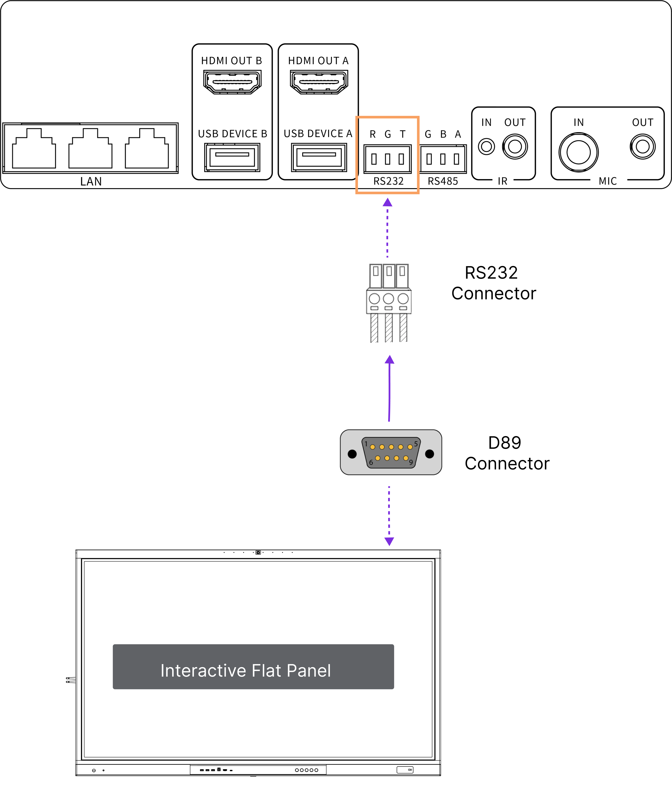  

   **Line Type Representation: **

   | Lines                                                        | Descriptions                                                 |
   | ------------------------------------------------------------ | ------------------------------------------------------------ |
   |  | **Arrow Direction**: The arrowheads indicate the direction of device connection |
   |  | **Solid line**: Indicate devices connected via wired cables. |
   |  | **Dashed line**: Indicate devices directly plugged into interfaces (without intermediary cables) |

4. If your device requires the RS232 port instead of DB9, follow the same wiring instructions. Connect the RS232 cable between the NDP500 and the device's RS232 interface. The diagram below uses the IQ LCS710 (Lecture Recoding System) as an example.

   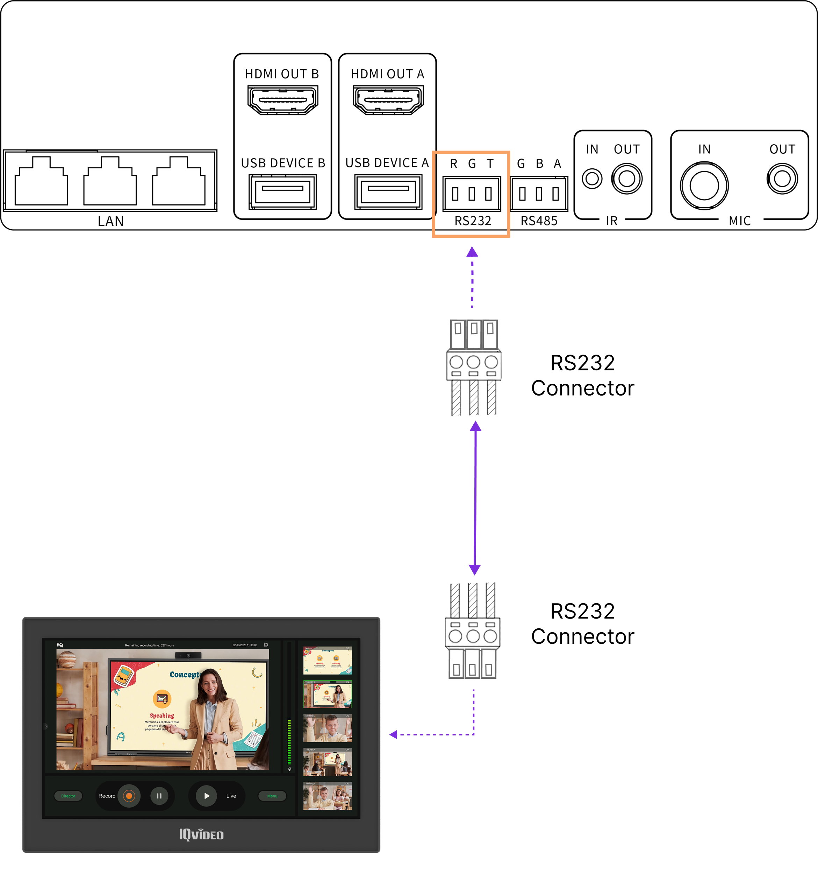 

   **Line Type Representation: **

   | Lines                                                        | Descriptions                                                 |
   | ------------------------------------------------------------ | ------------------------------------------------------------ |
   |  | **Arrow Direction**: The arrowheads indicate the direction of device connection |
   |  | **Solid line**: Indicate devices connected via wired cables. |
   |  | **Dashed line**: Indicate devices directly plugged into interfaces (without intermediary cables) |

5. Navigate to the Q-NEX console, select the NDP500 device under "Dashboard -> Devices -> Processor Manager", and click on the "Serial Control" column. Choose the correct device type, brand, and model, then click "Save".

   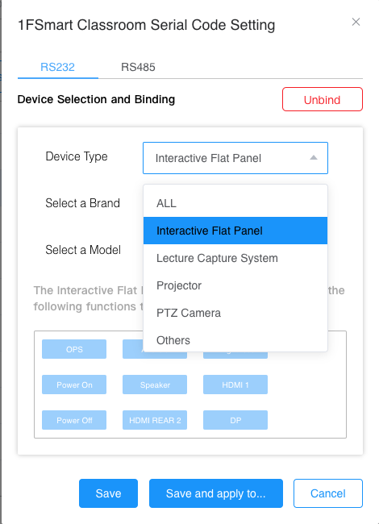 

   **Note**: 

   Once the device type and brand are selected, the relevant functions will be automatically configured based on the database.

#### 2. RS485 Control 

- Refer to the video at [9:15](https://www.youtube.com/watch?v=kHRZHC7xY_I&t=555s) for a demonstration on connecting RS485 ports to external devices, including using RS485 to control a PTZ camera for hybrid learning setups. 

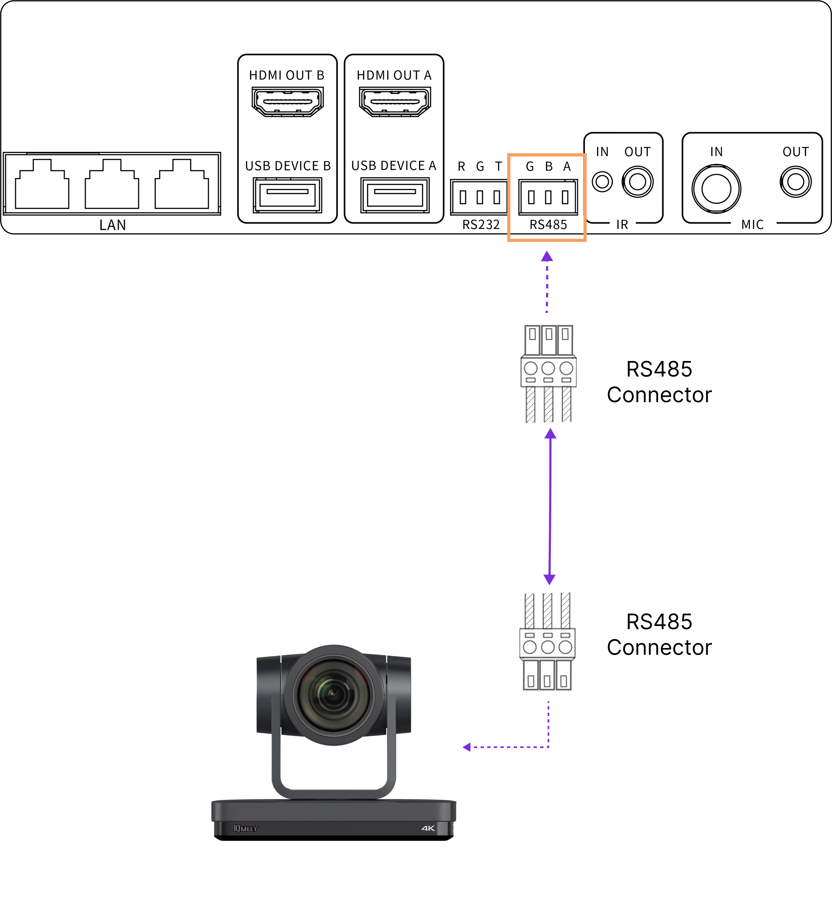 

The NDP500's RS485 interface is configured with three pins: **G** (Ground), **B** (Data-), and **A** (Data+). 

Follow these steps to connect a PTZ camera using the RS485 interface.

1. **Identify the RS485 Pins on NDP500:**
   - **A (Data+)**: Connect to the **+** terminal on the PTZ camera.
   - **B (Data-)**: Connect to the **-** terminal on the PTZ camera.
   - **G (Ground)**: Optional, connect if required by the camera.
2. **Wiring the PTZ Camera:**
   - Ensure secure connections between the NDP500 and the PTZ camera terminals.
3. **Configure the PTZ Camera:**
   - Navigate to the Q-NEX console, select the NDP500 device under "Dashboard -> Devices -> Processor Manager", and click on the "Serial Control" column.
   - In the "RS485 Control" module, choose the correct device type, brand, and model, then click "Save".
4. **Test the Connection:**
   - Use the Q-NEX Console, Touch Panel, or Web Console to control the PTZ camera.
   - Verify that the camera responds to pan, tilt, and zoom commands.

## 4.4 Broadcasting (Multimedia) 

### 4.4.1 Device Connection Diagram for Broadcasting

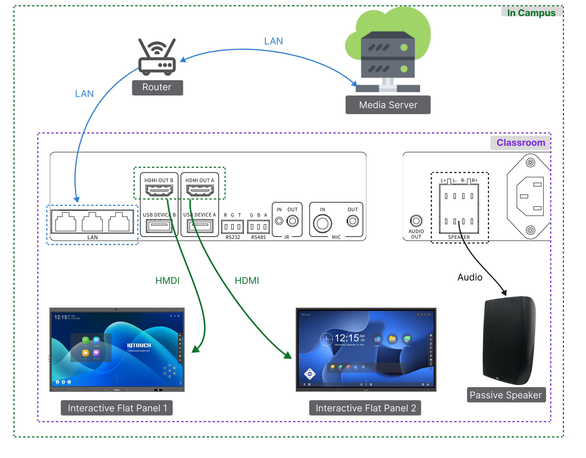 

This diagram illustrates the components of the classroom broadcasting system, showing how they are interconnected to enable multimedia delivery.

**Note**: 

- This section is tailored for formal campus production environments. Therefore, if the school enforces network controls, refer to section [5.1 Network Environment Requirement](#5.1 Network Environment Requirement) to ensure NDP500's correct access to the campus network.
- Users can remotely issue broadcast commands over the Internet, while all audio and video resources is pre-stored on the Media Server.

### 4.4.2 Topology Diagram for Broadcasting

 

The broadcasting topology diagram illustrates a typical topology for a campus broadcasting system.

**Note**: 

- For information about the Media Box, please refer to the Media Box documentation or consult our pre-sales team

### 4.4.3 Broadcasting Process 

The broadcasting feature enables streaming of various audio and video formats, providing educators with access to a wide range of multimedia resources stored on the school's media server.

These resources can be utilized not only for teaching purposes but also for activities such as examinations, promotions, and other related applications.

1. Administrators can pre-publish the content on the media server.

2. Users can issue broadcasting commands via various terminals such as the Q-NEX APP and Web-Console over the internet.

    

3. Upon receiving the broadcasting command, the Media Server begins encoding the specified content into a streaming media and pushes the stream to the NDP.

4. The NDP decodes the streaming media and delivers the content to the IFP for display, while the audio is played through the speakers.

**Note**: 

Please note that NDP also supports text broadcasting, without requiring Media Server support

  

## 4.5 Live-streaming

### 4.5.1 Topology Diagram for Live-streaming

 

### 4.4.2 Live Streaming Setup and Operation Steps

1. **Create Streaming Room**: Log in to the Web Console, navigate to the Streaming module, and create a new streaming room. Generate and save the room address and key.

     

2. **Configure Mobile Streaming**: Copy the generated address and key, and input them into your mobile streaming software. Start streaming from your mobile device to send the video feed to the designated room.

    

   **Note**: 

   For iPhone users, consider using third-party streaming tools like Larix, OBS Camera, or RTMP Live. Android users can utilize the Q-NEX APP, which already includes an integrated streaming module.

3. **Preview and Distribute Stream**: In the Web Console, preview the incoming video feed in the created room. Select the target NDP devices to distribute the stream and click the "START" button. Once deployed, these devices will decode the stream and display it on their connected screens.

    

# 5. Expanded Control and Connectivity

This section covers additional components and functionalities that expand the control and connectivity capabilities of the NDP100, including:

- **Control Box (CBX):** Exploring the features and setup of the Control Box, which extends NDP100 wireless control ability.
- **Media Box:** Understanding the Media Box, a component that enhances multimedia capabilities and connectivity options.

## 5.1 Control Box

The Control Box (CBX) wirelessly connects to NDP100(NMP) using Wi-Fi 2.4G. Placed near devices like air conditioners, displays, lights, or smart curtains, the CBX acts as a bridge, enabling wired control of these devices without extensive cabling.

**Note**:

> For convenience, we will refer to the Control Box as CBX throughout this manual.

The CBX features three interfaces: IR, Relay, and RS232. These interfaces allow the CBX to receive commands wirelessly from the NMP and then relay them to connected devices using different control methods, such as infrared signals (IR), relay switches, or RS232 communication.

**Note**:

> Each CBX can control only one type of device at a time. For example, if you need to control both an air conditioner(via IR) and lights(via Relay), you must use two separate CBX units, each dedicated to a specific device type, CBX cannot manage multiple device types simultaneously.

With the CBX, device management is efficient and tidy, eliminating the need for extensive wiring or modifications. The CBX can be easily wall-mounted, allowing for quick and convenient installation.

### 5.1.1 Interface View

 

| No.  | Interface         | Description                                                  |
| ---- | ----------------- | ------------------------------------------------------------ |
| 1    | Power Supply (DC) | 12V,1A                                                       |
| 2    | Reset Button      | Resets the CBX to its default factory settings               |
| 3    | Link Indicator    | Displays the connection status between the CBX and the NMP   |
| 4    | DIP Switch        | Used for configuration settings and adjustments of the CBX   |
| 5    | RS232             | Allows wired communication and control with RS232-compatibale devices. |
| 6    | IR                | Enables IR communication for controlling devices with infrared signals. |
| 7    | Relay             | Provides control over devices using relay switches for on/off functions. |

### 5.1.2 Topology Diagram

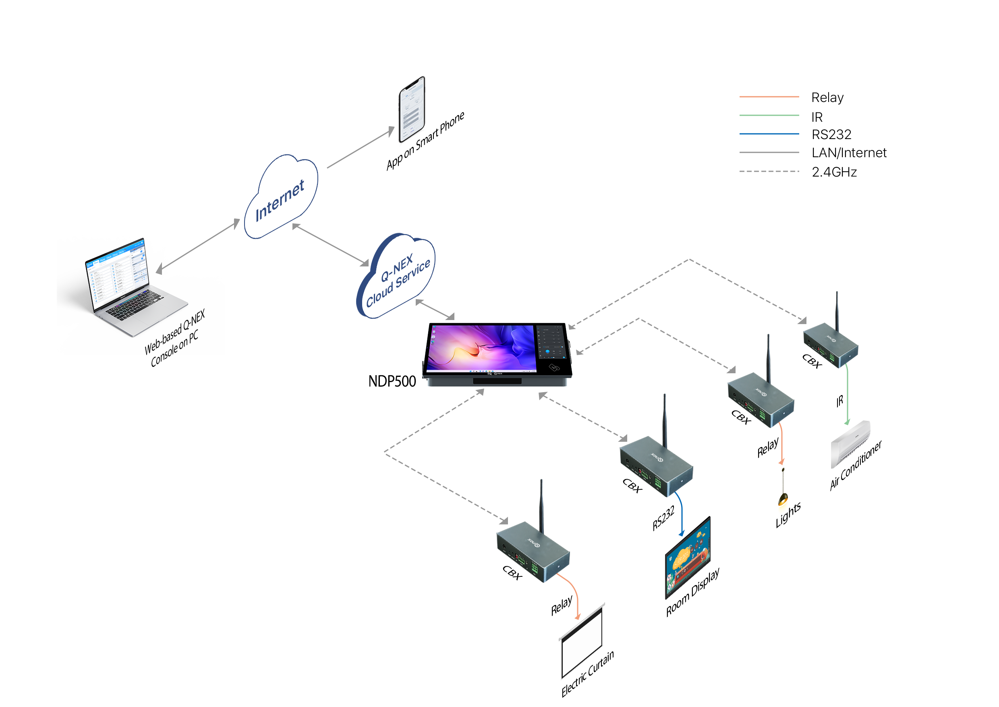 

### 5.1.3 CBX Paring 

#### 1. DIP Switch Configuration

Each CBX has a DIP switch with 2 toggle buttons. These buttons can be set to either the UP (OFF) or DOWN (ON) positions, creating a unique DIP switch combination. 

**Note**: 

> One NMP can pair with up to 4 CBX units simultaneously.

Each combination represents a unique CBX ID as shown in the table below. 

| **ID** | **Switch 1** | **Switch 2** | Illustration                                                 |
| ------ | ------------ | ------------ | ------------------------------------------------------------ |
| 1      | UP (OFF)     | UP (OFF)     |  |
| 2      | DOWN (ON)    | UP (OFF)     |  |
| 3      | UP (OFF)     | DOWN (ON)    |  |
| 4      | DOWN (ON)    | DOWN (ON     |  |

This ID is crucial for communication between the NMP and CBX. Once set, the DIP switch combination should not be changed to avoid communication failure.

To ensure successful pairing and control between the NMP and CBX units, please follow the instructions below:

1. When connecting the first CBX to the NMP, set the DIP switches to UP (OFF) + UP (OFF), corresponding to ID 1.
2. For subsequent CBX units, use different combinations from the table above to assign unique IDs (2,3, and 4).

**Note**: 

Once a DIP switch combination is set and the CBX is paired with the NMP, do not alter the DIP switch positions. Changes will disrupt communication between the NMP and the CBX.

#### 2. Paring and Setup

1. **Connect CBX and NMP, and Power On CBX**

   Connect the antenna to the front of the CBX before starting the pairing process. The antenna port is located on the front of the CBX.

   Ensure the CBX is connected to the NMP as illustrated in the diagram below. Make sure the power supply is connected to the CBX.

   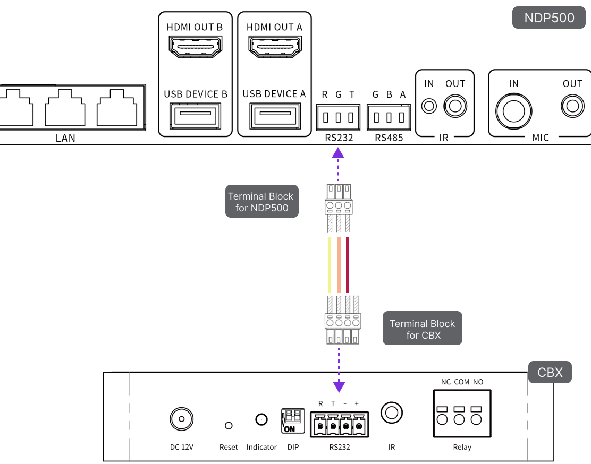 

   **Line Type Representation: **

   | Lines                                                        | Descriptions                                                 |
   | ------------------------------------------------------------ | ------------------------------------------------------------ |
   |  | **Arrow Direction**: The arrowheads indicate the direction of device connection |
   |  | **Solid line**: Indicate devices connected via wired cables. |
   |  | **Dashed line**: Indicate devices directly plugged into interfaces (without intermediary cables) |

    

   **Interface Wiring Illustration for CBX-RS223 and NMP-PANLE**:

   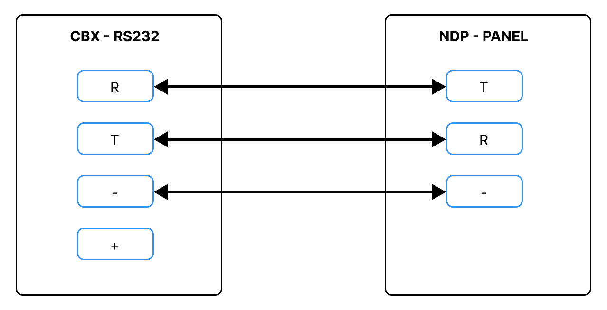 

   The diagram above illustrates the wiring sequence for connecting CBX-RS232 and NMP-PANEL. Each terminal on the CBX is connected to the corresponding terminal on the NMP PANLE, ensuring proper wiring of the cables.

   

2. **Initiate Paring Mode**

   Press and hold the reset button for 4-5 seconds until the indicator light turns red, then the CBX will automatically enter pairing mode with the NMP, indicated by a flashing green light.

   Once paired successfully, the green light will remain steady.

   

   **Indicator Light States:**

   | Indicator Light | Status               |
   | --------------- | -------------------- |
   | Green Flashing  | Pairing Mode         |
   | Green Steady    | Connected to NMP     |
   | Red Steady      | Not Connected to NMP |

3. **Post-Pairing Connections**

   After successfully pairing and removing the connection cable between the CBX and NMP, connect the devices to be controlled to the appropriate CBX interfaces based on their type. 

   For example, use the RELAY interface for controlling the power switch of lighting devices, the RS232 interface for display devices like IFPs and projectors, and the IR interface for devices with infrared remote controls, such as air conditioners, TVs, and electric curtains.

   

   **Note**:

   Each CBX can control only one type of device at a time. For instance, to control both an air conditioner (via IR) and light (via RELAY), two separate CBX units are required, each dedicated to a specific device type. A single CBX cannot manage multiple device types simultaneously.

   

4. **Configure CBX in the Dashboard**

   - Log in to the NMP/NDP management system Dashboard, and navigate to Devices > Device Management.

   - Select the NDP and click the CBX edit button to configure.

      

5. **Set Control Method According to the Controlled Device**

   Based on the DIP switch sequence, select the control method. (Power Control, RS232 Control, or IR Control)

    

   **Note**:

   A CBX in a disabled state indicates that no device is currently connected to the NMP via Wi-Fi. 

   If you are certain that the CBX has been successfully paired and connected previously, please check the current network status of the CBX and ensure that it is properly powered.

   - For RS232-connected devices, set the device brand and model.

      

   - For IR-connected devices, select the air conditioner and control options.

      

**Note**:

1. If the NMP/NDP is being replaced, re-pairing is required. Follow the instructions in the section "[Paring and Setup](#2. Paring and Setup)" from the first step to repair.

### 5.1.4 CBX Device Control

Once the CBX configuration is complete, users can control the connected devices through IR, RELAY, and RS232 on CBX. 

Refer to the corresponding screenshots for guidance.

  
  

# 6. Appendix

## 6.1 Network Environment Requirement

To ensure optimal integration, the school network needs to meet specific requirements tailored to the NDP. 

1. The school should allow NDP to access the Internet.

2. Whitelist Network Control Requirements:

   If the school employs whitelist network control, the following domains should be added to the whitelist:

   - "https://qnextech.com/" (Primary Domain)
   - "https://mg.qnextech.com/" (Secondary Domain).

3. IP Address and Port Requirements:

   The school network should allow access to the following addresses:

   - 110.90.11.185:80 (HTTP)
   - 110.90.11.185:443 (HTTPS)
   - 110.90.11.185:13393 (NDP Communication Service)
   - 110.90.11.185:12583 (NDP Upgrade Service).

4. MAC Address Control Requirements:

   If the school implements MAC address control, the MAC addresses of the following devices should be added to the allowed access list:

   - NDP
   - Touch Panel
   - Built-in PC (OPS).

5. NDP Network Configuration:

   - NDP must be connected to the **router** via a **wired connection**; NDP does not support wireless network connection.
   - NDP and Touch Panel should be on the same LAN. 
   - If there is a Media Server (broadcast and live streaming), ensure that the Media Server, NDP, and Touch Panel are on the same LAN.
   - The firewall should open the following ports for the Media Server:
     - 12570 (Broadcast Port)
     - 1935 (Streaming Port)
     - 80
     - 443.

6. NDP500 IP Address Setting:

   - To prevent issues caused by NDP500 IP changes, it is recommended that the NDP500 IP address be set as static.
   - Ensure that before the initial use of NDP, the Touch Panel successfully connects to NDP using this IP.

7. VLAN:

   NDP does not support VLAN. NDP, Touch Panel, and Media Server should be connected to the campus network as described above but should not be on VLAN

# 7. Contact Us

Q-NEX (https://qnextech.com/) is a subsidiary of Returnstar Interactive Technology Group Co, Ltd, a company that has been dedicated to the education industry since 2006. 

Q-NEX is focused on delivering a Smart Campus Solution that converges AV and loT control across all campus facilities. Q-NEX offers deeply customized options that assist school IT administrators in managing all electronic facilities and allow teachers to simplify the operations of a multimedia classroom.

 
