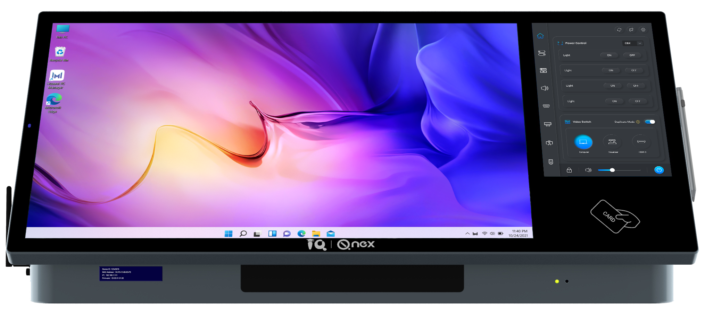

Q-NEX Desktop Digital Podium

 
NDP600

 
—— Datasheet ——

<!-- break -->

## 1. Desktop Digital Podium 

<table class="tbw">
    <tr class="tbody-tr">
        <td class="tbody-td"> </td>
        <td class="tbody-td"> 项目 </td>
        <td class="tbody-td"> 规格参数 </td>
    </tr>
    <!-- Display Screen -->
    <tr class="tbody-tr">
        <td class="tbody-td" rowspan="11"> 显示屏 </td>
        <td class="tbody-td"> 面板类型 </td>
        <td class="tbody-td"> IPS (TFT-LCD) </td>
    </tr>
    <tr class="tbody-tr">
        <td class="tbody-td"> 有效显示尺寸 </td>
        <td class="tbody-td"> 23.8 inch </td>
    </tr>
    <tr class="tbody-tr">
        <td class="tbody-td"> 分辨率 </td>
        <td class="tbody-td"> 1920(H) x 1080 (V) </td>
    </tr>
    <tr class="tbody-tr">
        <td class="tbody-td"> 显示颜色 </td>
        <td class="tbody-td"> 16.7M </td>
    </tr>
    <tr class="tbody-tr">
        <td class="tbody-td"> 亮度 </td>
        <td class="tbody-td"> 300 cd/m² </td>
    </tr>
    <tr class="tbody-tr">
        <td class="tbody-td"> 对比度 </td>
        <td class="tbody-td"> 1000:1 </td>
    </tr>
    <tr class="tbody-tr">
        <td class="tbody-td"> 表面处理 </td>
        <td class="tbody-td"> 3mm hardened anti-reflection safety glass (7H);  AG+AF 光学贴合技术 </td>
    </tr>
    <tr class="tbody-tr">
        <td class="tbody-td"> 可视角度 </td>
        <td class="tbody-td"> 178° (H), 178° (V) </td>
    </tr>
    <tr class="tbody-tr">
        <td class="tbody-td"> 触控方式 </td>
        <td class="tbody-td"> 电容式，10点多点触控，4096 x 4096 分辨率，兼容 Windows 7/8/10/11 </td>
    </tr>
    <tr class="tbody-tr">
        <td class="tbody-td"> 手写功能 </td>
        <td class="tbody-td"> 主动电容笔，4096级压感，±0.25mm 精度，< 5mm 识别高度，支持 Windows Ink，兼容 Windows 7/8/10/11 </td>
    </tr>
    <tr class="tbody-tr">
        <td class="tbody-td"> 控制面板 </td>
        <td class="tbody-td"> 10.1 inch 触控面板，用于访问 NDP500 功能。 RAM: 2GB ROM: 16GB CPU: 四核，1.6GHz NFC: 支持 </td>
    </tr>
    <!-- Interface -->
    <tr class="tbody-tr">
        <td class="tbody-td" rowspan="6"> 接口 </td>
        <td class="tbody-td"> LAN 交换口 </td>
        <td class="tbody-td"> 10M / 100M / 1000M RJ45 x2 </td>
    </tr>
    <tr class="tbody-tr">
        <td class="tbody-td"> 音频 </td>
        <td class="tbody-td"> 3.5mm audio in x1; 3.5mm audio out x1 </td>
    </tr>
    <tr class="tbody-tr">
        <td class="tbody-td"> 麦克风接口 </td>
        <td class="tbody-td"> 6.35mm 有线 MIC 输入 x1; 内置接收器的 UHF 无线 MIC; 3.5mm MIC 混合输出 x1 </td>
    </tr>
    <tr class="tbody-tr">
        <td class="tbody-td"> HDMI 接口 </td>
        <td class="tbody-td"> HDMI 2.0 in x2; HDMI 2.0 out x1 </td>
    </tr>
    <tr class="tbody-tr">
        <td class="tbody-td"> Touch USB </td>
        <td class="tbody-td"> Touch USB x2 </td>
    </tr>
    <tr class="tbody-tr">
        <td class="tbody-td"> 通讯接口 </td>
        <td class="tbody-td"> RS232 x2； IR-In x1; IR-Out x1 </td>
    </tr>
</table>
<!-- break -->
<!-- 这里增加一个跨页 -->

<table class="tbw">
<tr class="tbody-tr">
        <td class="tbody-td"> </td>
        <td class="tbody-td"> 项目 </td>
        <td class="tbody-td"> 规格参数 </td>
    </tr>
    <tr class="tbody-tr">
        <td class="tbody-td" rowspan="4"> 接口 </td>
        <td class="tbody-td"> 功放 </td>
        <td class="tbody-td">2 x (40W + 40W)，支持最多 4 个无源音箱（2 对，固定阻抗）</td>
    </tr>
    <tr class="tbody-tr">
        <td class="tbody-td"> 电源控制 </td>
        <td class="tbody-td">灯光控制端口（EXTERNAL）x1 显示设备电源输出及控制端口（Display）x1 投影仪 / 幕布控制端口（UP-DOWN）x1</td>
    </tr>
    <tr class="tbody-tr">
        <td class="tbody-td"> 电源接口 </td>
        <td class="tbody-td">NDP500 电源输入 x1（POWER）</td>
    </tr>
    <tr class="tbody-tr">
        <td class="tbody-td"> 天线 </td>
        <td class="tbody-td">内置隐藏式天线（支持无线麦克风和 2.4G Wi-Fi）x1</td>
    </tr>
    <!-- Built-in PC -->
    <tr class="tbody-tr">
        <td class="tbody-td" rowspan="6"> 内置电脑 </td>
        <td class="tbody-td"> 处理器（CPU） </td>
        <td class="tbody-td">Intel® Core™ i5 </td>
    </tr>
    <tr class="tbody-tr">
        <td class="tbody-td"> 内存（RAM） </td>
        <td class="tbody-td">8GB </td>
    </tr>
    <tr class="tbody-tr">
        <td class="tbody-td"> 存储（Storage） </td>
        <td class="tbody-td">512GB SSD </td>
    </tr>
    <tr class="tbody-tr">
        <td class="tbody-td"> 显卡（Graphics Card） </td>
        <td class="tbody-td">支持 Intel® Iris® Xe Graphics </td>
    </tr>
    <tr class="tbody-tr">
        <td class="tbody-td"> 网卡（Network Card） </td>
        <td class="tbody-td">1 x 10/100/1000M 自适应以太网端口 </td>
    </tr>
    <tr class="tbody-tr">
        <td class="tbody-td"> 无线连接（Wi-Fi） </td>
        <td class="tbody-td">支持 802.11ac/a/b/g/n；支持 Bluetooth </td>
    </tr>
        <!-- Wireless Mic Receiver -->
    <tr class="tbody-tr">
        <td class="tbody-td" rowspan="11"> 无线麦克风 接收器 </td>
        <td class="tbody-td"> 电源输入 </td>
        <td class="tbody-td">12V </td>
    </tr>
    <tr class="tbody-tr">
        <td class="tbody-td"> 频带宽度 </td>
        <td class="tbody-td">300 kHz </td>
    </tr>
    <tr class="tbody-tr">
        <td class="tbody-td"> 频率响应 </td>
        <td class="tbody-td">30 Hz - 16 kHz </td>
    </tr>
    <tr class="tbody-tr">
        <td class="tbody-td"> 工作频率范围 </td>
        <td class="tbody-td">低频段: 642 MHz - 672 MHz  高频段: 674 MHz - 702 MHz</td>
    </tr>
    <tr class="tbody-tr">
        <td class="tbody-td"> 最大通道数 </td>
        <td class="tbody-td">40 个通道（每个频段 20 个）</td>
    </tr>
    <tr class="tbody-tr">
        <td class="tbody-td"> 接收灵敏度 </td>
        <td class="tbody-td">-96 dBm </td>
    </tr>
    <tr class="tbody-tr">
        <td class="tbody-td"> 信噪比（SNR） </td>
        <td class="tbody-td">94 dB </td>
    </tr>
    <tr class="tbody-tr">
        <td class="tbody-td"> 音频输出电平 </td>
        <td class="tbody-td">最大 0.9 Vrms </td>
    </tr>
    <tr class="tbody-tr">
        <td class="tbody-td"> 失真度 (THD+N) </td>
        <td class="tbody-td">< 0.1% </td>
    </tr>
    <tr class="tbody-tr">
        <td class="tbody-td"> 延迟 </td>
        <td class="tbody-td">4 ms（关闭频移时为 2.2 ms）</td>
    </tr>
    <tr class="tbody-tr">
        <td class="tbody-td"> 工作温度 </td>
        <td class="tbody-td">-20°C 到 80°C </td>
    </tr>
</table>
<!-- 这里增加一个跨页 -->

<!-- break -->

<table class="tbw">
    <!-- General Specifications -->
    <tr class="tbody-tr">
        <td class="tbody-td"> </td>
        <td class="tbody-td"> 项目 </td>
        <td class="tbody-td"> 规格参数 </td>
    </tr>
    <tr class="tbody-tr">
        <td class="tbody-td" rowspan="8"> 一般规格 </td>
        <td class="tbody-td"> AV 解码器 - 媒体内容 </td>
        <td class="tbody-td">
            协议: RTMP 
            分辨率: 720p@30fps（推荐），最高可达 1080p@30fps 
            来源: 媒体服务器 
            支持音频格式: MP3、WAV、FLAC、Ogg、Opus 及其他常见音频格式 
            支持视频格式: MP4、MKV、RMVB、RM、MOV、AVI、FLV、WMV 及其他常见视频格式
        </td>
    </tr>
    <tr class="tbody-tr">
        <td class="tbody-td"> AV 解码器 - 实时直播 </td>
        <td class="tbody-td">
            协议: RTMP 
            分辨率: 720p@30fps（推荐），最高可达 1080p@30fps 
            来源: 通过媒体服务器从 IP 摄像头、智能手机、PC 等设备接入，利用内置的 Q-NEX Streaming Service System，将内容投送至教室媒体终端
        </td>
    </tr>
    <tr class="tbody-tr">
        <td class="tbody-td"> 支架调节范围 </td>
        <td class="tbody-td">30° - 50° </td>
    </tr>
    <tr class="tbody-tr">
        <td class="tbody-td"> 电源输入 </td>
        <td class="tbody-td">100V - 240V AC，50/60Hz </td>
    </tr>
    <tr class="tbody-tr">
        <td class="tbody-td"> 工作温度范围 </td>
        <td class="tbody-td">使用时: 0°C 到 40°C；存储时: -15°C 到 +60°C </td>
    </tr>
    <tr class="tbody-tr">
        <td class="tbody-td"> 湿度 </td>
        <td class="tbody-td">使用时: 20% - 80%（无冷凝）；存储时: 10% - 90%（无冷凝）</td>
    </tr>
    <tr class="tbody-tr">
        <td class="tbody-td"> 净重 </td>
        <td class="tbody-td">25 kg </td>
    </tr>
    <tr class="tbody-tr">
        <td class="tbody-td"> 产品尺寸（mm） </td>
        <td class="tbody-td">716 (L) x 350 (W) x 242 (H) </td>
    </tr>
</table>
## 2. Wireless Microphone WX-D11

<table class="tbw">
    <tr class="tb-tr">
        <td class="tbody-td"> 项目 </td>
        <td class="tbody-td"> 规格参数 </td>
    </tr>
    <tr class="tb-tr">
        <td class="tbody-td"> 接收灵敏度 </td>
        <td class="tbody-td"> -96 dBm </td>
    </tr>
    <tr class="tb-tr">
        <td class="tbody-td"> 接收器工作电流 </td>
        <td class="tbody-td"> 150 mA </td>
    </tr>
    <tr class="tb-tr">
        <td class="tbody-td"> 工作频率范围 </td>
        <td class="tbody-td"> 低频段: 642 MHz - 672 MHz / 高频段: 674 MHz - 702 MHz </td>
    </tr>
    <tr class="tb-tr">
        <td class="tbody-td"> 频率响应 </td>
        <td class="tbody-td"> 30 Hz - 16 kHz </td>
    </tr>
    <tr class="tb-tr">
        <td class="tbody-td"> 麦克风类型 </td>
        <td class="tbody-td"> 单指向性 </td>
    </tr>
    <tr class="tb-tr">
        <td class="tbody-td"> 信噪比（SNR） </td>
        <td class="tbody-td"> 94 dB </td>
    </tr>
    <tr class="tb-tr">
        <td class="tbody-td"> 发射功率 </td>
        <td class="tbody-td"> 10 dBm </td>
    </tr>
    <tr class="tb-tr">
        <td class="tbody-td"> 失真度 (THD+N) </td>
        <td class="tbody-td"> < 0.1% </td>
    </tr>
    <tr class="tb-tr">
        <td class="tbody-td"> 传输距离 </td>
        <td class="tbody-td"> ≤30 m </td>
    </tr>
    <tr class="tb-tr">
        <td class="tbody-td"> 延迟 </td>
        <td class="tbody-td"> 3 ms </td>
    </tr>
    <tr class="tb-tr">
        <td class="tbody-td"> 工作温度 </td>
        <td class="tbody-td"> -20°C 到 +80°C </td>
    </tr>
    <tr class="tb-tr">
        <td class="tbody-td"> 电源 </td>
        <td class="tbody-td"> 4.2V 800mAh 14500 锂电池 </td>
    </tr>
    <tr class="tb-tr">
        <td class="tbody-td"> 麦克风工作电流 </td>
        <td class="tbody-td"> 120 mA </td>
    </tr>
    <tr class="tb-tr">
        <td class="tbody-td"> 电池续航时间 </td>
        <td class="tbody-td"> 最长 6 小时 </td>
    </tr>
</table>
