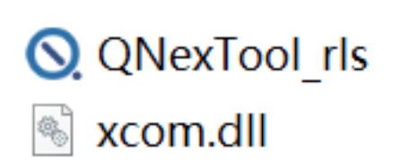
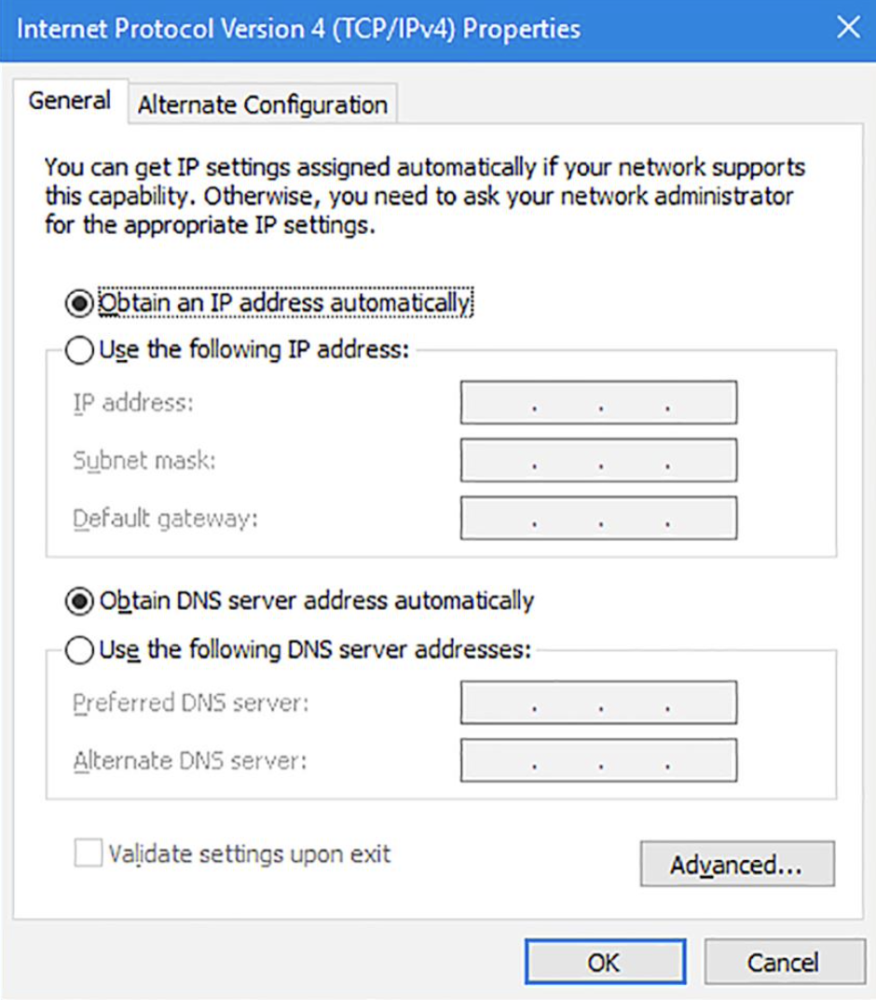
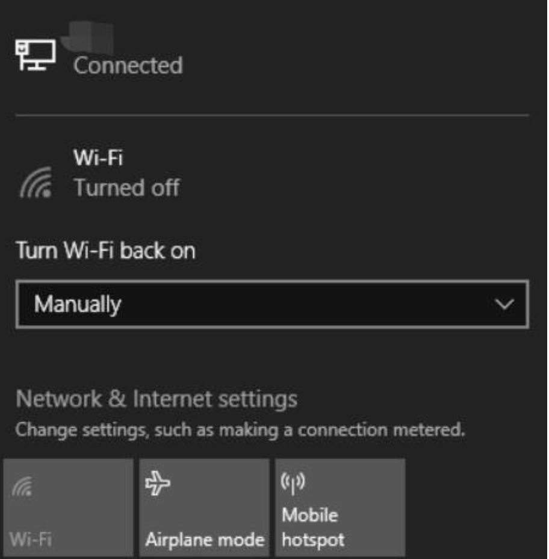
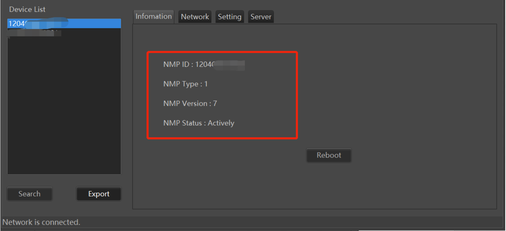
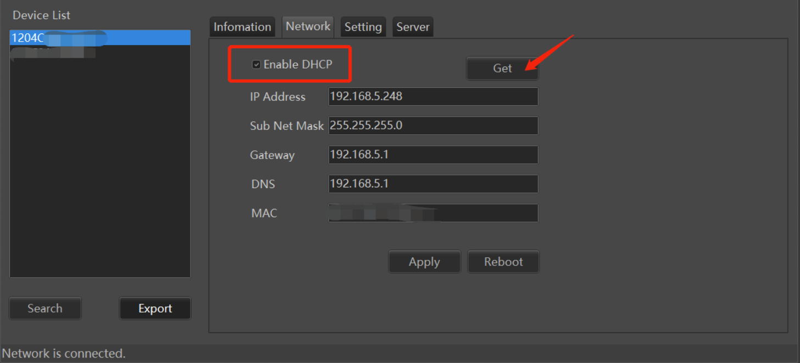
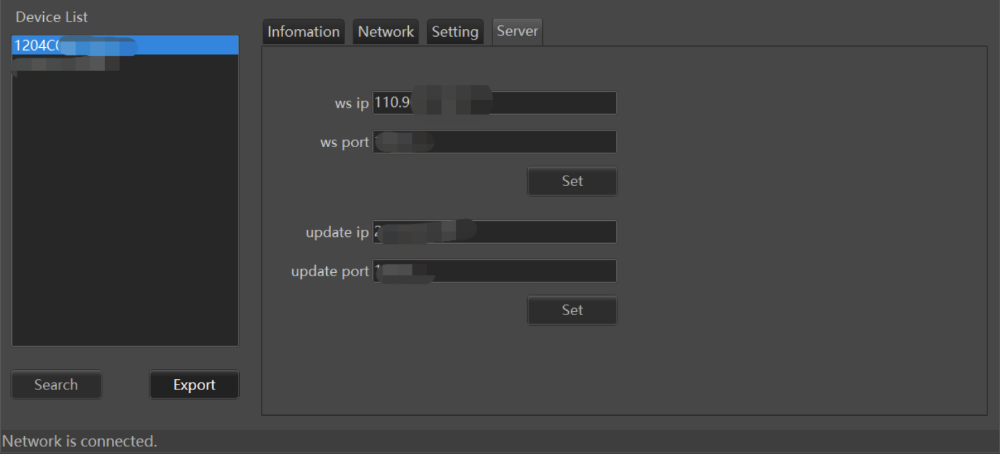

# Q-NEX Device Configuration Tool Guide

[toc]

## 1. Overview of the Q-NEX Config Tool

The **Q-NEX Device Config Tool** (referred to as the Config Tool) is used to configure the Q-NEX NMP device during setup, particularly in situations without internet connectivity.

## 2. Installation and Connection

### 2.1 Installing the Config Tool on a PC

The Config Tool is a portable application for Windows and does not require installation. Simply double-click to launch. 

Ensure both required files are stored in the same directory for proper operation：

 

**Note:** Currently, only a Windows version is available.

### 2.2 Connecting the PC to the NMP

#### 2.2.1 Direct LAN Connection

1. Connect the PC to one of the NMP's LAN ports.
2. Launch the Config Tool on the PC.
3. Click "Search" in the lower-left corner of the Config Tool interface.
4. Select an NMP ID from the Device List to display additional information under the "Information" tab.

#### 2.2.2  Networked LAN Connection

1. Configure the PC to automatically obtain an IP address.

    

2. Disable Wi-Fi on the PC.

    

3. Launch the Config Tool and click "Search."

4. Select an NMP ID from the Device List to view details under the "Information" tab.

    

**Note:** Use the "Reboot" button in the "Information" tab to restart the NMP, which applies any configuration changes.

## 3. NMP Network Configuration

1. Connect the PC and NMP on the same LAN.

2. Select an NMP ID in the Device List and navigate to the "Network" tab.

3. Check “Enable DHCP” and click "Get" to retrieve network connection information.

     

## 4. Configuring the NMP Device

In the "Setting" tab, various parameters for the NMP device can be configured. Click "Apply" to save changes. To apply these settings, restart the NMP from the "Information" tab or use the Control Panel/Touch Panel.

### 4.1 Configuration Options

  

| No.  | Setting                   | Description                                                  |
| ---- | ------------------------- | ------------------------------------------------------------ |
| 1    | **Power On Mode**         | Select the method for powering on: "Touch Panel" or "Swipe Card". |
| 2    | **Power Out A**           | Set power status for the "Display" port device during startup. |
| 3    | **Power Out B**           | Set power status for the "External" port device during startup. |
| 4    | **Screen Control**        | Enable or disable automatic screen control during power on/off. |
| 5    | **Type of E-Lock**        | Set the E-Lock status during power-up.                       |
| 6    | **Projector Power Delay** | Define the delay (in seconds) for powering off a projector connected via RS232. |
| 7    | **E-Lock Closing Delay**  | Set a delay (in seconds) for closing the E-Lock door.        |
| 8    | **HDMI OUT A/B/C**        | Choose default HDMI IN sources for each HDMI OUT display during startup. |
| 9    | **Broadcast Audio**       | Select the audio output for network broadcasts: "Line Audio" (speaker port only) or "HDMI Audio" (speaker port and HDMI OUT A). |

**Note:** 

After setting "Broadcast Audio," click "Apply." Wait for the NMP or MBX to beep, then restart the device to apply the setting.

## 5. Setting the Q-NEX Console Server IP

In the "Server" tab, the regulated Q-NEX Console server IP address is displayed. For configuring a private server, consult the Q-NEX Team for guidance on modifying the IP address according to specific network requirements.

 

## References

1. smb://192.168.10.168/IQ-国际事业部/6.小奇智联项目部/1.部门共享/2.一些售前资料/Q-NEX售前资料/@NMP config tool 用户版