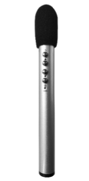

Q-NEX Networked Media Processor

 
NMP211-R-L2T

 
—— Datasheet ——

# NMP211

The Networked Media Processor (NMP) serves as the central control unit responsible for managing and coordinating various functionalities. 

 

| No.  | Interface                                      | Description                                                  |
| ---- | ---------------------------------------------- | ------------------------------------------------------------ |
| 1    | RJ45 * 4                                       | Ethernet ports (100Mbps, non-PoE) for NMP network connectivity; also enables NMP to function as a switch. |
| 2    | HDMI Matrix 3 * 3                              | Consists of 3 HDMI inputs and 3 HDMI outputs, forming the video matrix for NMP. |
| 3    | 2.4G Wireless Mcirophone Antenna Interface * 1 | Supports 2.4GHz wireless microphones with one-to-two setup for handheld and lapel microphones. |
| 4    | 2.4G Wi-Fi Antenna Interface * 2               | Built-in 2.4G Wi-Fi RP Transceiver within NMP, allowing wireless device integration and control expansion with Q-NEX's CBX component. |
| 5    | Display (WAGO) * 1                             | Provides power output for connected devices, such as projectors, TVs, Interactive Flat Panels (IFP), and smart podiums. |
| 6    | UP-DOWN (WAGO) * 1                             | Offering up, pause, and down functions for connected devices like projector screens and motorized curtains. |
| 7    | RS232 * 1                                      | Allows connection to devices equipped with standard RS232 ports, such as Pan-Tilt-Zoom (PTZ) cameras and Interactive Flat Panels (IFP), etc. |
| 8    | Panel * 1                                      | Interface for connection to mechanical control panels, allowing direct control of basic devices and AV matrix switching without the need for network connectivity. |
| 9    | IR * 2                                         | IR learner port * 1: Used for learning IR remote control codes. IR emitter port * 1: For infrared remote-control functionality. |
| 10   | USB * 2                                        | Reserved for card reader                                     |
| 11   | Touch USB * 3                                  | TOUCH USB IN * 1 :  Receives touch signals from the Interactive Pen Display.  TOUCH USB OUT * 2 : Sends touch signals to OPS or Laptop for touch-following functionality. |
| 12   | 6.35mm Wired Microphone In * 1                 | Interface for connecting a 6.35mm wired microphone.          |
| 13   | 3.5mm MIC Mixed Out * 1                        | Mixes audio from both the microphone input and the wireless microphones (handheld and lapel) for combined output. |
| 14   | Audio-IN * 2                                   | Two 3.5mm line-in interfaces for connecting external audio devices such as laptops, smartphones etc. |
| 15   | Audio Out                                      | Audio output interface for connecting to speakers or amplifiers. |
| 16   | External Speaker Output                        | The NMP includes an integrated power amplifier, capable of delivering 2*(40w+40w) output, designed to connect with passive speakers.  (Fixed impedance speakers only). |
| 17   | Electric Lock Interface (LOCK) * 1             | Allows integration with electric lock systems, enabling scenarios such as automatic door locking after a specified period post door opening.  Note:  Only supports electric locks, not electronic lock systems. |
| 18   | Power Fuse * 1                                 | Power fuse for protection against electrical faults.         |
| 19   | External Port (WAGO) * 1                       | External port interface for lighting control and other devices. there are two methods to control lighting and other devices: 1. **Direct Connection to NMP-External**: With this mode, users can directly manage lighting control using NMP. 2. **Integration with SPDT Switch**: By replacing the existing switch panel with a Single Pole Double Throw (SPDT) switch and connecting it to NMP, both NMP and the switch panel can control the lighting. |
| 20   | NMP Power Supply (WAGO) * 1                    | Power supply for NMP, supporting wide voltage range (110-240 V AC). |

**General Specifications**

| No.  | Item              | Specification                                                |
| ---- | ----------------- | ------------------------------------------------------------ |
| 1    | Size \(mm\)       | 440(L)\*292(W)\*50(H)                                        |
| 2    | Weight            | 3.9 Kg                                                       |
| 3    | Design            | Standard 1U rack-mount, suitable for installation in various types of cabinets |
| 4    | Motherboard       | Industrial-grade, high-speed 32-bit CPU with embedded operating system |
| 5    | Push Notification | Displays messages, alerts, and announcements from IT admin or teachers on classroom displays instantly or on schedule |

# Touch Panel

The Touch Panel allows users to access NMP functionalities such as power control, matrix switching, volume adjustment, and Divisible Room operations. Even in LAN-connected environments without Internet access, users still can perform local operations like matrix switching and volume adjustments.

The Touch Panel serves as the primary controlling interface, providing intuitive touch-based controls for the operation of the NMP. 

| No.  | Item             | Specification                                                |
| ---- | ---------------- | ------------------------------------------------------------ |
| 1    | Model            | CPL20                                                        |
| 2    | CPU              | Quad-core, Main frequency 1.6GHz                             |
| 3    | GPU              | Quad-core                                                    |
| 4    | RAM              | 2G                                                           |
| 5    | ROM              | 16G                                                          |
| 6    | O.S.             | Android 10                                                   |
| 7    | Screen           | 10-inch 1280*800 IPS                                         |
| 8    | Dimension (mm)   | 244(L)\*171.5(H)\*28(W)                                      |
| 9    | Touch            | Capacitive screen with tempered glass, 10-point touch  Optical bonding |
| 10   | I/O Port         | RJ45*1 (PoE supported)  USB2.0 *3  Type-C OTG *1  Audio (3.5mm) *1  DC (12V) *1 |
| 11   | Physical Button  | Power *1                                                     |
| 12   | IC               | Supported                                                    |
| 13   | Working          | -20°C to 70°C                                                |
| 14   | Working Humidity | <85%                                                         |
| 15   | Installation     | Desktop stand                                                |

# Microphones

The NMP211 comes with 2.4GHz wireless microphones, offering reliable audio performance for classrooms, meetings, and presentations.

## Handheld Microphone

| No.  | Item                                   | Specification                |
| ---- | -------------------------------------- | ---------------------------- |
| 1    | Matching models                        | Q-NEX NMP                    |
| 2    | Frequency Response                     | 40-16K (Hz)                  |
| 3    | Directivity                            | Capacitive Uni-Directional   |
| 4    | Sensitivity                            | -44 (dB)                     |
| 5    | Frequency Range                        | 2400-2482 MHz                |
| 6    | Modulation Mode                        | GFSK                         |
| 7    | Power supply                           | 3.7V / 800mA lithium battery |
| 8    | Battery life                           | >8-12H                       |
| 9    | RF power                               | 0 dBm                        |
| 10   | Maximum wireless transmission distance | 10-15m                       |
| 11   | Size                                   | 160*15mm                     |

## Lapel Microphone

| No.  | Item                                   | Specification                |
| ---- | -------------------------------------- | ---------------------------- |
| 1    | Matching models                        | Q-NEX NMP                    |
| 2    | Frequency Response                     | 40-16K (Hz)                  |
| 3    | Directivity                            | Capacitive Uni-Directional   |
| 4    | Sensitivity                            | -46 (dB)                     |
| 5    | Frequency Range                        | 2400-2482 MHz                |
| 6    | Modulation Mode                        | GFSK                         |
| 7    | Power supply                           | 3.7V / 800mA lithium battery |
| 8    | Battery life                           | >6-8 H                       |
| 9    | RF power                               | 0 dBm                        |
| 10   | Maximum wireless transmission distance | 15-20m                       |
| 11   | Size                                   | 57*24*27mm                   |

# Control Box

The Control Box (CBX) wirelessly connects to a NMP using Wi-Fi 2.4G. Placed near devices like air conditioners, displays, lights, or smart curtains, the CBX acts as a bridge, enabling wired control of these devices without extensive cabling.

| No.  | Interface         | Description                                                  |
| ---- | ----------------- | ------------------------------------------------------------ |
| 1    | Power Supply (DC) | 12V,1A                                                       |
| 2    | Reset Button      | Resets the CBX to its default factory settings               |
| 3    | Link Indicator    | Displays the connection status between the CBX and the NMP   |
| 4    | DIP Switch        | Used for configuration settings and adjustments of the CBX   |
| 5    | RS232             | Allows wired communication and control with RS232-compatible devices. |
| 6    | IR                | Enables IR communication for controlling devices with infrared signals. |
| 7    | Relay             | Provides control over devices using relay switches for on/off functions. |

