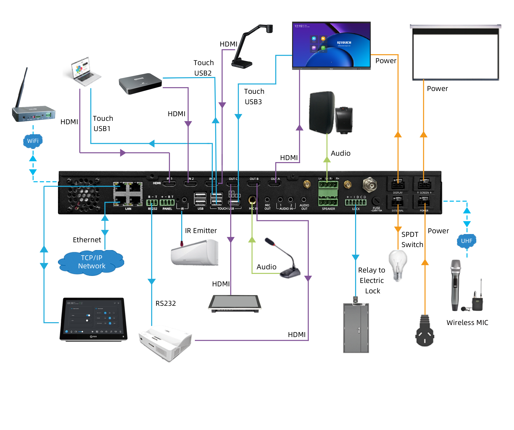

Q-NEX Networked Media Processor

 
NMP211

 
—— User Manual ——

 

Returnstar Interactive Technology Group Co., Ltd.

# 1. Introduction

The Q-NEX Networked Media Processor incorporates Ethernet connectivity into its device control system, allowing for remote operation and centralized management of various devices within a school setting.

# 2. Components of NMP

## 2.1 NMP Front View

 

| No.  | Interface       | Description                                                  |
| ---- | --------------- | ------------------------------------------------------------ |
| 1    | MIC 1 Indicator | 1. **Off**: Handheld microphone not paired or pairing unsuccessful. 2. **On (Green)**: Successful pairing with the NMP. 3. **Blinking (Green)**: Pairing in progress. |
| 2    | MIC 2 Indicator | **Off**: Mic not paired or pairing unsuccessful. 2. **On (Green)**: Successfully paired with the NMP. 3. **Blinking (Green)**: Pairing in progress |

## 2.2 NMP Rear View

 

| No.  | Interface                                     | Description                                                  |
| ---- | --------------------------------------------- | ------------------------------------------------------------ |
| 1    | RJ45 * 4                                      | Ethernet ports for NMP network connectivity and switch functionality (100Mbps, non-PoE). |
| 2    | HDMI Matrix 3 * 3                             | 3 HDMI inputs and outputs forming the NMP's video matrix.    |
| 3    | 2.4G Wi-Fi Antenna Interface * 2              | Built-in 2.4G Wi-Fi RP Transceiver for wireless device integration and control expansion. |
| 4    | UHF Wireless Microphone Antenna Interface * 1 | Built-in receiver for UHF wireless microphones, supporting one-to-two setups. |
| 5    | Display (WAGO) * 1                            | Provides power output for connected devices such as projectors, TVs, IFPs, and smart podiums. |
| 6    | UP-DOWN (WAGO) * 1                            | Offers control functions for connected devices like projector screens and motorized curtains. |
| 7    | RS232 * 1                                     | Allows connection to devices with standard RS232 ports like PTZ cameras and IFPs. |
| 8    | Panel * 1                                     | Interface for mechanical control panels, enabling direct control of devices and AV matrix switching. |
| 9    | IR * 2                                        | IR learner port for remote codes and IR emitter port for remote control. |
| 10   | USB * 2                                       | Reserved for card reader.                                    |
| 11   | Touch USB * 3                                 | USB interfaces for NMP's touch-following feature.            |
| 12   | 6.35mm Wired Microphone In * 1                | Interface for connecting a wired microphone.                 |
| 13   | 3.5mm MIC Mixed Out * 1                       | Mixes audio from microphone input and wireless microphones for combined output. |
| 14   | Audio-IN * 2                                  | Line-in interfaces for connecting external audio devices.    |
| 15   | Audio Out                                     | Audio output interface for connecting to speakers or amplifiers. |
| 16   | External Speaker Output                       | Integrated power amplifier for passive speakers (Fixed impedance only). |
| 17   | Lock * 1                                      | Interface for door lock control systems.                     |
| 18   | Power Fuse * 1                                | Protection against electrical faults.                        |
| 19   | External Port (WAGO) * 1                      | Interface for lighting control and other devices.            |
| 20   | NMP Power Supply (WAGO) * 1                   | Power supply supporting wide voltage range (110-240 V AC).   |

## 2.3 Handheld Microphone

 

| No.  | Description  |
| ---- | ------------ |
| 1    | LCD Screen   |
| 2    | Power Button |

**Handheld Micriophone Usgae:**

- Press power button to turn on/off.
- Press **once** to switch channels; press **three** times quickly to enter/exit pairing mode.

Note :

The microphones are pre-configured before shipping. Unless necessary, there is no need to re-pair them. For detailed pairing instructions, please refer to the user manual.

## 2.5 Lapel Microphone

 

| No.  | Description           |
| ---- | --------------------- |
| 1    | Lapel Mic Port        |
| 2    | Power Switch (Slider) |
| 3    | Antenna               |
| 4    | LCD screen            |
| 5    | Volume Adjust         |
| 6    | Channel Button        |

**Usage Instructions:**

- Slide the power button to the left to turn on the power, and slide it to the right to turn off the power.
- Channel Button: Press **once** to switch channels; press **three** times quickly to enter the pairing mode, and press **once more** to exit pairing mode.

Note :

The microphones are pre-configured before shipping.

# 3. Get Started

1. connect the NMP to power and the router with a long network cable.

2. Power the 10-inch Android Touch Panel using either a power adapter or PoE (do not use both simultaneously) and connect it to the NMP network—either via its LAN port or through a router/switch on the same LAN.

    

3. Log in at https://mg.qnextech.com/console/login and click "Dashboard" to access the platform.（After purchase, you'll receive your account details from our sales team.）

    

4. IP Address Retrieval

   Log into the Dashboard’s “Devices >> Processor Manage” page to find your NMP’s IP, then enter it on the Touch Panel and click “Connect.” 

    

   **Note**:

   For issues or consistency, use the router or NMP Config Tool to verify/set a static IP.

5. Enter the NMP IP Address: After connecting to the network, input the NMP IP address on the Touch Panel.

    

6. Prepare long HDMI cables; connect each from an IFP to the NMP’s HDMI Out. Then, use Q-NEX software to manage inputs and outputs.

    

**Note**:

For further details on NMP's features—such as device control, broadcasting, and touch-following wiring setups—please refer to the User Manual or contact your account manager for the necessary materials.

# 4. Contact Us

Q-NEX (https://qnextech.com/) is a subsidiary of Returnstar Interactive Technology Group Co, Ltd, a company that has been dedicated to the education industry since 2006. 

Q-NEX is focused on delivering a Smart Campus Solution that converges AV and loT control across all campus facilities. Q-NEX offers deeply customized options that assist school IT administrators in managing all electronic facilities and allow teachers to simplify the operations of a multimedia classroom.

 

