
Q-NEX Networked Media Processor

 
NMP211

 
—— User Manual ——

 

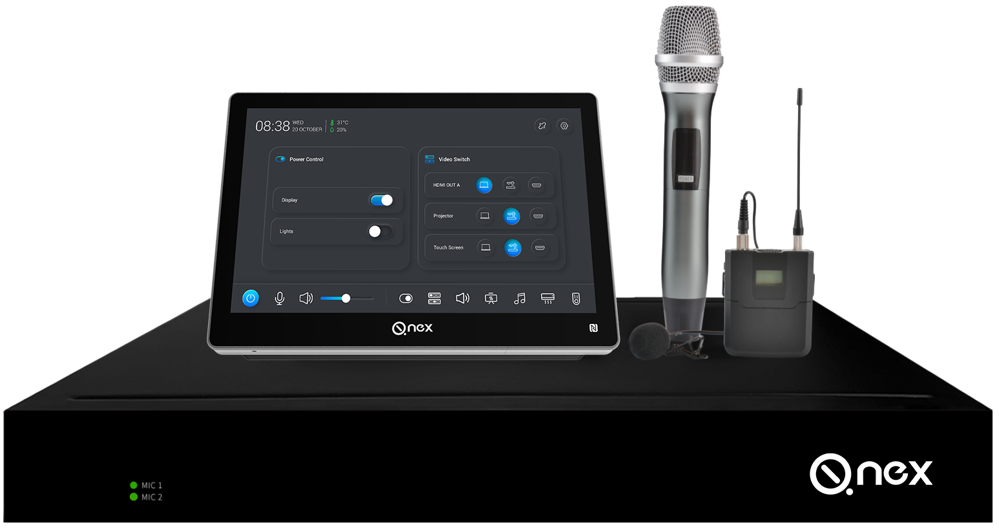

Returnstar Interactive Technology Group Co., Ltd.

<!-- break -->

[toc]

# Safety Instructions 【4.3.4 Electric LOCK connection】章节需要补充

To ensure the safe and effective operation of this equipment, please read the following instructions carefully. Failure to comply with these guidelines may result in serious injury or damage to the device.

## 1. General Safety Instructions

- **Power Source**: To safely disconnect the equipment from power,  remove the power cord from the unit or the power source. The power plug serves as the disconnect device and should remain easily accessible.
- **No User-Serviceable Parts**: There are no user-serviceable parts inside this equipment. Do not open the device. All servicing should be performed by qualified personnel. Removing the cover may expose you to dangerous voltages and will void the warranty.
- **Ventilation**: Ensure proper ventilation to avoid overheating. Do not block any ventilation openings. Install the equipment in accordance with the manufacturer's instructions. Avoid placing the device in a confined space without sufficient airflow.

## 2. Placement

- **Stable Surface**: Place the equipment on a stable surface to prevent it from tipping over. Avoid placing it on an unstable cart, stand, tripod, or table.
- **Heat Sources**: Keep the equipment away from direct sunlight, radiators, heat registers, stoves, or other heat-producing devices.
- **Water and Moisture**: Do not expose the equipment to rain, moisture, or any type of liquid. Avoid placing liquid-filled objects, such as vases, on or near the equipment.
- **Magnetic Fields**: Keep the device away from strong magnetic fields that could interfere with its operation.

## 3. Power Supply

- **Voltage Compatibility**: Ensure the operating voltage of the equipment matches the local power supply. Using incorrect voltage may damage the device and void the warranty.
- **Storm Precautions**: During thunderstorms or when the equipment is not in use for an extended period, unplug the power cord and any connected cables to protect the device from power surges.
- **Power Cord Care**: Handle the power cord with care. Avoid pinching, bending, or placing heavy objects on it. Only use the power cord provided with the equipment, and do not modify or extend it.
- **Grounding**: Ensure that the power outlet used is properly grounded to prevent electric shock.
- **Power Outages**: Sudden power failures may damage the equipment. If a power outage occurs, turn off the device and unplug the power cord to protect it from potential damage.

# 1. Introduction

The Q-NEX Networked Media Processor integrates the Ethernet connection into the device control system, allowing users to remotely control the device. It is mainly designed to assist the school's IT admin in managing various electronic facilities in a school, and free teachers from the complicated operation of a multimedia classroom.

## 1.1 Device Connection Diagram

## 1.3 Terminology

| Term                                                 | Descriptions                                                 |
| ---------------------------------------------------- | ------------------------------------------------------------ |
| NMP                                                  | Networked Media Processor, NMP is the core component that enables functionalities such as remote device control, audio/video matrix switching, and advanced features like "Touch-Following,", "Broadcasting", and "Live Streaming". |
| [Touch Panel](#2.3 Touch Panel )                     | The Touch Panel serves as the primary control interface, providing intuitive touch-based controls for the operation of the NMP. |
| [Web-console](https://mg.qnextech.com/console/)      | Web-console is a web-based platform for remote device management of NMP, constituting a part of NMP. This platform enables operations similar to the Touch Panel for individual devices and also allows simultaneous operations on multiple NMPs. Additionally, it provides functions such as scheduling device controls, broadcasting, and live streaming. |
| Q-NEX App                                            | A mobile application for controlling Q-NEX NMP systems       |
| [Dashboard](https://mg.qnextech.com/dashboard/index) | The Dashboard is the backend management system of the Q-NEX platform, constituting a part of NMP. Basic configurations such as [IP lookup](#3.2 Connect Touch Panel to NMP) for the Touch Panel during the initial stage, or login information for Web-Console and Q-NEX App, as well as operations related to learning and utilizing the [infrared code library](#4.3.2 IR Control) mentioned in this document, all rely on the support of the Dashboard system. |
| Device Connection Diagram                            | Illustrates the physical connections and layout between devices, emphasizing direct connections and interface relationships. Helps understand specific device connections, including ports, cables, and physical details of the connections. |
| Topology Diagram                                     | Depicts the overall architectures and logical relationships between devices. Emphasizes the roles and positions of devices within the network, as well as data flow and transmission paths. Helps understand the structure and operation of the network. |

# 2. Components of NMP

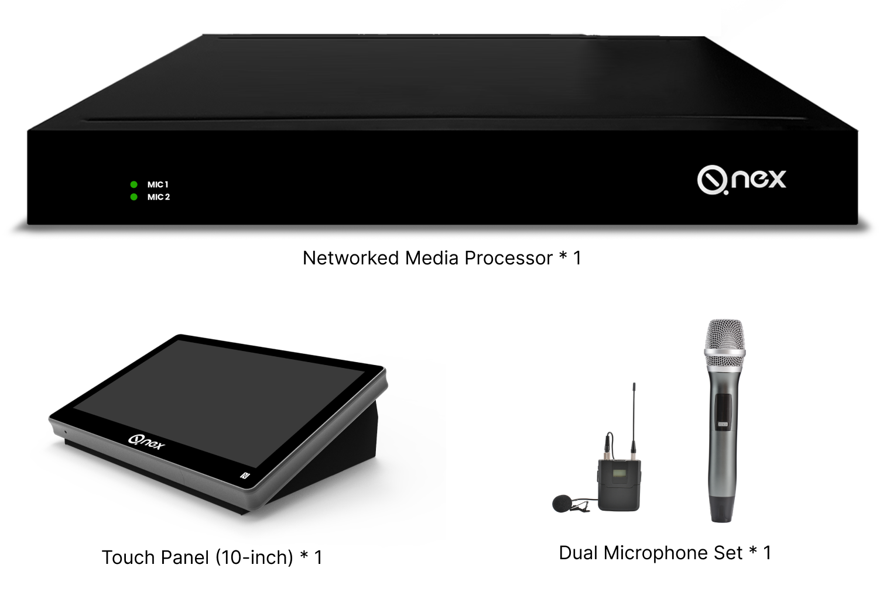

## 2.1 NMP Front View

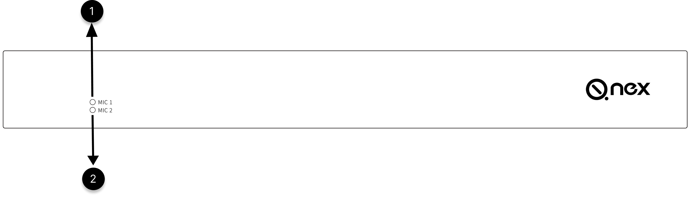 

| No.  | Interface       | Description                                                  |
| ---- | --------------- | ------------------------------------------------------------ |
| 1    | MIC 1 Indicator | Indicates the status of the handheld microphone for the NMP's one-to-two wireless microphone setup (handheld microphone + lavalier microphone). It has three states: 1. **Off**: Indicates that the handheld microphone is not paired with the NMP, or pairing is unsuccessful. 2. **On (Green)**: Indicates successful pairing between the handheld microphone and the NMP. 3. **Blinking (Green)**: Indicates that the handheld microphone is currently pairing with the NMP. |
| 2    | MIC 2 Indicator | Indicates the status of the lavalier microphone for the NMP's one-to-two wireless microphone setup (handheld microphone + lavalier microphone). It has three states: 1. **Off**: Indicates that the lavalier microphone is not paired with the NMP, or pairing is unsuccessful. 2. **On (Green)**: Indicates successful pairing between the lavalier microphone and the NMP. 3. **Blinking (Green)**: Indicates that the lavalier microphone is currently pairing with the NMP. |

## 2.2 NMP Rear View

 

| No.  | Interface                                     | Description                                                  |
| ---- | --------------------------------------------- | ------------------------------------------------------------ |
| 1    | RJ45 * 4                                      | Ethernet ports (100Mbps, non-PoE) for NMP network connectivity; also enables NMP to function as a switch. |
| 2    | HDMI Matrix 3 * 3                             | Consists of 3 HDMI inputs and 3 HDMI outputs, forming the video matrix for NMP. |
| 3    | 2.4G Wi-Fi Antenna Interface * 2              | Built-in 2.4G Wi-Fi RP Transceiver within NMP, allowing wireless device integration and control expansion with Q-NEX's CBX component. |
| 4    | UHF Wireless Microphone Antenna Interface * 1 | Built-in receiver for UHF wireless microphones, supporting one-to-two wireless microphone setups for teaching/meeting scenarios. |
| 5    | Display (WAGO) * 1                            | Provides power output for connected devices, such as projectors, TVs, Interactive Flat Panels (IFP), and smart podiums. |
| 6    | UP-DOWN (WAGO) * 1                            | Offering up, pause, and down functions for connected devices like projector screens and motorized curtains. |
| 7    | RS232 * 1                                     | Allows connection to devices equipped with standard RS232 ports, such as Pan-Tilt-Zoom (PTZ) cameras and Interactive Flat Panels(IFP), etc. |
| 8    | Panel * 1                                     | Interface for connection to mechanical control panels, allowing direct control of basic devices and AV matrix switching without the need for network connectivity. |
| 9    | IR * 2                                        | IR learner port * 1: Used for learning IR remote control codes. IR emitter port * 1: For infrared remote control functionality. |
| 10   | USB * 2                                       | Reserved for card reader                                     |
| 11   | Touch USB * 3                                 | **TOUCH USB IN * 1 **:  Receives touch signals from the Interactive Pen Display.  **TOUCH USB OUT * 2** : Sends touch signals to OPS or Laptop for touch-following functionality. For details, refer to section [4.2.1.1 Touch-following](#4.2.1.1 Touch-following). |
| 12   | 6.35mm Wired Microphone In * 1                | Interface for connecting a 6.35mm wired microphone. Use a wired microphone for clear reinforcement during instruction or conferences. |
| 13   | 3.5mm MIC Mixed Out * 1                       | Mixes audio from both the microphone input and the wireless microphones (one-to-two) for combined output. |
| 14   | Audio-IN * 2                                  | Two 3.5mm line-in interfaces for connecting external audio devices such as laptops, smartphones, etc. |
| 15   | Audio Out                                     | Audio output interface for connecting to speakers or amplifiers. |
| 16   | External Speaker Output                       | The NMP includes an integrated power amplifier, capable of delivering 2*(40w+40w) output, designed to connect with passive speakers.  (Fixed impedance speakers only). |
| 17   | Lock * 1                                      | Allows integration with door lock control systems, enabling scenarios such as automatic door lock closure after a specified period post door opening. |
| 18   | Power Fuse * 1                                | Power fuse for protection against electrical faults.         |
| 19   | External Port (WAGO) * 1                      | External port interface for lighting control and other devices. there are two methods to control lighting and other devices: 1. **Direct Connection to NMP-External**: With this mode, users can directly manage lighting control using NMP. 2. **Integration with SPDT Switch**: By replacing the existing switch panel with a Single Pole Double Throw (SPDT) switch and connecting it to NMP, both NMP and the switch panel can control the lighting. |
| 20   | NMP Power Supply (WAGO) * 1                   | Power supply for NMP, supporting wide voltage range (110-240 V AC). |

## 2.3 Touch Panel

The Touch Panel is a 10-inch Android touchscreen device, custom-designed to work with the NMP. Its applications are tailored specifically for controlling various functions of the NMP, such as video matrix switching, volume, and microphone control, as well as infrared and RS232 control, etc.

 

## 2.4 Handheld Microphone

 

| No.  | Description  |
| ---- | ------------ |
| 1    | LCD Screen   |
| 2    | Power Button |

**Handheld Micriophone Usgae:**

- Press the power button to turn on the microphone; long press to turn off.
- Press **once** to switch channels; press **three** times quickly to enter pairing mode,, and press **once more** to exit pairing mode.

**Paring Instructions**:

Please note that the microphones are pre-configured before shipping. Unless necessary, there is no need to repair them.

1. Before pairing, ensure all NMP antennas are fully extended. Point the microphone at the UHF antenna (the longest one) for pairing.

2. Ensure the NMP main power is off before paring.

   > You may use the Touch Panel to power off the NMP's main power

3. Press the power button **three** times quickly to enter pairing mode.

4. Immediately power on NMP using Touch Panel, then the microphone will automatically pair with NMP( (the NMP has a built-in receiver).

5. Successful pairing indicated by solid green MIC 1 light on MMP.

Note :

- Ensure the NMP main power is off before starting pairing.
- To ensure successful pairing, bring the microphone close to the NMP's antenna during the pairing process. 

## 2.5 Lapel Microphone

 

| No.  | Description           |
| ---- | --------------------- |
| 1    | Lapel Mic Port        |
| 2    | Power Switch (Slider) |
| 3    | Antenna               |
| 4    | LCD screen            |
| 5    | Volume Adjust         |
| 6    | Channel Button        |

**Usage Instructions:**

- Slide the power button to the left to turn on the power, and slide it to the right to turn off the power.
- Channel Button: Press **once** to switch channels; press **three** times quickly to enter the pairing mode, and press **once more** to exit pairing mode.

**Pairing Instructions:**

Please note that the microphones are pre-configured before shipping. Unless necessary, there is no need to repair them.

1. Before pairing, ensure all NMP antennas are fully extended. Point the microphone at the UHF antenna (the longest one) for pairing.

2. Before initiating pairing, ensure the main power of the NMP is turned off

   > You may power off the NMP main power via the Touch Panel.

3. With the lavalier microphone powered on, quickly press the pairing button **three** times to enter pairing mode.

4. Immediately proceed to power on the NMP main power via the Touch Panel, then the lavalier microphone will automatically pair with the NMP (the NMP has a built-in receiver)

5. Upon successful paring, the MIC 2 indicator light on the front of the NMP will remain solid (green).

Note :

- Ensure the NMP main power is off before starting pairing.
- To ensure successful pairing, bring the microphone close to the NMP's antenna during the pairing process. 

# 3. Get Started

## 3.1 Power and Network Access 

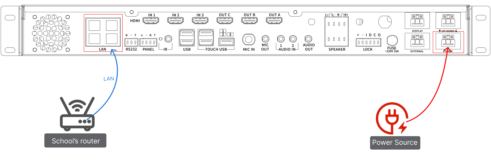

1. Upon arrival in the classroom, connect the NMP's power to the general power supply within the classroom to provide power to the NMP. 
2. Prepare a network cable with sufficient length. Connect one end to one of the LAN ports of the NMP and the other end to the router in the classroom.

## 3.2 Connect Touch Panel to NMP

The Touch Panel is a 10-inch Android touchscreen device, custom-designed to work with the NMP. Its applications are tailored specifically for controlling various functions of the NMP, such as video matrix switching, volume and microphone control, as well as infrared and RS232 control, etc.

1. Power the Touch Panel: 

   The Touch Panel supports two power supply methods:

   - Use a power adapter.
   - Use PoE (Power over Ethernet). The Touch Panel supports PoE.

    Warning: 

   **Do not power the Touch Panel using both the adapter and POE simultaneously, as it may cause a short circuit and void the warranty.**

2. Connect to the Network:

   - Connect  the Touch Panel to the NMP LAN port

     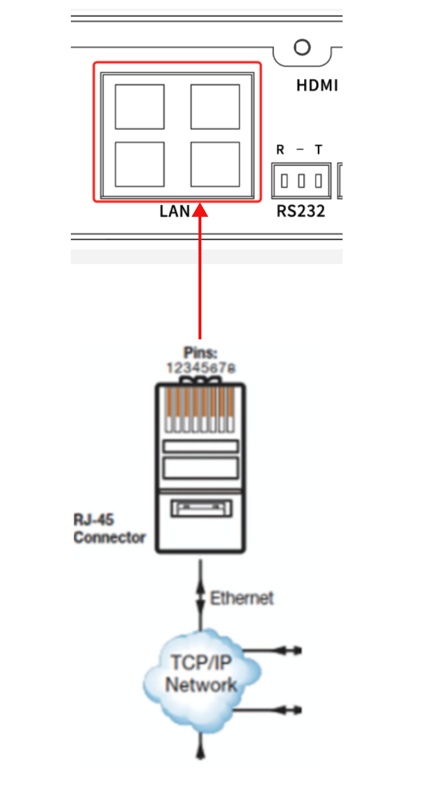  

   - Or connect the Touch Panel to the router/switch, ensuring the Touch Panel and NMP are on the same LAN

3. After purchasing, you’ll receive your account details from our sales team via email or other methods (e.g., WhatsApp, phone).

4. Log in to the Web-Console at https://mg.qnextech.com/console/login.

5. In Web-Console, use the "Dashboard" button to access the Dashboard platform. 

    

   > For platform roles, see "1.3 Terminology" in the User Manual.

6. IP Address Retrieval

   Retrieve the NMP IP address by logging into the [Dashboard](https://mg.qnextech.com/dashboard/index) and visiting the  '***Devices >> Processor Manage***' page. Identify your NMP and note the IP address from the 'IP Address' column.

   Enter this IP on the Touch Panel and click 'Connect'." to establish a connection with the NMP.

    

   **Note**:

   - If connection issues arise, use the router device or NMP config Tool.exe to identify the correct IP address, particularly in situations where DHCP changes may not be immediately reflected in the web-based backend.
   - For consistent access, consider using the Q-NEX Config Tool to set a static IP for the NMP, preventing IP changes post-reboot or network alterations.

7. Enter the NMP IP Address: After connecting to the network, input the NMP IP address on the Touch Panel.

    

8. Unlock the Touch Panel to activate the NMP main power. 

    

## 3.3 Connecting IFPs to NMP 

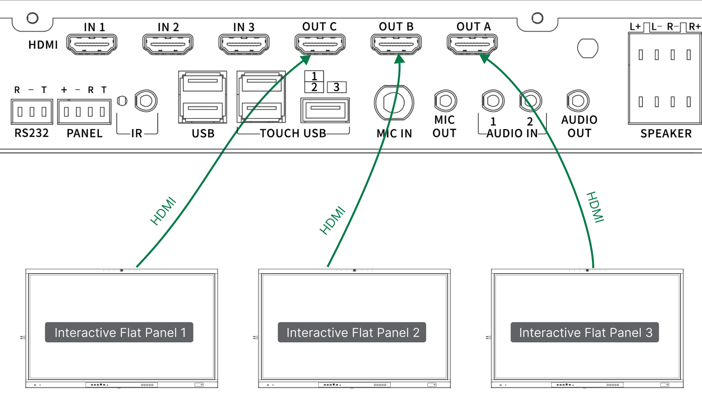 

1. **Prepare HDMI Cable**: Ensure you have sufficiently long HDMI cables to connect the IFPs to the NMP.
2. **Connect HDMI Cable**: Plug one end into IFP and the other into NMP's HDMI Out ports

Once the classroom displays are set up, users can utilize the Q-NEX software to manage input and output sources. 

For instructions on how to perform video switching with the NMP, please refer to section [4.2.1 Video Matrix Switch](#4.2.1 Video Matrix Switch).

# 4. Wiring and Setup

In addition to the basic functionalities provided in the preceding sections, the NMP is capable of interfacing with classroom devices for remote control and advanced operations. 

To enable these advanced features, system integrators are required to perform basic wiring and setup tasks. This section focuses on detailing these essential connections and configurations necessary for integrating the NMP with classroom devices.

## 4.1 Get ready for NMP

###  4.1.1 WAGO Connector Installation Guide

The NMP includes several WAGO connectors that require proper wiring. These connectors are designated for DISPLAY, UP-DOWN, EXTERNAL, and POWER interfaces. 

While the POWER interface is pre-configured before shipment, the other three interfaces need to be wired on-site based on the specific layout and requirements of the installation environment.

Follow the steps below to correctly install these connectors.

| Step | Screenshot                                                  | Instructions                                                 |
| ---- | ----------------------------------------------------------- | ------------------------------------------------------------ |
| S1   |        | Wire Preparation 1. Strip the insulation off the ends of the wires.  Refer to the image for specific length requirements 2. If the wires are stranded, twist them together to form a single strand. |
| S2   |  | Wire Connection to WAGO Connector 1. Align the wires according to their respective terminals on the WAGO connector.  Ensure strict adherence to the correct sequence for live and neutral wires. 2. Firmly insert a flathead screwdriver into the small hole above the wire (to open the clamping mechanism below). 3. Apply slight pressure to push the wire into the terminal hole. 4. Remove the screwdriver, allowing the clamping mechanism to secure the wire firmly in place. 5. Gently tug on the wire to ensure it is securely fastened. |
| S3   |       | Cover Installation for WAGO Connector 1. Align the cover with the WAGO connector 2. Press down firmly on the cover until it snaps securely into place. |

 Warning:

**During installation, be cautious not to connect the neutral and live wires of the AC power supply (positive and negative poles of the DC power supply) to the Wago port simultaneously, as it may cause a short circuit.** 

### 4.1.2 Terminal Block Installation Guide

The NMP features several terminal block interfaces that also require proper wiring, these include interfaces for RS232, PANEL, SPEAKER, and LOCK.

These terminal block connections need to be configured on-site, tailored to the specific size and requirements of the installation environment. 

Follow these steps to install the terminal blocks:

| Step | Screenshot                                                   | Instructions                                                |
| ---- | ------------------------------------------------------------ | ----------------------------------------------------------- |
| S1   |  | Turn the screwdriver counter-clockwise to loosen the screw. |
| S2   |  | Insert the bare wire into the hole of the terminal block    |
| S3   |  | Turn the scewdriver clockwise to tighen the screw.          |

## 4.2 AV Control 

The AV Control section of the NMP encompasses various features aimed at managing audiovisual signals through the NMP.

### 4.2.1 Video Matrix Switch 

- The  NMP's Video Matrix Switch routes video signals from multiple input sources to different output displays.

  - Connect display devices, such as laptops, document cameras, IQShare(WP40), etc., to HDMI In.
  - Connect display devices, like IFP, TV, projector, etc., to HDMI Out.

  

  While for the NMP interfaces, we have established the following configurations:

  **HDMI INs for NMP**:

  | HDMI In Port | Input Source           |
  | ------------ | ---------------------- |
  | HDMI In 1    | Built-in PC            |
  | HDMI In 2    | Podium Desktop HDMI-In |
  | HDMI In 3    | Podium Desktop USB-C   |

  **HDMI Outs for NMP**:

  | HDMI Out Port | Output Destination             |
  | ------------- | ------------------------------ |
  | HDMI Out A    | Interactive Pen Display        |
  | HDMI Out B    | Interactive Flat Pen Display 1 |
  | HDMI Out C    | Interactive Flat Pen Display 2 |

  **Note**:

  For information on the deployment of HDMI Out ports on the NMP, please refer to "[3.3 Connecting IFPs to NMP](#3.3 Connecting IFPs to NMP )."

  

  After connecting the desired input and output devices, users can perform video matrix switching from various input sources to different output displays via Touch Panel, Web-console, or Q-NEX App.

   

   

 

####  4.2.1.1 Touch-following 

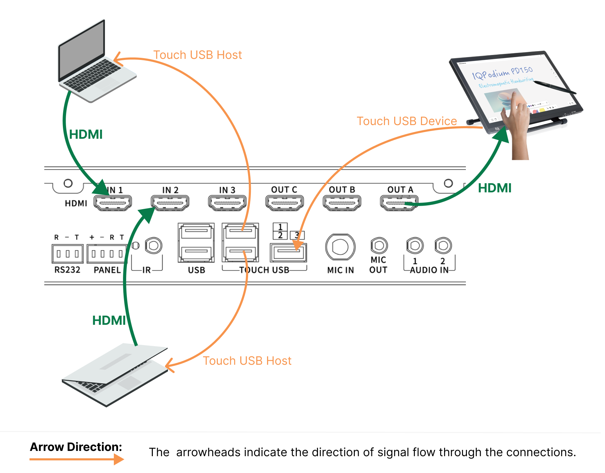 

"Touch-following" is a feature that enables continuous touch operation across multiple input sources.It allows users to switch between devices without interrupting touch functionality, ensuring a smooth and uninterrupted user experience. 

**USB Port Assignments for Touch-following**：

- **TOUCH IN (Touch USB 3)**: Designed to receive touch input from the Interactive Pen Display, allowing NMP to interpret and process touch signals directly from the display device.
- **TOUCH OUT (Touch USB 1,2)**: Provides touch signal output to external input sources, such as OPS or Laptop, enabling touch-following functionality across multiple devices.

**Note**: 

Ensure correct matching of HDMI and Touch USB connections to avoid confusion.

### 4.2.2 Audio Control

#### 4.2.2.1 SPEAKER

##### 1. SPEAKER Connection Instructions

 

**Line Type Representation：**

| Lines                                                   | Descriptions                                                 |
| ------------------------------------------------------- | ------------------------------------------------------------ |
|  | **Arrow Direction**: The arrowheads indicate the direction of device connection |
|  | **Solid line**:  Indicate devices connected via wired cables. |
|   | **Dashed line**: Indicate devices directly plugged into interfaces (without intermediary cables) |

1. The NMP features an integrated power amplifier capable of delivering ***2\*(40w+40w)*** output, designed specifically for connecting with passive speakers.
2. It's important to note that the NMP only supports ***fixed impedance*** speakers and does not support fixed voltage speakers.
3. To connect passive speakers, users should replace the speaker cable with a ***Phoenix audio connector*** and plug it into the designated speaker interface.
4. The NMP supports the connection of up to ***two pairs*** of passive speakers.

After successful wiring and setup, you can control the volume via the Touch Panel, Web-console, or Q-NEX APP.

##### 2. Device Connection Diagram for SPEAKER

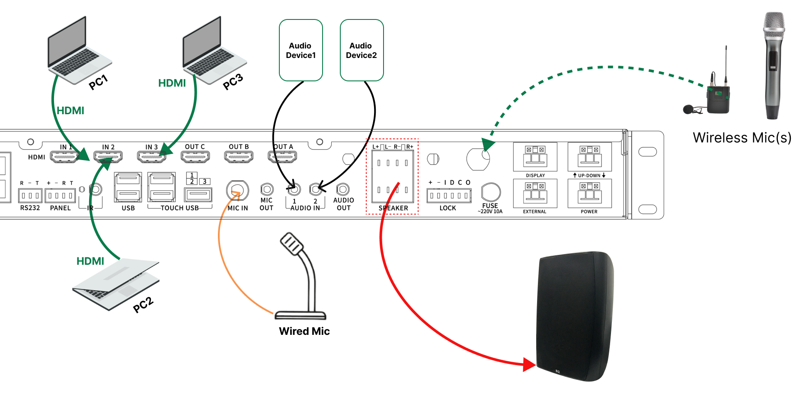

**Line Type Representation: **

| Lines                                                    | Descriptions                                                 |
| -------------------------------------------------------- | ------------------------------------------------------------ |
|  | **Arrow-head**: indicates the direction of audio signal flow through the connections. |
|   | **Solid line**: indicates physical cables connection.        |
|    | **Dashed line**: indicates wireless connection               |

 

**Note**:

Please note that this legend is designed to explain the flow of audio signals. It is not intended to restrict the compatibility to only these devices. 

In fact, The NMP offers versatile connectivity options for various devices, enabling customized solutions for different scenarios. 

If you find this legend doesn't meet your needs, feel free to consult our solutions team.

##### 3. Topology Diagram for SPEAKER

**Line Type Representation: **

| Lines                                                    | Descriptions                                                 |
| -------------------------------------------------------- | ------------------------------------------------------------ |
|  | **Arrow Direction**: indicates the direction of audio signal flow through the connections. |
|   | **Solid line**: indicates the ability to output multiple audio signal simultaneously. |
|    | **Dashed line**: only ONE audio source can be input to the speaker at a time |

 The Speaker interface supports simultaneous mixing and output of audio from:

1. **HDMI OUT A / AUDIO IN 1 / AUDIO IN 2:** (one source at a time)
2. **Wireless Microphone**
3. **MIC IN**

##### 4. SPEAKER Interface Control Features 

After completing the necessary wiring setup, users can control the volume, treble, and bass of the device connected to the SPEAKER interface (e.g., passive speaker) via the Touch Panel, Web-console, or Q-NEX APP.

 

#### 4.2.2.2 AUDIOs

    

1. AUDIO IN: Connect external audio devices.

2. AUDIO OUT: Connect external sound amplification devices, such as speakers or amplifiers.

##### 1. Device Connection Diagram for AUDIO

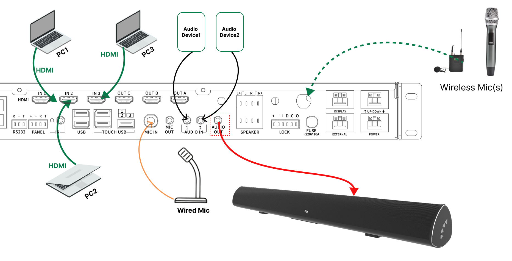

**Line Type Representation: **

| Lines                                                    | Descriptions                                                 |
| -------------------------------------------------------- | ------------------------------------------------------------ |
|  | **Arrow-head**: indicates the direction of audio signal flow through the connections. |
|   | **Solid line**: indicates physical cables connection.        |
|    | **Dashed line**: indicates wireless connection               |

**Note**:

1. This legend explains audio signal flow and isn't limited to specific devices. The NMP offers versatile connectivity for various needs. Reach out to our solutions team if you need further assistance."
2. Audio signals from the AUDIO IN interfaces can be directly output to the AUDIO OUT and SPEAKER interfaces. However, the signals cannot be output to the HDMI OUT interfaces.

##### 2. Topology Diagram for AUDIO

**Line Type Representation：**

| Lines                                                    | Descriptions                                                 |
| -------------------------------------------------------- | ------------------------------------------------------------ |
|  | **Arrow Direction**：indicates the direction of audio signal flow through the connections. |
|   | **Solid line**： indicates the ability to output multiple audio signal simultaneously. |
|    | **Dashed line**：only ONE audio source can be input to the speaker at a time |

The Audio-out serves as an output for audio signals from various input sources.  It supports simultaneous mixing and output of audio from:

1. **HDMI OUT A / AUDIO IN 1 / AUDIO IN 2:** (one source at a time)
2. **Wireless Microphone**
3. **MIC IN**

 

##### 3. Audio Interface Control Features

After completing the necessary wiring setup, users can control the Audio such as volume, treble, and bass via the Touch Panel, Web Console, Q-NEX APP.

 

#### 4.2.2.3 Mic

The Mic sources can combine both wireless and wired input, with outputs directed simultaneously to the AUDIO OUT and SPEAKER interface.

Please note that the audio from the microphone (Mic-in) can be independently controlled through a dedicated control module. Users can control the volume or mute the microphone's audio using the dedicated Mic control module.

 

**Note**:

1. Given the above screen capture, adjustments made within the Speaker module will affect HDMI OUT A, AUDIO IN 1, and AUDIO IN 2 sources, but will not affect the microphone (MIC IN).
2. During broadcasting, the Mic channel will be muted and users cannot unmute the microphone through the Touch Panel, Web Console, or Q-NEX APP during the broadcast. The mute will automatically be lifted when the broadcast ends.

## 4.3 Device Control

### 4.3.1 Power control

 

This section governs the power management and operational control of connected devices through interfaces like Display, Up-Down, and External Wago connectors. Users can regulate power distribution and device states by NMP.

**Power Specifications**: 

1. NMP device maximum power: 2000W.
2. DISPLAY port maximum power: 1200W.
3. UP-DOWN port maximum power: 300W 
4. EXTERNAL port maximum power: 1200W. (Acts as a switch, the power does not count towards NMP's total power consumption)

 **Caustion: Electrical Installtion Requires Qualified Personnel**

**The installation and wiring of components such as "DISPLAY", "UP-DWON", and "EXTERNAL" interfaces involve working with high-voltage systems. To ensure safety and compliance with industry standards, these tasks must only be performed by licensed electricians or qualified technical personnel.** 

**Warning: Power Off During Wiring**

To ensure safety during wiring, make sure the NMP is completely powered off, and the power plug is disconnected from the outlet. Only after completing the wiring tasks for the DISPLAY, UP-DOWN, and EXTERNAL interfaces, should you reconnect the power and proceed with testing.

#### 1. DISPLAY 

The DISPLAY Wago interface serves to provide power to display devices such as IFPs and projectors. Additionally, it facilitates controlled shutdown procedures (with RS232 port) for these devices to mitigate the risk of damage caused by sudden power loss.

 

**Connection Steps:**

1. Replace the device plug with the WAGO connector. Refer to [4.1.1 WAGO Connector Installation Guide](#4.1.1 WAGO Connector Installation Guide) for Wago connector installation instructions.
2. Connect the WAGO connector to the DISPLAY port of the NMP.
3. Devices can still be powered on or off by solely connecting to the DISPLAY port.

Note:

For devices requiring controlled shutdown and delayed power-off settings (For example: IFP, projector), connect them to the NMP's RS232 port. This ensures that devices receive proper shutdown instructions before power is cut off, and allows for adequate cooling before shutting down completely.

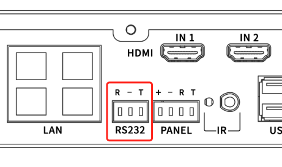 

To configure the power settings, log in to the Dashboard and navigate to "***Device >> Processor Manager.***" Select the appropriate device and click "Edit." On the edit page, scroll down to find the "Power Settings" tab. 

In the "**\* Power off delay**" field, enter a value in seconds as shown in the example image: 

 

After completing the wiring, you can use the Q-NEX software platform (such as the Touch Panel) to control the DISPLAY port:

#### 2. UP-DOWN 

The UP-DOWN  Wago interface is specifically designed for controlling projection screens. Users can remotely raise or lower the projection screen via the NMP's control options, including the Q-NEX Console, mobile app, or Touch Panel.

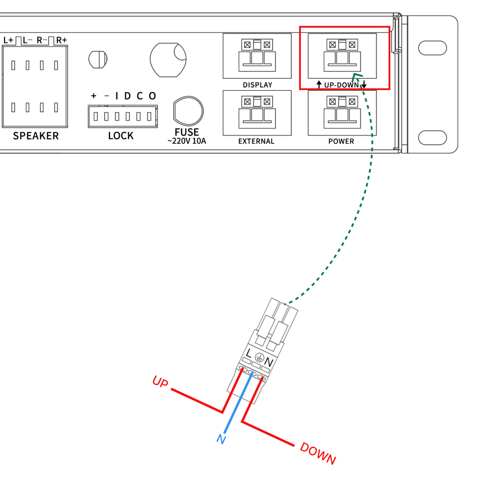  

**Line Type Representation: **

| Lines                                                   | Descriptions                                                 |
| ------------------------------------------------------- | ------------------------------------------------------------ |
|  | **Arrow Direction**: The arrowheads indicate the direction of device connection |
|  | **Solid line**: Indicate devices connected via wired cables. |
|   | **Dashed line**: Indicate devices directly plugged into interfaces (without intermediary cables) |

**Connection Steps:**

1. Replace the plug of the projection screen with the WAGO connector. Refer to [4.1.1 WAGO Connector Installation Guide](#4.1.1 WAGO Connector Installation Guide) for Wago connector installation instructions.
2. Wire Configuration
   - Connect the "UP" wire to the "L" port of the Wago connector.
   - Connect the "DOWN" wire to the "N" port of the Wago connector.
   - Connect the "N" wire to the "G" port of the Wago connector.
3. Connect to the Up-Down port. 
4. Connect the other end of the wires to the corresponding terminals on the projection screen curtains.

 **Note**: This wiring configuration is exclusively for use with projection screen curtains.

After completing the required wiring setup, users can perform up and down operations using the Touch Panel, Web Console, or Q-NEX APP. 

 

**Note: about electric curtains control**

Users should be aware that our product also supports the control of electric curtains for raising and lowering. 

However, this connection method can be much more complex, different products and scenarios may require different wiring configurations to achieve control. 

Therefore, we recommend consulting our professional consulting team for assistance.

#### 3. EXTERNAL

The EXTERNAL interface on the NMP enables flexible lighting control. Users can directly manage lighting or integrate it with an SPDT switch for customized automation and centralized control. Control settings can be adjusted via the Touch Panel and Web Console.

 

There are two methods to achieve lighting control with NMP: direct connection and integration with an SPDT switch.

**1. Direct Connection to NMP:** 

In this mode, user gains the ability to manage the lighting control by NMP.

    

: The current-carrying capacity of the "External" should not exceed 1200W

**2. Integration with SPDT Switch:** 

By replacing the existing switch panel with a Single Pole Double Throw (SPDT) switch and connecting it to NMP, both NMP and the switch panel gain control over the light.

 

: The current-carrying capacity of the"External" should not exceed 1200W

After completing the wiring for the external port, you can control it on the Touch Panel and Web-Console. 

### 4.3.2 IR Control

The NMP is equipped with both an IR IN and an IR OUT interface, allowing users to manage IR devices efficiently.

 

To control IR-enabled devices (e.g., air conditioner, TV, projector), NMP supports batch application of infrared control codes, enabling efficient control without repetitive learning. 

Here's a simplified guide for using IR functionality with an air conditioning unit:

1. Check if your air conditioner brand is in the Q-NEX database. If your air conditioner is recognized in the Q-NEX database, identify the control codes to manage and control it through the Touch Panel or Web-console.
2. If not in the database, use IR Learning on the Touch Panel or Web-console for control.

#### 1. Air Conditioner-Identified in the code database

Follow these steps:

1. Connect the infrared emitter to the 'IR' port on NMP, and aim it at the air conditioner, ensuring no obstacles between the emitter and the air conditioner:

    

2. Log in to Q-NEX Console -> Dashboard -> Devices -> Processor Manager. Choose your NMP device, in the 'IR Control' module, and click on the 'Edit' button:

    

3. Follow these steps:

   | Step | Screenshot                                                   | Instructions                                                 |
   | ---- | ------------------------------------------------------------ | ------------------------------------------------------------ |
   | S1   |             | In the IR control page, click "Identify New A/C control code" |
   | S2   |  | Click the "Start" button                                     |
   | S3   |   | Align the remote control with the IR interface, press the power button, and the system will automatically identify the remote control code. |
   | S4   |  | Upon successful identification, it will display " Identify successfully." |
   | S5   |  | After identification, enter the air conditioner's brand and category, then click Save. |
   | S6   |  | You will be redirected to the IR Control Setting page. Select the newly added air conditioner name and click Save. |

4. After successful saving, control the air conditioner on the Touch Panel or Web-console

 

#### 2. Air Conditioner-Unable to Identify in the Code Database

IR remote control module is available for unrecognized air conditioners or other devices using infrared remote control. Connect the infrared transmitter to the "IR" port of NMP, aim the transmitter at the device, and ensure there will be no blocks in between the transmitter and the device.

1. Log in to the "Q-NEX Console -> Dashboard -> Devices -> Processor manager". Select your NMP device, and in the "Infrared Control" module, click the "Edit" button. Follow the instructions below:

   | Step | Screenshot                                                   | Instructions                                                 |
   | ---- | ------------------------------------------------------------ | ------------------------------------------------------------ |
   | S1   |         | In the IR control interface, click the "New remote control code." button |
   | S2   |  | Select A/C click "Next".                                     |
   | S3   |  | Click "Start to learn"                                       |
   | S4   |   | 1. On the remote control, select the desired mode, such as setting the temperature to 25 degrees and choosing the cooling mode. 2. Power off the remote, then aim the remote at NMP's "IR IN" port and press the remote's power button again. 3. The system will start learning the selected air-conditioning mode. : To learn the power-off function, aim the remote at the IR port and power off directly. |
   | S5   |  | After successful learning, a "Success" prompt will  appear. Then click the "Next" button |
   | S6   |  | Enter the corresponding function name here                   |
   | S7   |  | Then you will be redirected to the "IR Control Setting" page. Then, select the newly added function name and click Save. |

2. After successfully saving, you can operate the device on the Touch Panel or Web Console 

: To learn additional modes for the air conditioner, follow steps S1 through S7. Additionally, note that the process for learning codes on other infrared devices is similar to the above steps

### 4.3.3 RS232 Control

NMP provides one RS232 interface, enabling control of devices such as IFP, projectors, and PTZ cameras.

1. Prepare cable for RS232 connection

    

2. If your device uses a DB9 connector (Interactive Flat Panel, for example), connect one end of the cable to the RS232 connector, with the R, G, T pins corresponding to the RS232 connector. Connect the other end to the DB9 connector.

    

   - Connect the RS232 connector's T (transmit) pin to the DB9's RX (Pin 2).
   - Connect the RS232 connector's R (receive) pin to the DB9's TX (Pin 3).
   - Connect the RS232 connector's G (ground) pin to the DB9's GND (Pin 5).

   : Our accessory box includes both DB9M (DB9 Male) and DB9F (DB9 Female) connectors. Use the appropriate connector based on your device's requirements.

3. Insert the RS232 connector into the RS232 interface on the NMP. Connect the DB9 connector to the corresponding device (e.g., Interactive Flat Panel), as shown in the following diagram:

   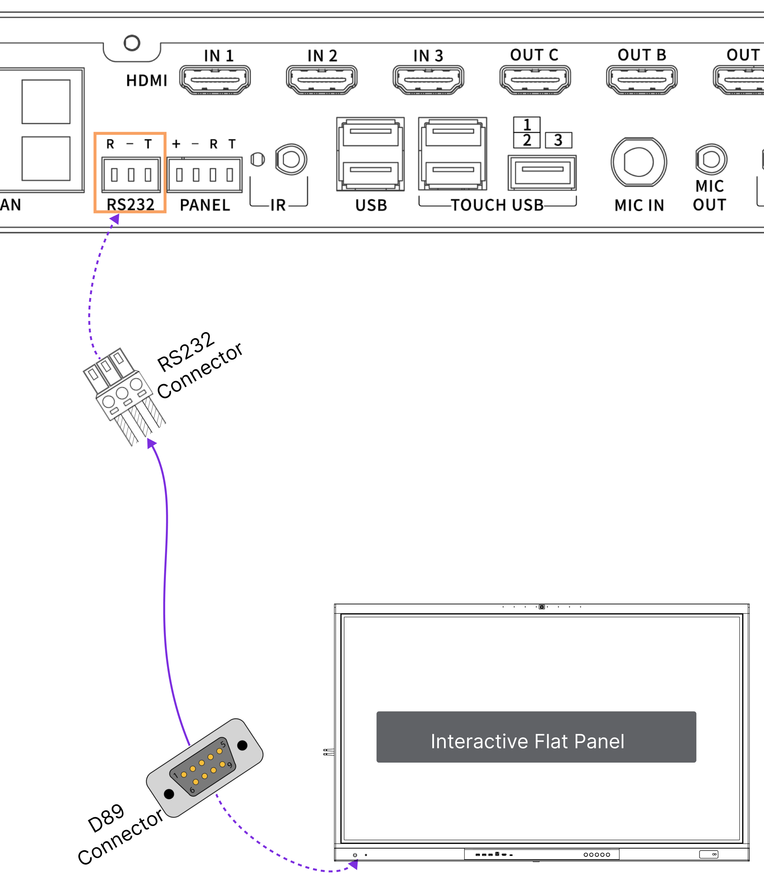 

   **Line Type Representation: **

   | Lines                                                        | Descriptions                                                 |
   | ------------------------------------------------------------ | ------------------------------------------------------------ |
   |  | **Arrow Direction**: The arrowheads indicate the direction of device connection |
   |  | **Solid line**: Indicate devices connected via wired cables. |
   |  | **Dashed line**: Indicate devices directly plugged into interfaces (without intermediary cables) |

4. If your device requires the RS232 port instead of DB9, follow the same wiring instructions. Connect the RS232 cable between the NMP and the device's RS232 interface. The diagram below uses the IQ LCS710 (Lecture Recoding System) as an exmaple.

   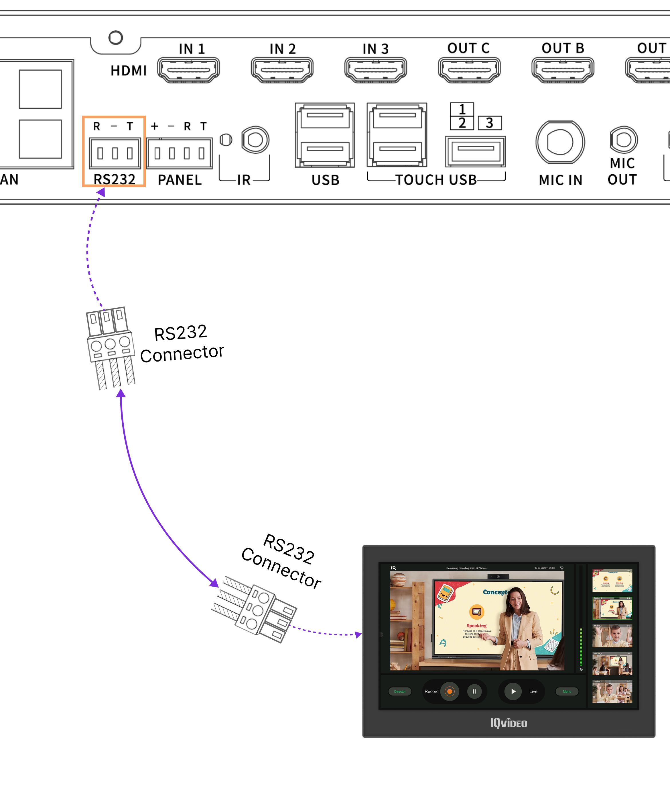 

   **Line Type Representation: **

   | Lines                                                        | Descriptions                                                 |
   | ------------------------------------------------------------ | ------------------------------------------------------------ |
   |  | **Arrow Direction**: The arrowheads indicate the direction of device connection |
   |  | **Solid line**: Indicate devices connected via wired cables. |
   |  | **Dashed line**: Indicate devices directly plugged into interfaces (without intermediary cables) |

5. Navigate to the Q-NEX Dashboard, select the NDP device under "Dashboard -> Devices -> Processor Manager", and click on the "Serial Control" column. Choose the correct device type, brand, and model, then click "Save".
     

6. After completing these steps, you can control the device via RS232 through the software platform.

    

### 4.3.4 Electric LOCK connection【类型补充，张静，2024-12-30】

> 这个类型的锁，卡片读取的信息是存在单台机子上，不会保存到我们平台上，这样卡片管理的时候，要每张卡，每台机子上去一一录入·····
>
> - 至少要说明，这种类型有什么限制，以及如果要避开这个限制，应该要咨询售前解决方案团队

Please connect the required interface according to your electronic lock type.

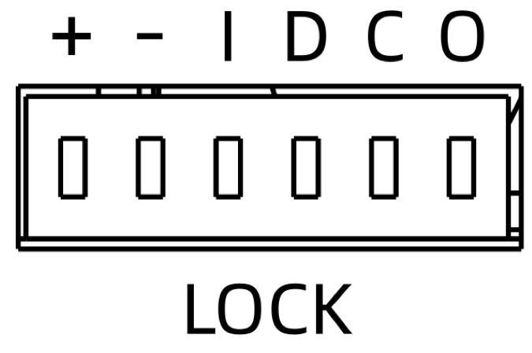 

| No.  | Symbol | Description                                 |
| ---- | ------ | ------------------------------------------- |
| 1    | **+**  | Power (output: 12V 800mA)                  |
| 2    | **-**  | Power ground (negative level)               |
| 3    | **I**  | Door switch interface                       |
| 4    | **D**  | Door lock status interface                  |
| 5    | **C**  | Relay common end, load capacity DC3A/30V    |
| 6    | **O**  | Relay normally open, load capacity DC3A/30V |

  

1. **Door Access Control Reader(External)**: Connect the door access control reader to the NMP's USB port.
2. **Electric Lock**: Connect the electric lock to the NMP's Lock port
3. **Door Switch (Internal)**: Connect the internal door switch to the NMP's Lock port.

#### Scenario 1: Integrating New Electric Lock via NMP

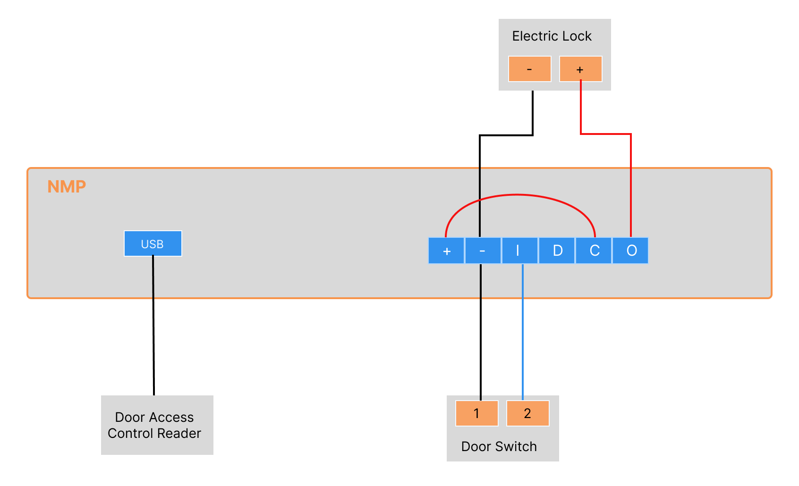 

In this scenario, the classroom initially does not have an electric lock, only traditional locks are installed. 

The electric lock control and power supply are both provided by the NMP (Networked Media Processor). 

When selecting electric locks, please ensure that the continuous operating current of the electronic lock does not exceed 800mA, and the operating voltage is 12V.

#### Scenario 2: Integration with Existing Electric Lock

In this scenario, the classroom already has an electric lock, and there is a desire to integrate the electric lock with the NMP (Networked Media Processor) for remote control via the Q-NEX platform. This situation can be further divided into two sub-scenarios:

##### 1. Partial Integration with Existing Electric Lock

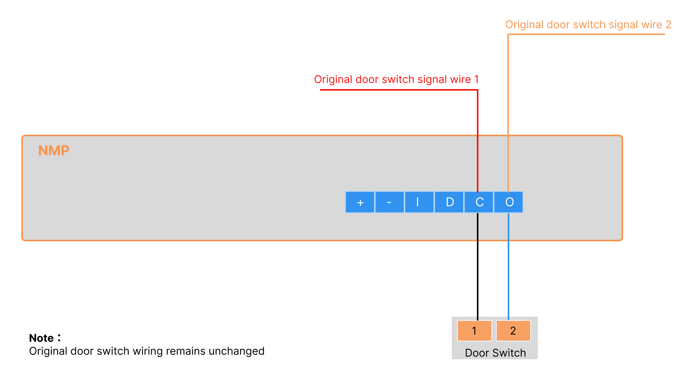 

In this sub-scenario, the existing electric lock remains in place, ensuring that the original door switch wiring configuration remains unchanged. However, the Q-NEX platform can now control the electric lock for door opening.

It's important to note that while the NMP enables remote control of the electric lock, it does not manage the card access system in this setup. 

Additionally, manual door closing operations and automatic door closing delay configuration are responsibilities retained by the original electric lock

##### 2. Full Integration with Existing Electric Lock

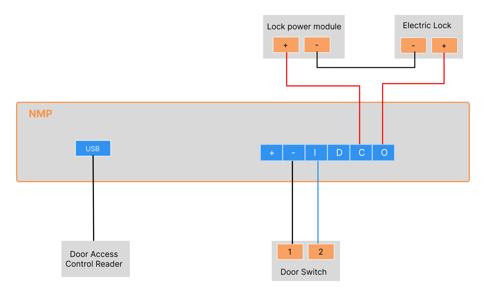 

In this sub-scenario, the existing electric lock retains only the lock and lock power module. The NMP controls the opening and closing of the door. 

The NMP can be configured for manual door closing or automatic door closing with a delay of 5 seconds.

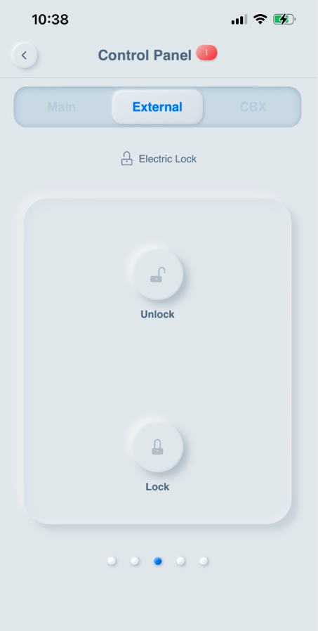 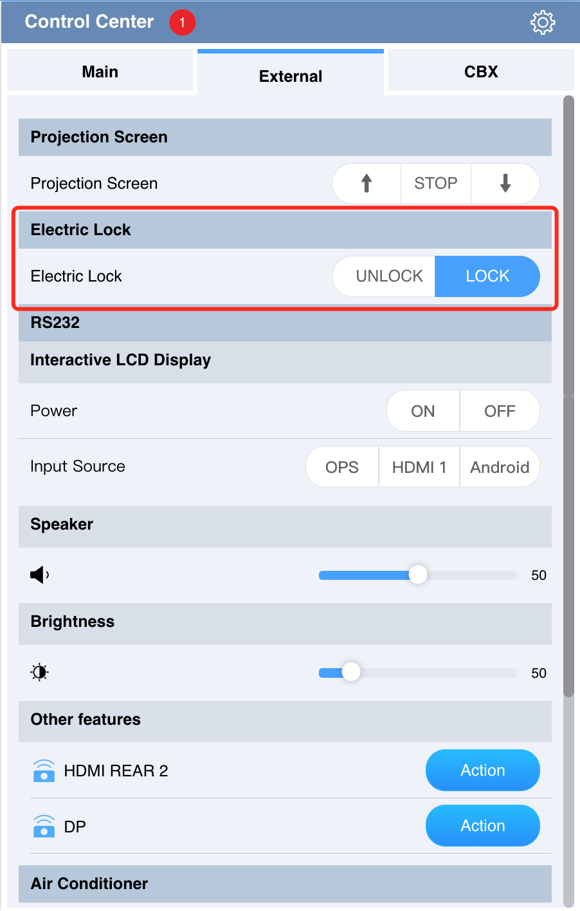  

## 4.4 Broadcasting (Multimedia)

### 4.4.1 Device Connection Diagram for Broadcasting 

 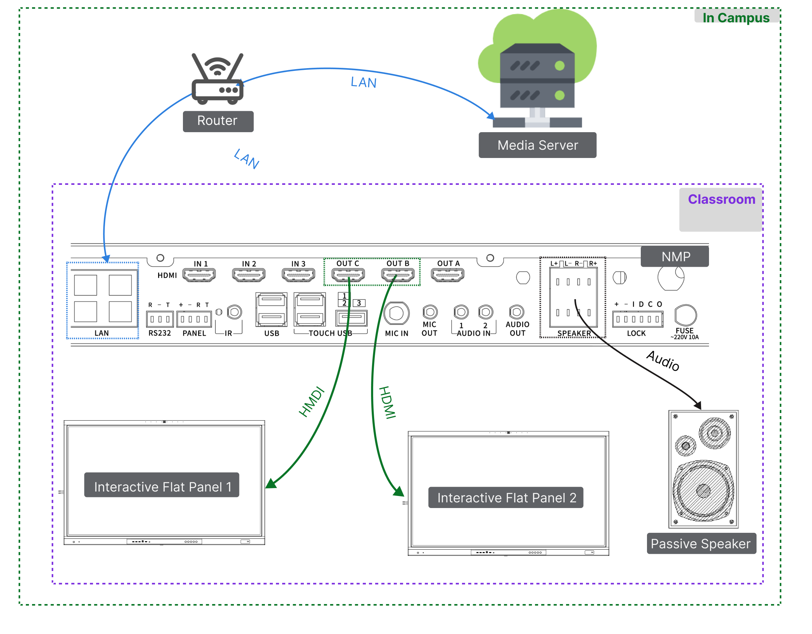

This diagram illustrates the components of the classroom broadcasting system, showing how they are interconnected to enable multimedia delivery.

**Note**: 

- Users can remotely issue broadcast commands over the Internet, while all audio and video resources are pre-stored on the Media Server.

### 4.4.2 Topology Diagram for Broadcasting

 

The broadcasting topology diagram illustrates a typical topology for a campus broadcasting system.

**Note**: 

- For information about the Media Box, please refer to the Media Box documentation or consult our pre-sales team

#### Audio Topology for Broadcasting

 

In broadcast mode, the audio signal decoded by the NMP can be directly transmitted to the corresponding audio equipment via the SPEAKER and AUDIO OUT interfaces.

For digital audio signals, they need to be processed through the HDMI OUT A port. During the broadcasting, only the device (IFP, for example) connected to HDMI OUT A will have audio output. IFPs connected to HDMI OUT B and C will not receive audio.

**Note**: 

[Live-streaming](#4.5 Live-streaming) audio is handled in the same manner.

### 4.4.3 Integrating NMP into Campus

1. Refer to the [Device Connection Diagram for Broadcasting](#4.4.1 Device Connection Diagram for Broadcasting) provided above to set up the NMP. Ensure the NMP is properly connected to the campus network infrastructure. Connect the necessary display and audio devices in the classroom, such as Interactive Flat Panels and speakers, to the NMP.

2. The Media Server should be directly connected to the school's core router to support campus-wide broadcasting. 

   Below is the recommended **minimum** specifications for the Media Server:

   | Feature                 | Specification                                   |
   | ----------------------- | ----------------------------------------------- |
   | Storage type            | ECC                                             |
   | Maximum extended memory | 64G                                             |
   | RAM                     | 16G                                             |
   | HDD Storage             | 4T*4 SATA                                       |
   | Drive bays              | Up to 4 x 3.5" hot-swap in hybrid drive carrier |
   | Network card            | Dual-port Gigabit network card                  |
   | CPU                     | 6-core 12-thread CPU                            |
   | System                  | Windows Server OS                               |

   Additionally, remote access to the Media Server is required to allow our development team to perform remote installations and configurations tailored to each server.

3. After completing these setups, please contact the Q-NEX team for further configurations.

   The Q-NEX team will remotely access the Media Server to install the media streaming software and adjust essential parameters for broadcasting functionality.

   This configuration is a one-time setup, enabling integration of broadcasting functionality for future NMP(s) deployments at the school.

   

### 4.4.4 Broadcasting Process 

The broadcasting feature enables streaming of various audio and video formats, providing educators with access to a wide range of multimedia resources stored on the school's media server.

These resources can be utilized not only for teaching purposes but also for activities such as examinations, promotions, and other related applications.

1. Administrators can pre-publish the content on the media server.

2. Users can issue broadcasting commands via various terminals such as the Q-NEX APP and Web-Console over the internet.

   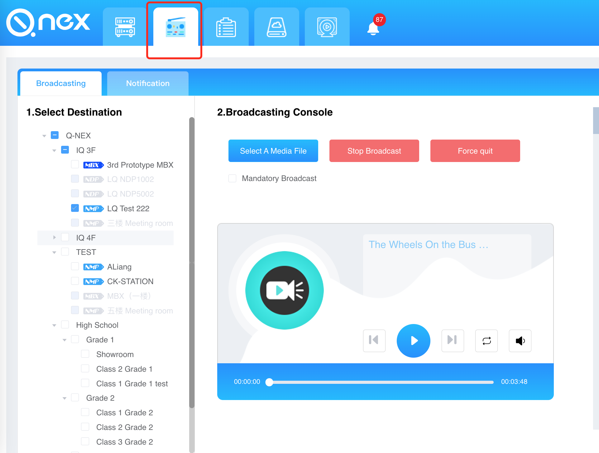 

3. Upon receiving the broadcasting command, the Media Server begins encoding the specified content into a streaming media and pushes the stream to the NMP.

4. The NMP decodes the streaming media and delivers the content to the IFP for display, while the audio is played through the speakers.

**Note**: 

Please note that NMP also supports text broadcasting, without requiring Media Server support

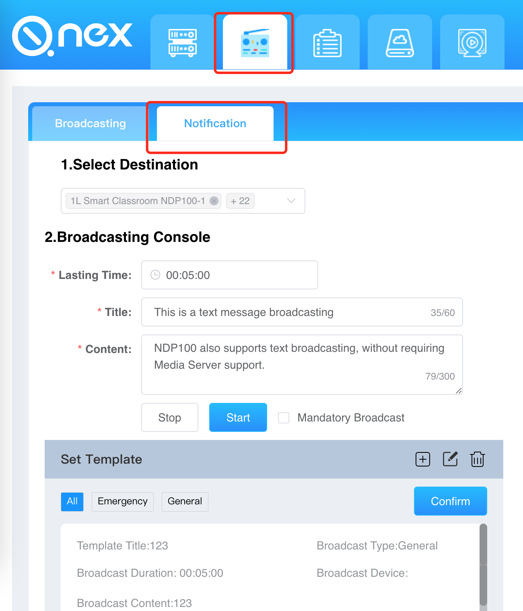  

### 4.4.5 Campus-wide Broadcasting Solutions with NMP

The NMP extends its broadcasting capabilities beyond individual classrooms, enabling collaboration with other NMP(s) units and NDP(Q-NEX Networked Digital Podium)s to establish campus-wide broadcasting solutions. 

Implementing a campus-wide broadcasting solution involves intricate configuration and necessitates consultation with our professional pre-sales team.

## 4.5 Live-streaming

###  4.5.1 Device Connection Diagram for Live-streaming

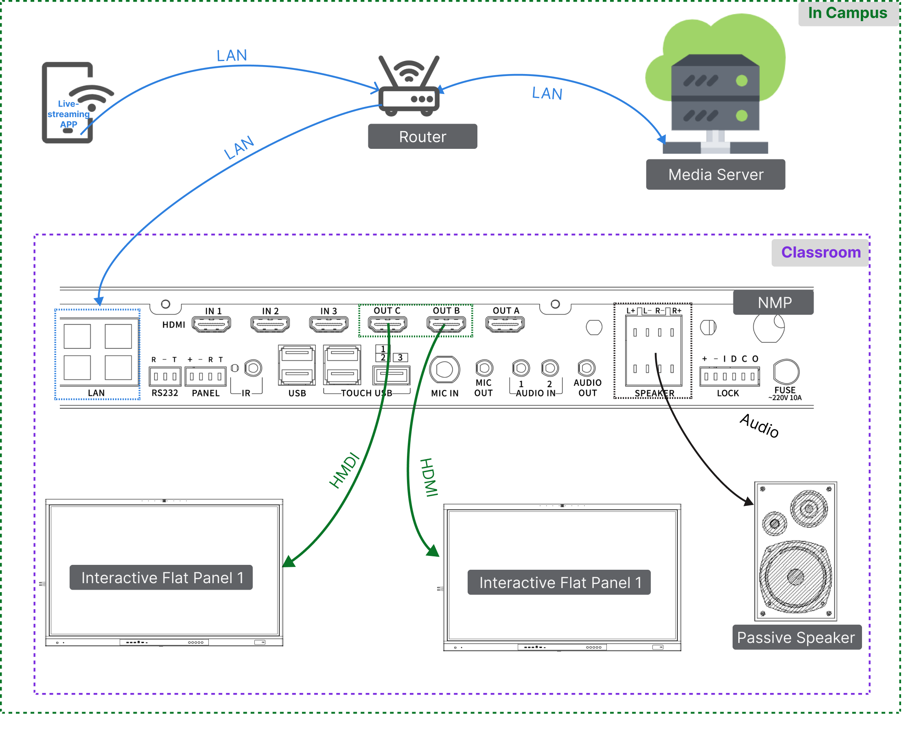 

### 4.5.2 Topology Diagram for Live-streaming

 

### 4.4.3 Live Streaming Setup and Operation Steps

1. **Create Streaming Room**: Log in to the Web Console, navigate to the Streaming module, and create a new streaming room. Generate and save the room address and key.

     

2. **Configure Mobile Streaming**: Copy the generated address and key, and input them into your mobile streaming software. Start streaming from your mobile device to send the video feed to the designated room.

    

   **Note**: 

   For iPhone users, consider using third-party streaming tools like Larix, OBS Camera, or RTMP Live. Android users can utilize the Q-NEX APP, which already includes an integrated streaming module.

3. **Preview and Distribute Stream**: In the web console, preview the incoming video feed in the created room. Select the target NDP/NMP devices to distribute the stream and click the "START" button. Once deployed, these devices will decode the stream and display it on their connected screens.

    

# 5. Expanded Control and Connectivity

This section covers additional components and functionalities that expand the control and connectivity capabilities of the NMP, including:

- **Control Box(CBX):** Exploring the features and setup of the Control Box, which extends NMP wireless control ability.
- **Media Box:** Understanding the Media Box, a component that enhances multimedia capabilities and connectivity options.
- **Divisible Room Integration:** Exploring how the NMP can be integrated into a divisible room setup for enhanced flexibility and functionality.

## 5.1 Control Box

The Control Box (CBX) wirelessly connects to NMP using Wi-Fi 2.4G. Placed near devices like air conditioners, displays, lights, or smart curtains, the CBX acts as a bridge, enabling wired control of these devices without extensive cabling.

**Note**:

> For convenience, we will refer to the Control Box as CBX throughout this manual.

The CBX features three interfaces: IR, Relay, and RS232. These interfaces allow the CBX to receive commands wirelessly from the NMP and then relay them to connected devices using different control methods, such as infrared signals (IR), relay switches, or RS232 communication.

**Note**:

> Each CBX can control only one type of device at a time. For example, if you need to control both an air conditioner(via IR) and lights(via Relay), you must use two separate CBX units, each dedicated to a specific device type, CBX cannot manage multiple device types simultaneously.

With the CBX, device management is efficient and tidy, eliminating the need for extensive wiring or modifications. The CBX can be easily wall-mounted, allowing for quick and convenient installation.

### 5.1.1 Interface View

 

| No.  | Interface         | Description                                                  |
| ---- | ----------------- | ------------------------------------------------------------ |
| 1    | Power Supply (DC) | 12V,1A                                                       |
| 2    | Reset Button      | Resets the CBX to its default factory settings               |
| 3    | Link Indicator    | Displays the connection status between the CBX and the NMP   |
| 4    | DIP Switch        | Used for configuration settings and adjustments of the CBX   |
| 5    | RS232             | Allows wired communication and control with RS232-compatibale devices. |
| 6    | IR                | Enables IR communication for controlling devices with infrared signals. |
| 7    | Relay             | Provides control over devices using relay switches for on/off functions. |

### 5.1.2 Topology Diagram

 

### 5.1.3 CBX Paring 

#### 1. DIP Switch Configuration

Each CBX has a DIP switch with 2 toggle buttons. These buttons can be set to either the UP (OFF) or DOWN (ON) positions, creating a unique DIP switch combination. 

**Note**: 

> One NMP can pair with up to 4 CBX units simultaneously.

Each combination represents a unique CBX ID as shown in the table below. 

| **ID** | **Switch 1** | **Switch 2** | Illustration                                              |
| ------ | ------------ | ------------ | --------------------------------------------------------- |
| 1      | UP (OFF)     | UP (OFF)     |  |
| 2      | DOWN (ON)    | UP (OFF)     |  |
| 3      | UP (OFF)     | DOWN (ON)    |  |
| 4      | DOWN (ON)    | DOWN (ON     |  |

This ID is crucial for communication between the NMP and CBX. Once set, the DIP switch combination should not be changed to avoid communication failure.

To ensure successful pairing and control between the NMP and CBX units, please follow the instructions below:

1. When connecting the first CBX to the NMP, set the DIP switches to UP (OFF) + UP (OFF), corresponding to ID 1.
2. For subsequent CBX units, use different combinations from the table above to assign unique IDs (2,3, and 4).

**Note**: 

Once a DIP switch combination is set and the CBX is paired with the NMP, do not alter the DIP switch positions. Changes will disrupt communication between the NMP and the CBX.

#### 2. Pairing and Setup

1. **Connect CBX and NMP, and Power On CBX**

   Connect the antenna to the front of the CBX before starting the pairing process. The antenna port is located on the front of the CBX.

   Ensure the CBX is connected to the NMP as illustrated in the diagram below. Make sure the power supply is connected to the CBX.

    

   **Line Type Representation: **

   | Lines                                                    | Descriptions                                                 |
   | -------------------------------------------------------- | ------------------------------------------------------------ |
   |  | **Arrow Direction**: The arrowheads indicate the direction of device connection |
   |   | **Solid line**: Indicate devices connected via wired cables. |
   |    | **Dashed line**: Indicate devices directly plugged into interfaces (without intermediary cables) |

    

   **Interface Wiring Illustration for CBX-RS223 and NMP-PANLE**:

    

   The diagram above illustrates the wiring sequence for connecting CBX-RS232 and NMP-PANEL. Each terminal on the CBX is connected to the corresponding terminal on the NMP PANLE, ensuring proper wiring of the cables.

   

2. **Initiate Paring Mode**

   Press and hold the reset button for 4-5 seconds until the indicator light turns red, then the CBX will automatically enter pairing mode with the NMP, indicated by a flashing green light.

   Once paired successfully, the green light will remain steady.

   

   **Indicator Light States:**

   | Indicator Light | Status               |
   | --------------- | -------------------- |
   | Green Flashing  | Pairing Mode         |
   | Green Steady    | Connected to NMP     |
   | Red Steady      | Not Connected to NMP |

3. **Post-Pairing Connections**

   After successfully pairing and removing the connection cable between the CBX and NMP, connect the devices to be controlled to the appropriate CBX interfaces based on their type. 

   For example, use the RELAY interface for controlling the power switch of lighting devices, the RS232 interface for display devices like IFPs and projectors, and the IR interface for devices with infrared remote controls, such as air conditioners, TVs, and electric curtains.

   

   **Note**:

   Each CBX can control only one type of device at a time. For instance, to control both an air conditioner (via IR) and light (via RELAY), two separate CBX units are required, each dedicated to a specific device type. A single CBX cannot manage multiple device types simultaneously.

4. **Configure CBX in the Dashboard**

   - Log in to the NMP management system Dashboard, and navigate to Devices > Device Management.

   - Select the NMP and click the CBX edit button to configure.

       

5. **Set Control Method According to the Controlled Device**

   Based on the DIP switch sequence, select the control method. (Power Control, RS232 Control, or IR Control)

    

   **Note**:

   A CBX in a disabled state indicates that no device is currently connected to the NMP via Wi-Fi. 

   If you are certain that the CBX has been successfully paired and connected previously, please check the current network status of the CBX and ensure that it is properly powered.

   - For RS232-connected devices, set the device brand and model.

      

   - For IR-connected devices, select the air conditioner and control options.

      

**Note**:

If the NMP is being replaced, re-pairing is required. Follow the instructions in this section ([Paring and Setup](##2. Paring and Setup)) from the first step to repair.

### 5.1.4 CBX Device Control

Once the CBX configuration is complete, users can control the connected devices through IR, RELAY, and RS232 on CBX. 

Refer to the corresponding screenshots for guidance.

  
  

# 6. Appendix

## 6.1 Network Environment Requirement

To ensure optimal integration, the school network needs to meet specific requirements tailored for the NMP. 

1. The school should allow NMP to access the Internet.

2. Whitelist Network Control Requirements:

   If the school employs whitelist network control, the following domains should be added to the whitelist:

   - "https://qnextech.com/" (Primary Domain)
   - "https://mg.qnextech.com/" (Secondary Domain).

3. IP Address and Port Requirements:

   The school network should allow access to the following addresses:

   - 110.90.11.185:80 (HTTP)
   - 110.90.11.185:443 (HTTPS)
   - 110.90.11.185:12573 (NMP Communication Service)
   - 110.90.11.185:12583 (NMP Upgrade Service).

4. MAC Address Control Requirements:

   If the school implements MAC address control, the MAC addresses of the following devices should be added to the allowed access list:

   - NMP
   - Touch Panel

5. NMP Network Configuration:

   - NMP must be connected to the **router** via a **wired connection**; NMP does not support wireless network connection.
   - NMP and Touch Panel should be on the same LAN. 
   - If there is a  Media Server (broadcast and live streaming), ensure that the Media Server, NMP, and Touch Panel are on the same LAN.
   - The firewall should open the following ports for the Media Server:
     - 12570 (Broadcast Port)
     - 1935 (Streaming Port)
     - 80
     - 443

6. NMP IP Address Setting:

   - To prevent issues caused by NMP IP changes, it is recommended that the NMP IP address be set as static.
   - Ensure that before the initial use of NMP, the Touch Panel successfully connects to NMP using this IP.

7. VLAN:

   NMP does not support VLAN. NMP, Touch Panel, and Media Server should be connected to the campus network as described above but should not be on VLAN.

# 7. Contact Us

Q-NEX (https://qnextech.com/) is a subsidiary of Returnstar Interactive Technology Group Co, Ltd, a company that has been dedicated to the education industry since 2006. 

Q-NEX is focused on delivering a Smart Campus Solution that converges AV and loT control across all campus facilities. Q-NEX offers deeply customized options that assist school IT administrators in managing all electronic facilities and allow teachers to simplify the operations of a multimedia classroom.

 
