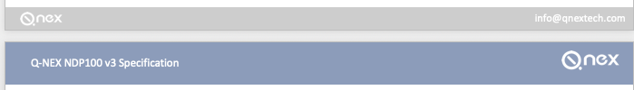

# README

[toc]

## 这是什么

这是Q-NEX系列产品的文档，目前包含：

1. 说明书：
   - NMP211
   - NDP100
   - NDP500
2. 参数表：
3. 验收标准：
4. 出货标准：
5. 装箱清单：

## 规范

1. 所有路径都应该用英文，且不应该包含空格，如：

   - ***Docs/NDP500/UserManual*** ✅
   - ***Docs/NDP500/用户手册***  ❌
   - ***Docs/NDP500/User Manual*** ❌

2. 预测到能共用的图片，统一放在NMP目录下，尽量不要单独维护。

   > 否则后续一个地方发生改动，要手动覆盖N个地方

3. 如有必要尽量都使用markdown或者纯文本形式，方便比较每次commit的内容。

   > 如果使用excel, word也可以追溯，但是只能一份份下载到本地对比，这些文件是以二进制的形式提交到git上

## 文档规范检查

1. 错别字：这个可以用word检查

2. 接口名称是否全部大写

3. 文档中的接口名称是否和丝印一一对应. 如： 

    

   - Audio In ❌
   - Audio-in  ❌
   - AUDIO-IN ✅

4. 接口的序列号是否和表格的序列号一一对应

### DataSheet规范

> 从市场部得到的一些规范，不是全部，如果可能需要重写覆盖默认的markdown样式

1. **标题首字母同意大写：**

   如：   ✅

2. **标题每个单词之间需要空格隔开**， 如：

   -   ✅
   -  ❌

3. **表格**

   - 表格整体居中
   - 表格头栏位(t-head)蓝底白字加粗、居中显示
   - 表格内容栏位左对齐

     

4. **Footer, Header：**

    

5. **其他：**

   - 拼写规范：

     | No.  | 正确拼写 | 不规范举例        |
     | ---- | -------- | ----------------- |
     | 1    | Wi-Fi    | Wifi, WiFi, Wi-fi |
     | 2    |          |                   |
     |      |          |                   |

     

## Git的简单命令

1. 远程拉取： 
   - git pull 
2. 本地添加修改的文件：
   - git  add .  （不要忘记加英文句号 . ）
   - git commit -m "本次修改的内容"
   - git push
3. git push之后，记得上github，creat a pull request给对方仓库

关于冲突后面会遇到，遇到了再具体解决
