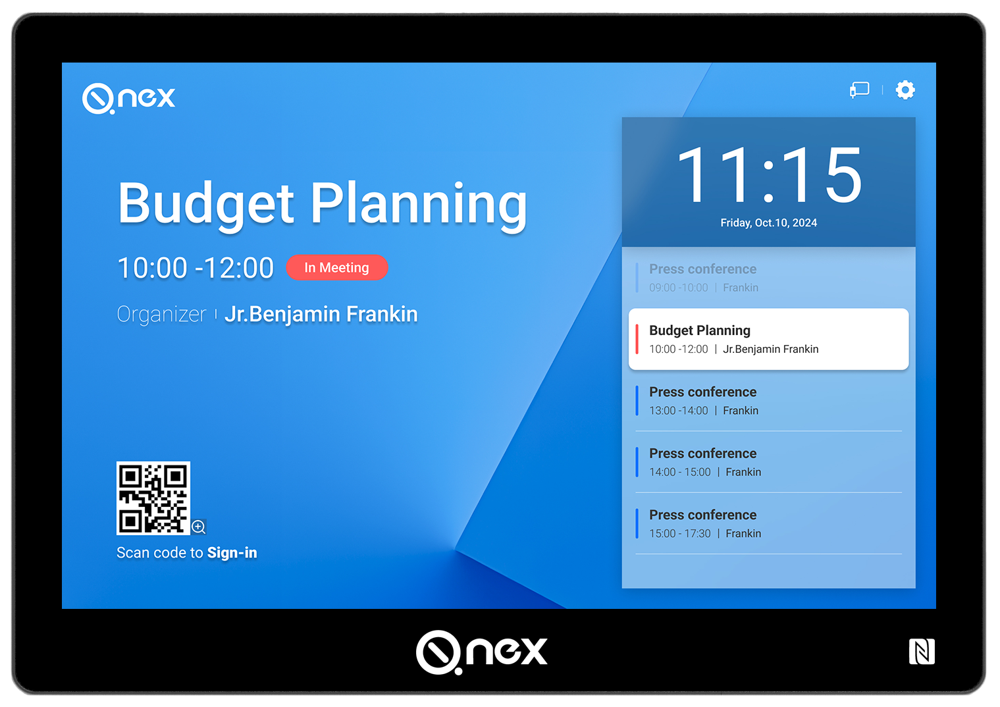
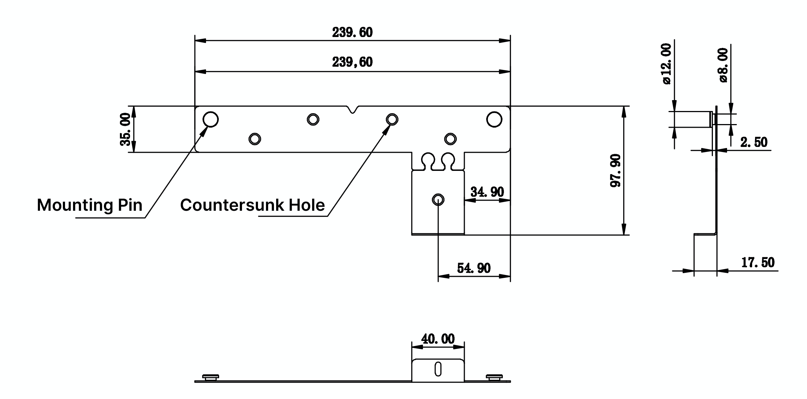
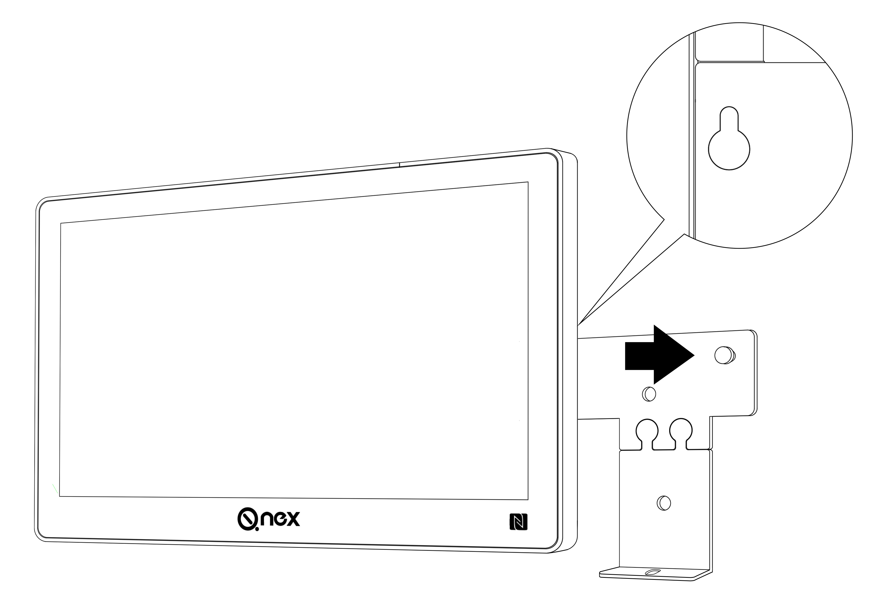
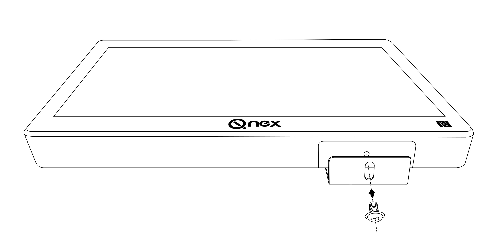
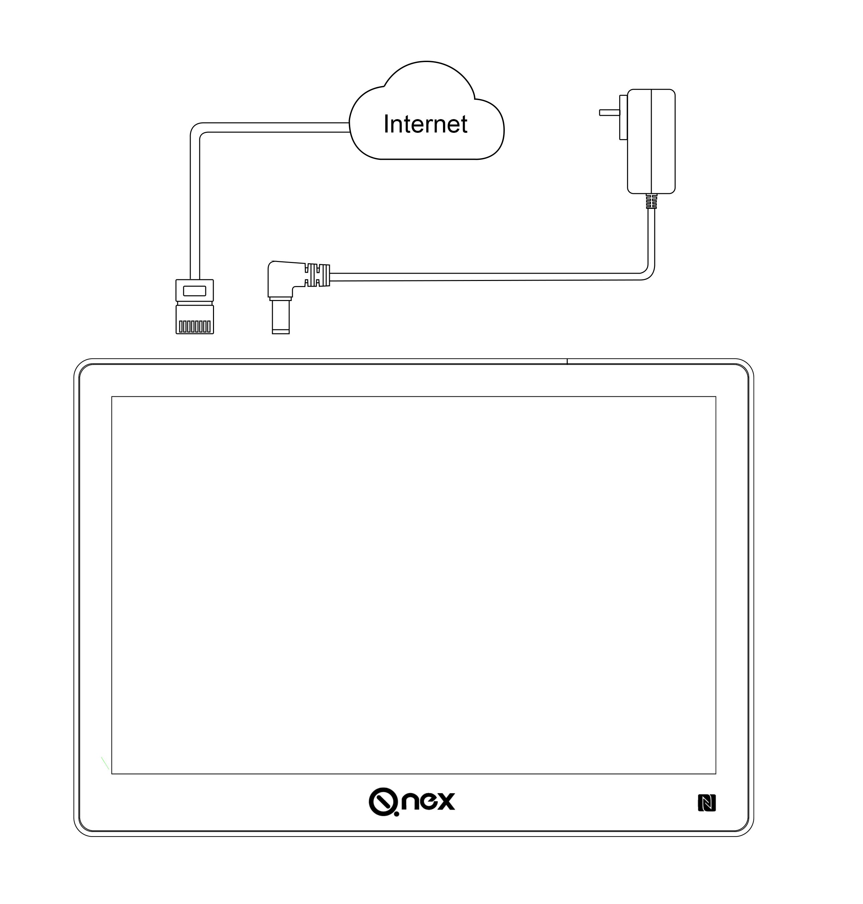
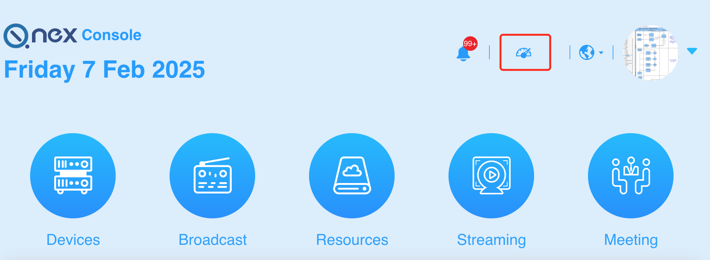
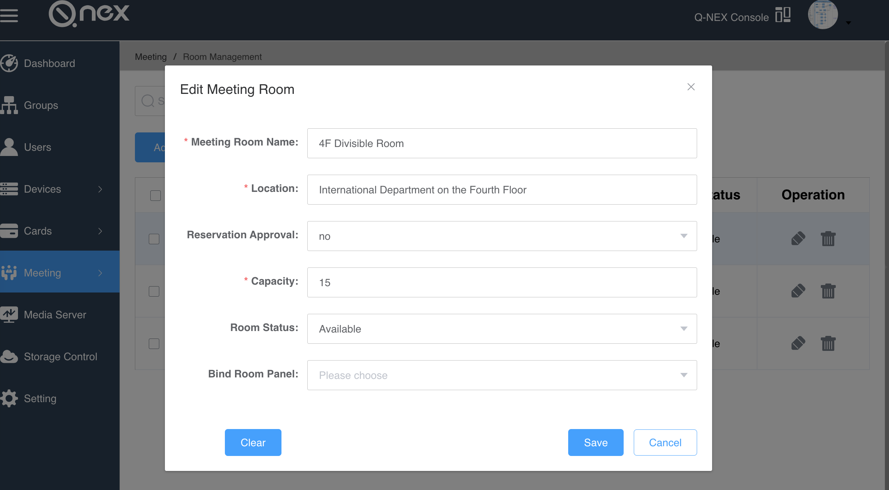

Q-NEX Room Scheduler 

 
—— Quick Guide ——

Returnstar Interactive Technology Group Co., Ltd.

<!-- break -->

# 1. Introduction

The **Q-NEX Room Scheduler Quick Guide** provides instructions for installing, wiring, and configuring the CPL50 device for use within the Q-NEX system to manage meeting rooms.

# 2. Understanding the CPL50

## 2.1 Dimensions

  

### Brackets

 

## 2.2 Interface

 

| No.  | Port(s)          | Description                                                  |
| ---- | ---------------- | ------------------------------------------------------------ |
| 1    | USB-C            | Used for firmware flashing.                                  |
| 2    | Audio            | Reserved port.                                               |
| 3    | USB (Type A) * 3 | Reserved port.                                               |
| 4    | Reset Button     | Used to reset the device to default settings.                |
| 5    | RJ45 Ethernet    | For wired network connection.  Supports **PoE (Power over Ethernet)** for power supply when connected to a PoE switch. |
| 6    | DC Power Jack    | For connecting the power adapter.  :warning:**Do not use PoE and the power adapter simultaneously.** |

# 3. Getting Started

## 3.1 Wall Mount for CPL50   

**Installation Guide for CPL50 10-Inch Screen with Wall Mount**

1. Secure the two brackets to the desired wall height using expansion bolts.

    

2. Align the keyhole slots on the back of the CPL50 with the mounting pins on the brackets, then slide the device downward to lock it in place.

    

3. Use screws to fasten the CPL50 to the brackets through the provided elongated mounting holes for stability.

    

## 3.2 CPL50 Wiring 

  

**Guide for CPL50 Wiring**

1. **Power Options**: CPL50 supports both **PoE (Power over Ethernet)** and a standard power adapter.

   :warning:**Warning:**
   Do **not** use both PoE and the power adapter simultaneously, as voltage inconsistencies may cause potential damage to the device. Use either:

   - **PoE with a PoE switch**, or
   - **The power adapter with a non-PoE switch/router**.

2. Use an LAN cable to connect the CPL50 to the meeting room's network, ensuring it shares the same LAN as the Q-NEX system.

## 3.3  Room Configuration Guide

**CPL50 Meeting Room Configuration Guide**

1. Log in to the Q-NEX system at https://mg.qnextech.com/console/login using your credentials. If you do not have an account, contact IQ for assistance. After logging in, click the **Dashboard icon** in the top-right corner to access the Dashboard system.

    

2. Navigate to **Meeting > Room Management** in the Dashboard menu to add meeting rooms based on the setup. Bind the CPL50 to the appropriate room during this process. For further adjustments, such as renaming the device or changing its wallpaper, go to **Meeting > Panel Management**.

     

## 3.4 Room Booking

**CPL50 Meeting Room Booking**

Return to the Web-Console via the **Q-NEX Console** icon in the Dashboard. Go to **Meeting** to book a room. Booking details sync instantly to the CPL50.
