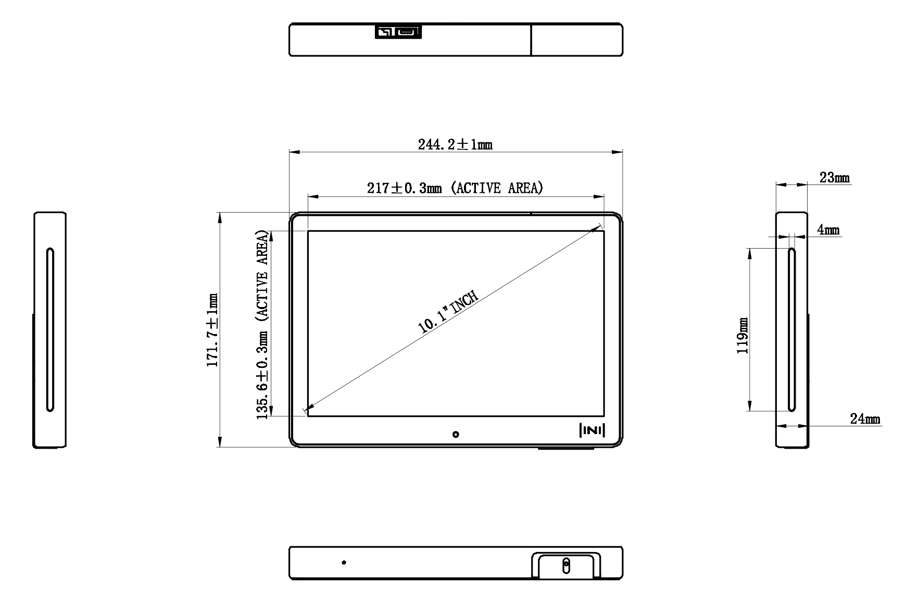
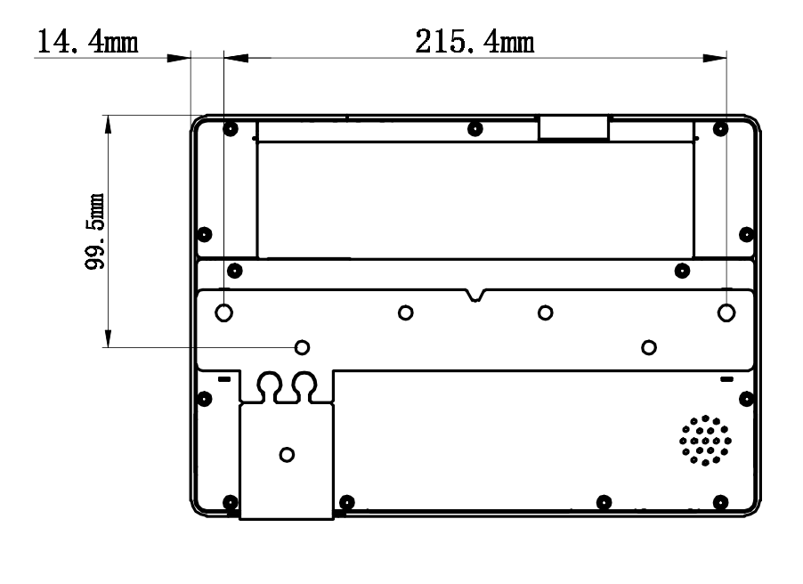

//一张大图

# 1. Introduction

The **Q-NEX Room Scheduler Quick Guide** provides instructions for installing, wiring, and configuring the CPL50 device for use within the Q-NEX system to manage meeting rooms.

# 2. Understanding the CPL50

## 2.1 Dimensions

  

### Brackets

 

## 2.2 Interface // 需要线框图 

// 需要线框图 

| No.  | Port(s)          | Description                                   |
| ---- | ---------------- | --------------------------------------------- |
| 1    | USB-C            | Used for firmware flashing.                   |
| 2    | Audio            | Reserved port.                                |
| 3    | USB (Type A) * 3 | Reserved port.                                |
| 4    | Reset Button     | Used to reset the device to default settings. |
| 5    | RJ45 Ethernet    | For wired network connection.                 |
| 6    | DC Power Jack    | For connecting the power adapter.             |

# 3. Getting Started

## 3.1 Wall Mount for CPL50 // 需要图 

**Installation Guide for CPL50 10-Inch Screen with Wall Mount**

1. Secure the two brackets to the desired wall height using expansion bolts.
2. Align the keyhole slots on the back of the CPL50 with the mounting pins on the brackets, then slide the device downward to lock it in place.
3. Use screws to fasten the CPL50 to the brackets through the provided elongated mounting holes for stability.

**CPL50 10寸屏壁挂安装指导**

1. 使用膨胀螺丝将两个壁挂支架固定在墙壁的指定高度。
2. 将CPL50背部的葫芦口对准支架上的挂钉，向下滑动以锁定设备。
3. 通过支架上的长条形安装孔使用螺丝固定CPL50，以增强稳定性。

## 3.2 CPL50 Wiring // 需要图 

**Guide for CPL50 Wiring**

1. Connect the power adapter to the CPL50.
2. Use a LAN cable to connect the CPL50 to the meeting room's network, ensuring it shares the same LAN as the Q-NEX system.

**CPL50 安装与接线快速指南**

1. 将电源适配器连接至 CPL50。
2. 使用网线将 CPL50 接入会议室网络，确保该网络与 Q-NEX 系统处于同一局域网。

## 3.3  Room Configuration Guide

**CPL50 Meeting Room Configuration Guide**

1. Log in to the Q-NEX system at https://mg.qnextech.com/console/login using your credentials. If you do not have an account, contact IQ for assistance. After logging in, click the **Dashboard icon** in the top-right corner to access the Dashboard system.

    

2. Navigate to **Meeting > Room Management** in the Dashboard menu to add meeting rooms based on the setup. Bind the CPL50 to the appropriate room during this process. For further adjustments, such as renaming the device or changing its wallpaper, go to **Meeting > Panel Management**.

     

**CPL50 会议室配置指南**

1. 访问 https://mg.qnextech.com/console/login，使用账号密码登录 Q-NEX 系统。如无账号，请联系 IQ 获取。登录后，点击右上角 **Dashboard 图标** 进入 Dashboard 系统。
2. 在 Dashboard 菜单中导航至 **Meeting > Room Management**，根据实际需求添加会议室，并在配置过程中绑定 CPL50。如需进一步调整 CPL50（例如重命名或更换壁纸），请导航至 **Meeting > Panel Management**。

## 3.4 Room Booking

**CPL50 Meeting Room Booking**

Return to the Web-Console via the **Q-NEX Console** icon in the Dashboard. Go to **Meeting** to book a room. Booking details sync instantly to the CPL50.

**CPL50 会议室预约指南**

通过 Dashboard 的 **Q-NEX Console 图标** 返回 Web-Console 页面，进入 **Meeting** 菜单预约会议室。预约信息将实时同步至 CPL50。