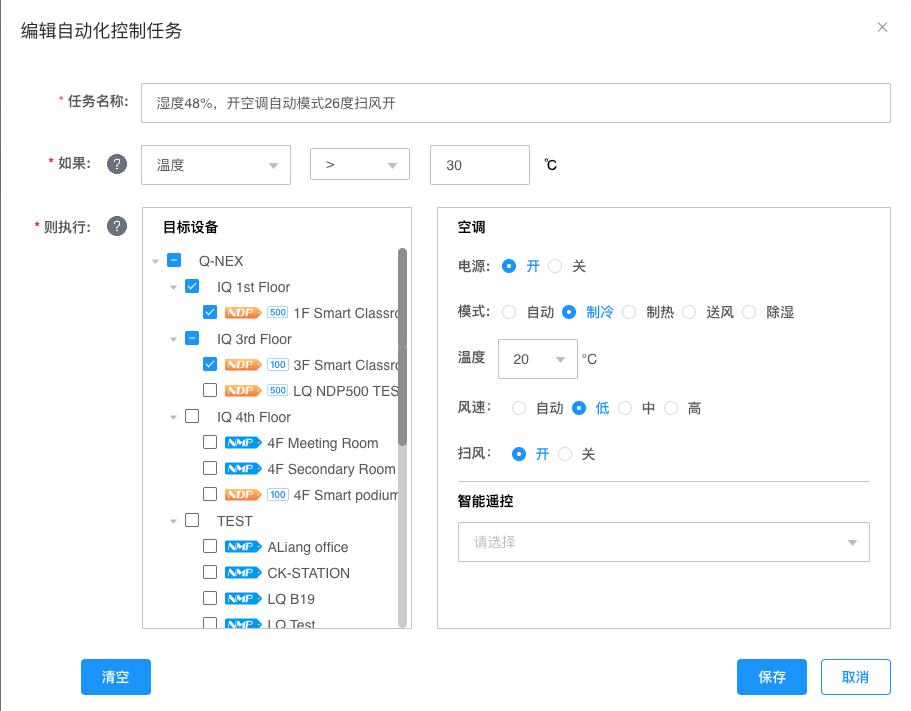

# 小奇智联云控系统使用说明书

[toc]

# 智联云控平台——工作台

 

智联云控平台的管理后台是系统管理者开展全面管理与配置的重要模块。

它提供了设备管理、用户管理、组织架构管理和角色权限分配等多项核心功能，帮助管理员实现平台的有序、高效运作。

通过管理后台，管理员可以实时监控系统运行状态，灵活调整配置，以确保平台在不同场景下的稳定和安全。

该系统设计注重操作的便捷性和管理的精细化，旨在为各类机构的日常运营提供坚实的技术保障，助力其高效管理和决策。

## 1.平台登录

 

用户可以通过以下步骤登录到智联云控平台的工作台界面：

1. **访问平台**
   在浏览器的地址栏中输入平台网址：[mg.qnextech.com](https://mg.qnextech.com/console/)，按回车键后进入智联云控平台的登录页面。
2. **输入登录信息**
   在登录页面，用户需要输入分配的用户名和密码。确保输入的用户名和密码正确无误。
3. **选择语言**
   登录页面提供多语言支持，用户可以根据需要在页面上选择系统语言。系统将根据选择的语言自动调整界面显示内容。
4. **点击登录**
   确认用户名和密码输入无误后，点击登录按钮。系统将验证用户身份，成功后将进入平台的工作台主界面。

## 2. 首页

系统用户包含管理员和普通用户两种身份。以管理员身份登录后，进入管理员首页，如下图所示：

 

注意：

本操作手册主要以管理员身份为例进行说明，以便更全面地介绍智联云控系统的各项功能与操作流程。

### 管理员首页功能点

智联云控平台的首页为用户提供了快速访问和操作平台各项功能的入口。以下是首页各个功能模块的详细说明：

1. **当前日期显示**
   在页面左上角，显示当前系统的日期和星期，便于用户了解当天的时间信息。
2. **通知中心**
   点击通知中心图标可以查看未读通知的数量及其概要信息。点击“查看全部消息”进入通知中心查看所有通知，用户可以将未读消息置顶或将当前页的未读消息全部标识为已读。
3. **管理后台入口**
   管理员可以通过点击此快捷入口直接进入管理后台进行更详细的系统管理与配置。
4. **语言切换**
   在页面右上角，用户可以通过此选项切换系统语言，以适应不同语言使用者的需求。
5. **个人信息**
   点击用户头像可查看和编辑个人资料，包括登录用户名、邮箱、电话等信息。此外，还可以修改密码和头像。
6. **设备控制**
   此模块允许用户直接进入设备控制页面，进行设备的开启、关闭及其它操作。用户可选中单台或多台设备进行统一管理。
7. **广播控制**
   用户可以通过此入口进入广播控制页面，选择广播目标设备，进行音频或视频的播放控制，并可选择是否强制广播。
8. **存储管理**
   用户可以进入存储管理页面，管理平台的云盘资源。此模块显示了存储空间的使用情况，并允许用户上传、下载或删除文件。
9. **直播控制**
   此模块提供直播操作的快速入口，用户可以通过此功能进行实时视频或音频的直播管理，方便应对各类活动和会议需求。
10. **今日任务日程**
    在首页下方显示今日的任务日程列表，包括所有用户创建的设备控制任务和广播任务。用户可以通过点击“查看详情”来查看或编辑具体任务。
11. **所有日程**
    点击此按钮将进入日程任务页面，查看所有任务的详细列表，包括历史日程和未来任务安排。用户可以在此新建、编辑或删除任务清单。

备注：

普通用户首页功能基本与管理员首页相同，但普通用户无管理后台快速入口

## 3. 设备控制

设备控制模块是智联云控平台的核心功能之一，允许用户对各类设备进行集中管理和操作。通过这一模块，用户可以查看设备的实时状态，进行设备的开关操作，调整视频输入输出、音频设置等关键参数。该模块的设计旨在简化设备管理流程，提升用户的操作效率。

### 设备控制页功能点

 

1. **平台标识**
   显示平台的标识，点击此标识可以返回到首页。
2. **功能菜单**
   在页面顶部显示主要功能菜单，用户可以快速切换到其他功能模块，如设备控制、广播控制、日程任务、存储管理和直播控制。
3. **通知中心**
   页面右上角的通知中心显示未读通知的数量，点击可查看详细信息。
4. **管理后台快捷入口**
   管理员可通过该入口快速进入管理后台进行高级配置和管理。
5. **语言切换**
   通过该选项，用户可以选择系统显示语言，满足不同语言环境下的使用需求。
6. **用户个人信息**
   点击用户头像可以查看或编辑个人信息，修改登录密码等。
7. **设备筛选器**
   用户可以根据设备所在的组织进行筛选，快速找到需要操作的设备。
8. **设备搜索**
   在搜索框中输入关键词，可快速查找特定设备。
9. **设备状态筛选与类型筛选**
   用户可以根据设备的运行状态（开机、关机、离线）和设备类型（如NMP、MBX、NPS等）来筛选列表中的设备，方便进行集中管理。
10. **设备列表**
       在设备列表中显示了当前用户有权限管理的设备，包括设备名称、所在位置、当前状态（开机或关机）以及设备类型。用户可以通过勾选设备进行批量操作。
11. **设备控制面板**
    选择设备后，控制面板将激活，显示当前设备的控制选项。用户可以对所选设备进行以下操作：
    - **主控制**：控制设备的主电源开关。
    - **外接设备**：控制外接设备的电源，如显示器、投影仪等。
    - **视频输入切换**：选择不同的HDMI输入源。
    - **音频切换与调节**：调整音频源及音量，包括高音和低音的调节。
    - **麦克风音量调节**：调节麦克风音量和音质。

## 4. 广播控制

广播控制模块是智联云控平台的重要功能之一，允许用户在多个设备上进行音频、视频以及文字广播。该模块分为“多媒体广播”和“文字广播”两个主要部分，用户可以根据需求选择不同的广播类型，并通过简洁的界面对广播内容进行精细化控制。无论是在日常信息发布还是紧急通知场景下，广播控制模块都能够有效提升信息传达的效率和覆盖面。

### 4.1媒体广播控制页功能点

 

1. **广播类型选择**
   用户首先可以在页面顶部选择广播类型，默认显示为“媒体广播”。在媒体广播模式下，用户可以通过音频或视频文件进行广播。
2. **选择广播目的地**
   用户可以在左侧的设备树中选择需要进行广播的设备或设备组。所有可用的设备都会在树状结构中显示，用户可以勾选一个或多个设备来设置广播的目标位置。
3. **广播设置**
   在中间区域，用户可以进行广播内容的设置和控制，包括以下操作：
   - **选择多媒体文件**：点击“选择多媒体文件”按钮，从系统中选择音频或视频文件进行广播。
   - **播放控制**：用户可以通过播放控制按钮（播放、暂停、停止）来控制广播的进度。
   - **强制广播**：勾选“强制广播”选项后，目标设备的用户将无法中断或退出当前的广播内容。
   - **停止广播**：点击“停止广播”按钮，立即终止当前的广播。
   - **强制停止**：在紧急情况下，管理员可以点击“强制停止”按钮，强行终止所有正在进行的广播。
4. **历史记录**
   在右侧区域，用户可以查看广播的历史记录。系统会自动保存最近一天、七天或三十天的广播记录，方便用户回顾和管理广播历史。

### 4.2 文字广播控制页功能点

 

1. **广播类型选择**
   在顶部功能区，用户可以选择广播类型。切换到“文字广播”选项后，页面将显示相关的设置和操作区域，专门用于发送文字内容的广播。
2. **选择广播目的地**
   在页面左侧，用户可以从设备树中选择需要接收文字广播的设备或设备组。设备列表以树状结构展示，用户可以通过勾选一个或多个设备来确定广播的目标。
3. **广播设置**
   中间区域为文字广播的设置区，用户可以在此进行以下操作：
   - **广播时长**：设置文字广播的持续时间，输入格式为分钟和秒。
   - **标题与内容**：用户需要输入广播的标题（最多60字）和正文内容（最多300字）。标题和内容是必填项。
   - **强制广播**：勾选“强制广播”选项后，目标设备的用户将无法中断或退出当前的文字广播。
   - **开始与停止**：设置完成后，点击“开始”按钮来启动文字广播。广播开始后，用户也可以通过“停止”按钮来提前结束广播。
4. **预设模板**
   在页面右侧，用户可以选择和管理预设的广播模板。这些模板包括了常用的文字广播设置，如标题、内容、播放时长等，用户可以直接应用这些模板来快速设置广播。模板可以分为“全部”、“应急”和“普通”三种类型，用户可以根据需要进行选择和确认。

## 5. 日程任务

日程任务模块是智联云控平台的重要功能之一，帮助用户管理和自动执行各种设备控制和广播任务。

用户可以根据实际需求，设置定时任务，以确保设备在指定时间执行相应的操作。

该模块支持任务的创建、编辑、删除以及历史任务的管理，为用户提供了灵活的日程安排和高效的设备控制手段。

### 5.1 日程任务页功能点

 

1. **功能菜单**
   用户可以通过顶部功能菜单进入“日程任务”模块，在该模块中管理与执行所有的日程任务。
2. **日程任务列表**
   在页面左侧显示了当前日程任务的列表，包括“现行日程清单”和“历史日程清单”两个部分：
   - **现行日程清单**：列出当前正在使用的日程任务，用户可以查看任务的名称、创建者、并进行编辑或删除操作。
   - **历史日程清单**：列出已完成或删除的任务，用户可以查看这些任务的历史记录，供参考或恢复使用。
     - 被删除或过期的日程清单会自动归档至此列表。用户可以恢复自己创建的清单，但需重新设置时间段。
     - 历史日程清单中的任务仅供查看或删除，无法编辑，也不能单独恢复。若要恢复任务，需先恢复整个清单。
     - 请注意，历史日程清单中的任务一旦删除，将无法恢复，请谨慎操作。
3. **任务详情与操作**
   页面中央区域显示了选定任务的详细信息，用户可以在这里查看任务的执行时间、重复方式、以及任务类型等具体内容。用户可以对任务进行以下操作：
   - **立即执行任务**：点击“立即执行任务”按钮，强制立即执行选中的任务。
   - **停止任务**：点击“停止任务”按钮，暂停正在进行的任务。
   - **编辑任务**：点击铅笔图标进入任务编辑页面，修改任务的具体设置。
   - **删除任务**：点击垃圾桶图标删除选中的任务，删除后无法恢复。
4. **新建清单**
   在页面左下角，用户可以点击“新建清单”按钮来创建一个新的日程任务。

### 5.2 新建清单

 

在智联云控平台的“日程任务”模块中，用户可以通过“新建清单”功能来创建一个新的任务清单。任务清单用于定义和管理一组将在指定时间内执行的设备操作或广播任务。以下是创建任务清单的步骤说明：

1. **任务清单名称**
   在弹出的“新建任务清单”窗口中，首先需要输入任务清单的名称。该名称应简洁明了，能够反映任务的内容或目的。任务清单名称是必填项，用于帮助用户在众多任务中快速识别和选择。
2. **任务清单有效期**
   设置任务清单的有效期是创建过程中至关重要的一步。用户需要选择任务清单的起始日期和结束日期，定义任务清单在此期间内有效。只有在有效期内，任务清单中的各项任务才会被平台执行。请注意，起始日期和结束日期是必填项。
3. **任务清单描述**
   用户可以在描述框中输入对任务清单的详细说明（最多100字）。此描述是可选项，用户可以用来记录任务清单的特殊要求或其他补充信息，方便以后查看和管理。
4. **确认或取消**
   - 点击“确认”按钮，保存并创建任务清单，任务清单将被添加到现行日程清单中。
   - 如果不希望继续创建任务清单，可以点击“取消”按钮放弃此次操作，返回到日程任务管理界面。

### 5.3 新建定时任务

 

在创建定时任务的第一步，用户需要选择要控制的目标设备。

1. **点击“新建”按钮**
   在日程任务模块中，点击页面中央的“新建”按钮后，选择“设备控制”选项以创建新的设备控制任务。

   注意：

   新增广播任务的流程与设备控制任务相似，因此此处不再重复说明。

2. **输入任务名称**
   在弹出的新建任务窗口中，用户需要为该任务输入一个名称，便于后续识别和管理。例如，“下课后关闭全校的教室电灯”。

3. **选择目标设备**
   在设备树中，用户可以选择一个或多个设备作为任务的执行目标。所有可用的设备将以树状结构显示，用户可以根据组织结构或设备类型快速定位并勾选需要控制的设备。

4. **点击“下一步”**
   选择好目标设备后，点击“下一步”按钮，进入到任务的控制选项设置页面。

#### 步骤1：选择目标设备

 

在创建定时任务的第一步，用户需要选择要控制的目标设备。

1. **点击“新建清单”按钮**
   在日程任务模块中，点击页面中央的“新建清单”按钮后，选择“设备控制”选项以创建新的设备控制任务。
2. **输入任务名称**
   在弹出的新建任务窗口中，用户需要为该任务输入一个名称，便于后续识别和管理。例如，“下课后关闭全校的教室电灯”。
3. **选择目标设备**
   在设备树中，用户可以选择一个或多个设备作为任务的执行目标。所有可用的设备将以树状结构显示，用户可以根据组织结构或设备类型快速定位并勾选需要控制的设备。
4. **点击“下一步”**
   选择好目标设备后，点击“下一步”按钮，进入到任务的控制选项设置页面。

#### 步骤2：控制选项

 

在第二步，用户需要设置要执行的控制选项。

1. **主控制**
   在控制选项页面，用户可以选择主电源的开关状态，例如将设备的主电源设为“关闭”以在特定时间后关闭设备。
2. **外接设备控制**
   用户还可以对外接设备进行控制，例如控制显示器的电源或音频视频的输入切换。根据不同的设备类型，用户可以选择相应的控制选项进行配置。
3. **选择设备类型**
   页面上方提供了不同设备类型的标签（如NMP/NDP、NPS、TSC），用户可以根据需要切换不同类型设备的控制选项进行配置。
4. **点击“下一步”**
   配置完成后，点击“下一步”按钮，进入时间设置页面。

#### 步骤3：时间设置

 

在第三步，用户设置任务的执行时间和重复方式。

1. **设定执行时间**
   在时间设置页面，用户可以设置任务的具体执行时间。输入时间后，点击“+”按钮添加多个执行时间点。
2. **选择重复方式**
   用户可以选择任务的重复方式：一次性、每日、每周或按自定义的时间段重复执行任务。用户还可以设定任务的开始和结束日期，以确定任务的有效期。
3. **确认任务设置**
   设置完成后，点击“确认”按钮，任务将保存并显示在日程任务列表中。此后，系统会按设定的时间自动执行该任务。

### 5.4 任务清单

  

述：

1. **时间筛选**
   用户可以通过选择任务的起始时间和结束时间，来筛选在该时间范围内的任务。此功能便于快速找到特定时间段内的任务。
2. **任务类型筛选**
   通过任务类型筛选下拉菜单，用户可以选择查看所有任务或特定类型的任务（如设备控制任务或广播任务）。此功能有助于用户聚焦于特定任务类型，简化操作。
3. **显示手动任务**
   勾选“仅显示手动任务”选项后，系统将仅显示手动创建的任务，隐藏自动生成的任务，帮助用户更好地管理和查看手动创建的任务。
4. **立即执行任务**
   用户可以点击“立即执行任务”按钮，强制系统立即执行选定的任务，不受预定时间的限制。这一功能适用于需要立即触发的紧急任务或临时任务。
5. **停止任务执行**
   点击“停止任务执行”按钮，用户可以暂停当前正在执行的任务。停止后，该任务将不再继续执行，直到重新启动。
6. **暂停/恢复任务**
   用户可以使用暂停按钮来临时暂停任务的执行，或者点击恢复按钮重新启动暂停的任务。这一功能便于用户灵活控制任务的执行状态。
7. **新建任务**
   点击“+”号按钮，用户可以创建一个新的任务清单。新建任务清单后，可以添加多个任务项，并配置相应的控制参数和执行时间。
8. **任务列表**
   任务列表显示当前任务清单中的所有任务。列表包含以下信息：
   - **任务名称**：显示每个任务的名称。
   - **状态**：显示任务的当前状态（如开始、暂停）。
   - **时间**：任务的执行时间。
   - **重复方式**：任务的重复方式（如单次、每日、每周等）。
   - **操作**：用户可以通过操作图标（如编辑、删除）对任务进行修改或删除。
9. **目标设备**
   在任务详情的右侧区域，显示该任务所涉及的目标设备列表。用户可以查看每个任务控制的设备范围，确保任务设置的准确性。

## 6. 存储管理

存储管理模块是智联云控平台的核心功能之一，提供了对公共盘和个人盘中资源的集中管理。通过该模块，用户可以上传、下载、删除文件，并进行文件夹的创建和管理。存储管理模块的设计旨在简化文件操作流程，提供直观的界面，让用户能够高效地管理和使用云端存储资源。

该资源库也是多媒体广播的来源。在进行广播操作之前，必须先将广播文件上传至此处。此外，存储管理模块使用的存储媒介通常部署在学校内网的服务器上，服务器需要由学校自行购买并维护。

### 存储管理功能点

 

1. **存储盘选择**
   左侧的面板显示了存储盘的分类，包括“公共盘”和“个人盘”两个部分。用户可以点击切换到相应的存储盘查看和管理文件。用户还可以查看当前存储盘的总容量和已用空间情况，便于及时调整存储策略。

2. **文件搜索与选择**
   用户可以通过顶部的搜索框输入关键词，快速查找存储盘中的特定文件或文件夹。搜索结果会即时显示在文件列表中，用户可以通过勾选来选择需要操作的文件或文件夹。

3. **文件操作选项**
   在文件操作区，用户可以进行以下操作：

   - **下载**：将选中的文件下载到本地设备。
   - **删除**：删除选中的文件或文件夹，删除后将无法恢复。
   - **上传文件**：通过点击“上传文件”按钮，用户可以将本地文件上传到当前路径下的存储盘中。
   - **新建文件夹**：用户可以在当前路径下创建一个新的文件夹，以便对文件进行分类管理。

4. **视图切换**
   通过点击视图切换按钮，用户可以在“列表视图”和“图标视图”之间切换文件的显示方式。这一功能方便用户根据自己的习惯，选择最适合的文件浏览方式。

5. **文件列表**
   文件列表显示了当前路径下所有文件和文件夹的名称、图标以及相关信息。用户可以通过勾选文件来进行批量操作，如批量下载或删除。在图标视图下，文件以图标形式展示，方便用户快速识别文件类型。

6. **文件与文件夹操作**

    

   在存储管理模块中，用户可以对文件和文件夹进行进一步的操作，通过点击文件或文件夹下方的三点按钮，会弹出一个快捷菜单，提供更多的管理选项。以下是具体功能的说明：

   - **重命名**
     用户可以点击“重命名”选项，对选定的文件或文件夹重新命名。输入新的名称后，按下回车键即可完成重命名操作。
   - **移动到…**
     选择“移动到…”选项后，用户可以将文件或文件夹移动到存储盘中的其他目录。系统会弹出一个目录选择窗口，用户可以在其中选择目标文件夹以完成移动操作。
   - **删除**
     用户可以点击“删除”选项，删除选定的文件或文件夹。请注意，删除操作不可逆，删除后文件或文件夹将无法恢复。

   对于文件，额外还提供了**下载**选项：

   - **下载**
     用户可以点击“下载”选项，将选定的文件下载到本地设备。下载功能适用于用户需要在本地备份或离线使用文件的情况。 

## 7. 直播控制

  

直播控制模块是智联云控平台新增的重要功能，用于实现校园内部的实时视频直播。

该功能支持通过已有的广播服务器进行直播。直播控制模块允许用户创建直播间，生成推流地址和密钥，并将这些信息提供给视频源设备（如手机、IP摄像头等）。

用户可以在直播间预览视频内容，并将流媒体推送至指定的设备（如NMP、NDP、MBX等）进行解码和播放。

### 7.1 直播控制功能点

 

1. **功能菜单**
   用户可以通过顶部功能菜单进入“直播控制”模块，开始管理和操作直播功能。
2. **直播间管理**
   在左侧面板中，用户可以查看现有的直播间列表，并通过点击“新增直播间”按钮来创建新的直播间。每个直播间都可以生成一个独立的推流地址和密钥，供视频源设备使用。
3. **视频预览与启动**
   中间区域显示了直播间的视频预览窗口。当视频源设备成功推流至直播间后，用户可以在此处实时预览直播内容。点击“START”按钮，开始将视频内容推送到选定的目标设备。
4. **推流地址与密钥生成**
   右上角区域显示了生成的RTMP推流地址和密钥。用户需要将这些信息提供给视频源设备，使其能够将视频流推送到该直播间。通过点击“复制链接”，可以方便地将地址和密钥复制到剪贴板。
5. **选择目标设备**
   右侧面板显示了所有可用的目标设备列表。用户可以选择一个或多个设备（如NMP、NDP、MBX等）作为视频的接收端，这些设备将解码视频流并将其显示在连接的显示设备（如IPF、TV等）上。

### 7.2 直播控制操作流程

1. **服务器配置**
   直播控制功能与广播功能类似，需要学校提供额外的服务器支持。如果学校已经部署了用于广播的服务器，则直播功能可以直接共用此服务器，无需额外购买。
2. **新增直播间**
   在直播控制模块页面，用户可以新增直播间。直播间用于生成推流地址和密钥，这些信息将提供给视频源设备（如手机、IP摄像头等）。
3. **推流地址与密钥配置**
   用户在直播间生成推流地址和密钥后，将其提供给视频源设备。视频源设备配置上相应的推流地址和密钥后，即可将视频流推送到直播间。
4. **视频内容预览**
   直播间会实时显示视频源设备推送的内容，用户可以在此处进行预览，以确保直播内容的质量和稳定性。
5. **选择直播设备**
   在预览内容无误后，用户可以选择一个或多个设备（如NMP、NDP、MBX等）作为流媒体的接收端。这些设备具备流媒体解码能力，可以将视频内容解码并推送到连接的显示设备（如IPF、TV等）。

## 8. 用户与偏好设置

“用户与偏好设置”模块集中管理与用户个性化操作相关的功能，旨在为用户提供一个便捷、个性化的操作环境。通过该模块，用户可以调整系统语言、管理个人资料，以及查看和处理通知中心的信息。以下是该模块中的主要功能说明：

1. **语言切换**
   用户可以在系统界面的右上角找到语言切换选项，轻松选择适合自己的操作语言（如英语、中文简体、中文繁体）。切换语言后，系统会立即更新所有界面的语言显示，无需重新登录或刷新页面。
2. **个人资料管理**
   在个人资料管理中，用户可以查看和编辑自己的个人信息，如用户名、邮箱、联系方式等。此模块还允许用户修改登录密码，确保账户安全。
3. **通知中心**
   通知中心显示了系统中的各种通知和提醒，用户可以查看未读消息，并将其标记为已读。通知中心帮助用户及时了解系统中的重要信息，如任务提醒、系统更新等。

### 8.1 语言切换

 

在智联云控平台中，用户可以通过语言切换功能来选择自己熟悉的语言，以便更好地操作和使用平台。该功能位于页面右上角的导航栏中，用户可以点击语言切换菜单来选择所需的语言。当前可选的语言包括：

- **English（英语）**
- **中文（简体）**
- **中文（繁體）**

#### 操作步骤：

1. **打开语言切换菜单**
   在页面右上角，点击当前显示的语言（例如“中文(简体)”），会出现一个下拉菜单，显示可选的语言列表。
2. **选择语言**
   从下拉菜单中点击所需的语言（例如“English”），系统会自动切换到所选语言，界面中的所有文本将实时更新为对应的语言。
3. **语言切换生效**
   选择语言后，整个平台的操作界面将立即应用新语言设置，无需重新登录页面。

### 8.2 个人资料

“个人资料”模块是智联云控平台中用于管理用户个人信息的重要功能。通过该模块，用户可以查看和编辑自己的基本信息，如用户名、头像、邮箱等。此外，用户还可以通过此模块访问新用户指引、提交意见反馈，或者退出当前账户。该模块的设计旨在提供一个便捷的入口，让用户能够快速管理个人信息并进行相关操作。

#### 个人资料页功能点

 

1. **访问个人资料**
   在页面右上角，用户的头像旁边会显示一个下拉菜单。点击头像，展开个人资料菜单。菜单中包括以下选项：
   - **个人资料**：查看和编辑用户的基本信息。
   - **新用户指引**：访问平台的新手用户指南，帮助用户熟悉系统的各项功能。
   - **意见反馈**：提交用户对系统使用过程中的意见或建议，帮助平台改进用户体验。
   - **退出登录**：安全退出当前登录账户，返回到登录页面。
2. **查看与编辑个人信息**
   点击“个人资料”选项后，用户可以进入个人信息管理页面。在这里，用户可以查看自己的用户名、所属组织、头像、邮箱地址等信息。用户可以点击对应的编辑按钮修改个人信息，并保存更改。
3. **修改密码**
   在个人资料管理页面，用户还可以找到修改密码的选项。为了保证账户安全，建议用户定期更换密码，并使用复杂的密码组合。
4. **访问新用户指引**
   如果用户是第一次使用平台，或者需要帮助了解某些功能，可以点击“新用户指引”选项，访问详细的用户指南。这些指引将帮助用户快速上手并充分利用平台的各项功能。
5. **提交意见反馈**
   用户可以通过“意见反馈”选项，将自己在使用平台过程中遇到的问题或改进建议提交给技术支持团队。反馈提交后，平台会进行评估和处理，以持续改进用户体验。
6. **退出登录**
   当用户需要离开或更换账户时，可以选择“退出登录”选项。此操作将安全地退出当前账户，用户需要重新登录才能继续使用平台。

### 8.3 通知中心

通知中心模块用于集中管理系统推送的各类通知和提醒。通过通知中心，用户可以实时查看与设备、任务等相关的各类消息，并根据需要将消息标记为已读或查看所有通知历史。该模块的设计旨在帮助用户及时掌握系统动态，确保管理工作的顺利进行。

1. **访问通知中心**
   用户可以通过页面右上角的铃铛图标进入通知中心。该图标会显示未读通知的数量，点击图标后会展开通知中心的详细列表。
2. **查看未读通知**
   在展开的通知列表中，用户可以看到所有未读的通知信息。每条通知都会显示相关设备的名称和通知内容（如“设备离线”）。用户可以点击每条通知以查看详细信息。
3. **标记为已读**
   用户可以通过勾选通知左侧的复选框来将单条通知标记为已读。如果想要一次性将所有通知标记为已读，可以勾选“全部标识为已读”选项，系统将自动更新所有未读通知的状态。
4. **查看全部消息**
   在通知中心的底部，用户可以点击“查看全部消息”来进入完整的通知历史页面。在这里，用户可以浏览所有已收到的通知，包括已读和未读消息，便于对历史事件进行追溯和管理。
5. **滚动查看**
   如果未读通知较多，用户可以通过通知列表右侧的滚动条查看更多通知内容，确保不会遗漏任何重要信息。

# 智联云控平台——管理后台

 

智联云控平台的管理后台是平台运营的核心管理模块，旨在为系统管理员提供全方位、精细化的管理工具。

通过这一后台系统，管理员能够有效配置和管理平台资源，涵盖设备管理、用户管理、组织架构管理及角色权限分配等关键领域。

管理后台通过直观的数据图表和报表功能，实时监控系统运行状况，为决策提供科学依据，确保平台的安全、稳定、高效运作。

## 1. 平台登录

 

 在智联云控平台中，用户可以通过主页右上角的“Dashboard”按钮进入管理后台。

Dashboard 是系统管理员和高级用户管理设备、资源和系统设置的核心平台，提供了对平台全局的控制和监控功能。

## 2. Dashboard图表

仪表盘是智联云控平台管理后台中的核心模块，提供了系统状态的概览和关键数据的可视化展示。管理员可以通过仪表盘快速了解设备数量、用户数量、存储使用情况，以及用户登录活跃时间段和外部设备使用情况等重要信息。该模块帮助管理员监控系统运行状态，做出及时调整和优化决策。

### Dashboard图表页功能点

  

1. **Dashboard 菜单**
   仪表盘模块位于管理后台的左侧菜单栏，点击“Dashboard”可以进入仪表盘界面。在这里，管理员可以查看系统的整体状态和关键数据。
2. **日期选择器**
   在仪表盘的右上角，管理员可以通过日期选择器选择要查看的数据时间范围。点击日期框可以选择起始和结束日期，系统会自动刷新并显示该时间段内的相关数据。
3. **全屏显示**
   仪表盘右上角提供了全屏显示按钮，点击后可以将仪表盘扩展至全屏，以便更好地查看和分析数据。再次点击或按下“ESC”键可以退出全屏模式。
4. **关键数据概览**
   仪表盘的中央区域显示了系统的关键数据，包括：
   - **Devices（设备数量）**：当前系统中注册的设备总数。
   - **Users（用户数量）**：当前系统中的用户总数。
   - **Storage Used（存储使用百分比）**：系统存储空间的使用情况，以百分比的形式显示当前存储的占用比例。
5. **用户登录活跃时间段**
   仪表盘的下方展示了用户在一天中的活跃时间段。通过热力图形式，管理员可以直观地看到用户在不同时间段的登录频率，有助于了解系统使用的高峰时段。
6. **外部设备使用情况**
   右下角区域显示了外部设备的使用情况图表。图表展示了不同类型的外部设备（如显示器、外接设备等）的使用时间统计，帮助管理员了解外部设备的使用频率和趋势。

 

7. **报修处理情况**
   在这一部分，仪表盘显示了系统中不同类型设备的报修处理情况。柱状图展示了NMP、NMP外接设备问题、MBX、MBX外接设备问题的总报修数、已完成报修数以及未完成报修数。

   通过这些数据，管理员可以清晰地了解各类问题的处理进度和效率，便于及时跟进和管理。

8. **常用文档**
   这一部分列出了当前系统中使用次数最多的文档列表，按使用次数进行排序。这里不仅展示了文件的名称和使用次数，还包括文件被广播调用的次数。

   这些数据帮助管理员了解哪些文档最为常用，尤其是在广播中被频繁使用的资源，从而可以对资源管理进行优化和调整。

9. **报修完成率**
   报修完成率部分通过折线图展示了在选定时间范围内的报修处理效率。图表中显示了总报修数、已完成报修数，以及整体的报修完成率。

   此信息帮助管理员评估维修团队的工作效率，并识别需要改进的地方，以确保设备问题能够及时得到解决。

10. **各模块维修频率**
    这一部分以环形图的形式展示了不同模块（如电源管理、音视频控制等）的维修频率。

    每个模块的维修频率都以百分比表示，管理员可以通过该图表直观地看到哪个模块的故障率较高，从而针对性地进行预防性维护或加强该模块的管理。
    
    

 

11. **常用功能**
      在“常用功能”部分，仪表盘通过雷达图展示了系统中最常使用的功能模块及其使用次数。这些功能模块包括电源控制、视频切换、空调调节、幕布升降、音量调节和磁控开关等。雷达图能够直观地显示各个功能的使用频率，有助于管理员了解哪些功能在实际应用中最为常用，从而优化设备管理和功能设置。
12. **常用广播方式**
      这一部分使用条形图展示了系统中各种广播方式的使用情况，包括文字通知、视频广播和音频广播。图表按广播方式的使用总次数进行统计，管理员可以清晰地看到不同广播方式的使用频率和受欢迎程度。这些数据能够帮助管理员评估各类广播方式的有效性，并对未来的广播策略进行优化。

## 3. 组织管理

在Q-NEX平台中，组织管理层级主要包括以下角色：**代理商**、**系统集成商**、**经销商**以及**学校和机构**。每个层级都有其独特的管理权限和职责。

- **代理商**：通常以国家为单位划分，一个国家可能拥有一个或多个代理商。代理商负责从Q-NEX采购产品并向其国家内的系统集成商和经销商分销设备。代理商拥有创建下级组织（如系统集成商、经销商）的权限，并可以管理这些下级组织的设备。
- **系统集成商**：通常是负责具体项目实施的组织，从代理商处获得设备并将其安装、集成到客户的具体应用中。系统集成商可以进一步创建或管理经销商、学校或机构，并负责设备的配置和维护。
- **经销商**：经销商从系统集成商处获得设备，并将设备销售或分配给最终用户（如学校、机构）。经销商通常负责更具体的市场或地区，在一定程度上负责设备的管理和用户培训。
- **学校和机构**：作为最终用户，学校和机构主要使用从经销商或系统集成商处获得的设备。他们通常没有创建下级组织的权限，但需要管理和使用设备，确保系统正常运作。

### 3.1 代理商

 

代理商管理模块用于在Q-NEX平台中管理代理商的账户及其相关信息。代理商通常是国家或地区范围内的主要合作伙伴，他们负责在其辖区内销售和分发Q-NEX产品。通过该模块，管理员可以创建、编辑和删除代理商账户，并管理代理商的基本信息和登录凭证。

#### 代理商模块功能点

1. **进入代理商管理页面**
   登录Q-NEX平台后，使用具有管理员权限的账户进入“组织管理”页面。在左侧菜单栏中选择“组织管理”，系统将显示当前所有的代理商及其下级组织。
2. **创建新的代理商**
   在“组织管理”页面中，点击“添加下级”按钮来创建新的代理商账户。在弹出的窗口中，输入代理商的名称、选择组织类型（通常为代理机构），并设置超级管理员账号和密码。还可以填写代理商的公司信息（如公司名称、邮箱、电话等），完成后点击“保存”。
3. **编辑代理商信息**
   如需修改代理商的信息，可以在组织列表中找到目标代理商，并点击其名称旁边的铅笔图标进入编辑模式。在编辑窗口中，可以修改代理商的名称、超级管理员账号及其密码，以及联系信息等。确认信息无误后，点击“保存”以应用更改。
4. **删除代理商账户**
   若需删除代理商账户，找到对应的代理商名称，点击名称旁边的垃圾桶图标即可删除。删除操作不可撤销，因此请在操作前确认无误。删除后，该代理商及其所有下级组织的账户将同时被删除。
5. **管理代理商层级关系**
   在组织管理页面，管理员还可以通过拖动代理商节点来调整其层级关系。如果需要重新组织代理商的结构，调整节点位置后，新的层级关系将立即生效。

### 3.2 终端/机构组织管理

 

终端/机构账号管理主要用于管理叶子节点（如学校、机构等）的账号。

这些叶子节点是系统的最终用户，负责使用和管理从上级分配的设备和资源。通过该模块，管理员可以创建、编辑、删除和管理这些终端/机构的账号。

#### 终端/机构组织管理模块功能点

1. **进入组织管理页面**
   登录Q-NEX平台后，使用终端/机构账号访问“Dashboard”。在左侧菜单栏中，点击“组织管理”进入组织管理页面。该页面展示了当前的组织结构层级，包括所有子级节点（如年级、班级等）和叶子节点（如教室、实验室等）。
2. **创建新的子级组织**
   在组织管理页面，点击“添加下级”按钮，管理员可以为当前选择的组织节点创建一个新的子级组织。输入新组织的名称，并根据需要进行其他设置，完成后点击“保存”。新创建的子级组织将出现在当前节点的下方。
3. **添加同级组织**
   如果需要在同一层级创建新的组织节点，可以使用“添加同级”按钮。点击该按钮后，输入新组织的名称，然后点击“保存”。新创建的同级组织将与当前选定的组织处于相同层级。
4. **编辑现有组织**
   若需修改现有组织的信息，找到目标组织名称，点击旁边的铅笔图标进入编辑模式。在弹出的窗口中，可以修改组织的名称和其他相关设置。确认修改无误后点击“保存”，系统将更新该组织的信息。
5. **删除组织节点**
   若某个组织节点不再需要，可以通过点击旁边的垃圾桶图标将其删除。删除操作不可撤销，且会删除该节点下的所有子级组织，因此操作前请谨慎确认。
6. **调整组织层级**
   在组织管理页面，管理员可以通过拖动组织节点来调整其层级关系。通过此功能，可以轻松地将某个班级或年级移动到不同的学校或机构下，重新组织结构使其符合实际管理需求。调整后的层级关系将立即生效。

## 4. 用户管理

用户管理模块是Q-NEX平台中负责管理所有用户账户的核心功能。通过该模块，管理员可以创建、编辑、删除用户账号，并分配相应的角色和权限。此外，管理员还可以为用户绑定设备，使其能够在Web-Console和Q-NEX APP上控制相应的NMP、NDP、NPS、MBX等设备。

### 用户管理页功能点

 

1. **进入用户管理页面**
   登录Q-NEX平台后，点击左侧菜单栏中的“用户管理”进入用户管理页面。在这里，管理员可以查看所有用户的基本信息，包括用户ID、昵称、登录名、角色、状态等。

2. **添加新用户**
   在用户管理页面，点击“+新用户”按钮，系统会弹出一个创建新用户的窗口。管理员需要输入用户的昵称、登录名、分配角色（如超级管理员或普通用户），并设置初始密码。确认无误后点击“保存”完成新用户的创建。

3. **编辑用户信息**
   若需修改现有用户的信息，可以在用户列表中找到目标用户，并点击用户旁边的铅笔图标进入编辑模式。在弹出的窗口中，管理员可以修改用户的昵称、登录名、角色等信息。确认修改后点击“保存”应用更改。

4. **删除用户**
   如果需要删除某个用户，找到对应的用户ID，点击其旁边的垃圾桶图标即可删除。删除操作不可逆，因此请谨慎操作。

5. **启用/禁用用户**
   在用户列表中，管理员可以通过点击“启用用户”或“禁用用户”按钮来控制某个用户的账号状态。禁用后的用户将无法登录平台，启用则恢复其登录权限。

6. **下载**

   在用户管理页面顶部，找到并点击“下载”按钮。系统将会自动生成一个包含当前所有用户信息的Excel文件并下载到本地。

7. **设备绑定**
   在用户管理页面中，点击用户行中的设备绑定图标，管理员可以为该用户绑定设备。绑定设备后，该用户在Web-Console和Q-NEX APP上可以操作控制这些绑定的设备，包括NMP、NDP、NPS、MBX等。绑定完成后点击“保存”，绑定关系立即生效。

8. **批量操作**
   用户管理模块还支持批量操作功能。管理员可以勾选多个用户，批量删除、启用或禁用这些用户。此外，管理员还可以批量绑定设备，快速配置多个用户的设备操作权限。

**添加用户**

 

1. **点击“新用户”按钮**
   在用户管理页面的顶部，点击蓝色的“+新用户”按钮，系统将弹出一个新用户创建窗口。
2. **填写用户信息**
   在弹出的新用户窗口中，按照以下步骤输入新用户的信息：
   - **昵称**：输入用户的昵称，这将在平台内显示。
   - **登录名**：设置用户的登录名，用户将使用此名称登录平台。
   - **密码**：为用户设置一个初始密码。用户可以在首次登录后自行更改密码。
   - **工号**：（可选）输入用户的工号或员工编号，以便更好地管理用户身份。
   - **用户ID**：系统自动生成用户ID，无需手动输入。
   - **角色**：从下拉菜单中选择用户的角色，如“普通用户”或“超级管理员”。
   - **邮箱**：输入用户的电子邮件地址，用于接收系统通知或重置密码。
   - **备注**：（可选）填写任何需要记录的备注信息。
3. **保存新用户**
   确认所有信息输入无误后，点击窗口底部的“保存”按钮。系统将创建新用户并将其添加到用户列表中。
4. **查看新用户**
   创建成功后，您可以在用户列表中看到新添加的用户，其状态将显示为“启用”，并且可以根据需要进一步编辑或绑定设备。

**设备绑定**

 

用户管理模块支持单个用户设备绑定和批量设备绑定两种方式。

**单个绑定**

1. 在用户列表中，找到需要绑定设备的用户，点击该用户行末尾的“绑定设备”图标。
2. 弹出“绑定设备”对话框，选择需要绑定的设备。
3. 选择完成后，点击“保存”按钮，即可完成设备绑定。

**批量绑定**

1. 勾选用户列表中的多个用户，点击“批量绑定”按钮。
2. 弹出“绑定设备”对话框，选择需要绑定的设备。
3. 选择完成后，点击“保存”按钮，即可为所选用户批量绑定设备。
4. 请注意：即便某个用户已经绑定过设备，在批量绑定操作中，设备会被重新全选。

## 5. 设备管理

 

设备管理模块提供对系统内所有设备的集中管理功能。管理员可以通过此模块进行设备的日常维护、监控和配置，包括报修日志、串口码管理、空调码管理、智能遥控码管理、接口重命名、自动化任务以及输入源切换联动等操作。这一模块确保了设备的高效运作和系统的稳定性。

### 5.1 设备管理

 

设备管理模块是Dahsbaord的核心模块，用于集中管理和控制学校或机构内的所有设备。在此模块中，管理员可以对设备进行添加、编辑、删除、批量操作，以及关联用户等管理操作，确保设备与用户的权限配置一致。此模块还提供了IP地址刷新功能，以便在设备的IP地址发生变更时进行快速更新。

#### 设备管理模块功能点

1. **搜索与筛选功能**（序号1）：
   - 管理员可以通过输入设备名称或IP地址来快速定位设备，或使用筛选器根据组织或设备类型筛选设备列表。
2. **批量操作按钮**（序号2）：
   - **添加设备**：点击“添加设备”按钮，可以新增单台或多台设备。
   - **批量添加**：选择多台设备后，点击“批量添加”按钮进行批量操作。
   - **删除设备**：选择设备后，点击“删除”按钮删除设备。
   - **编辑设备**：选择设备后，点击“编辑”按钮对设备信息进行修改。
   - **关联用户**：选择设备后，点击“关联用户”按钮，将设备与用户进行权限关联。可以选择单台设备或批量多台设备进行关联操作。
3. **设备信息列**（序号3）：
   - 显示设备的当前状态、类型、组织归属、IP地址、以及音视频广播和串口控制等功能的配置状态。
4. **设备操作**（序号4）：
   - 对设备进行单独操作，包括:
     - 设备刷新(列表中的刷新按钮用于刷新设备的IP地址，特别适用于DHCP分配IP地址变更的情况。)
     - 关联用户
     - 编辑设备信息
     - 以及删除设备。
5. **分页导航**（序号5）：
   - 设备列表的分页导航用于在设备较多时进行分页浏览，便于快速查找和管理设备。

#### 5.1.1 设备管理详情页

说明：编辑详情页面的配置因设备类型而异，因为每种设备的接口不同。例如，NPS 和 NDP500 等设备没有电子锁接口，因此在其编辑页面中不会显示此项配置。为了方便说明，这里以接口最多、功能最全的 **NMP** 设备为例进行详细展开。

 

**基本信息设置**：

- **设备名称**：用于标识设备的名称，可以根据实际使用场景进行命名，以便在设备列表中快速识别。
- **设备ID**：设备的唯一标识符，用于设备在系统中的唯一性识别，通常由系统自动生成，不可修改。
- **类型**：设备的类型（如NMP、MBX等），决定了设备的功能和操作权限。
- **组织**：设备所在的组织或楼层，可以将设备归属于不同的部门或位置。

 

**开关机设置**

 

1. 开机同步启动
   - **显示设备**：选择此项后，设备开机时会自动同步启动与其连接的显示设备（如投影仪、显示器等）。
   - **外部电源（CBX）**：当选择此项时，设备开机时会同步启动外部电源模块。
   - 电源（CBXs）**、**空调**、**RS232**：可以根据需要选择是否在设备开机时同步启动这些外部设备或接口。

2. **显示设备**：在设备关机时，同步关闭与其连接的显示设备。
   - **外部电源（CBXs）**：可选择在设备关机时，关闭外部电源模块。
   - **空调**：选择此项可在设备关机时，自动关闭与设备相关联的空调设备。
   - **RS232**：如果设备通过RS232接口连接其他设备，则可选择此项，在设备关机时同步关闭RS232连接的设备。

3.  **关机延时断电**：
    - 该选项允许管理员设置一个延时，以便在设备关机后延迟断电，确保所有同步关闭的设备能顺利完成关机流程。延时时间可在0到255秒之间调整，默认设置为30秒。

**接口设置**

 

在**接口设置**部分，管理员可以对设备的硬件接口进行配置，确保设备能够与其他外设或系统有效联动。

1. **锁定面板**：
   - **启用锁定（刷卡解锁）**：选择此项后，设备面板会处于锁定状态，需通过刷卡方式解锁使用。
   - **停用锁定（面板无使用限制）**：选择停用锁定，设备面板将处于解锁状态，用户无需刷卡即可操作设备。
2. **投影幕布联动设置**：
   - **幕布升降联动Display开关**：选择启用联动后，当设备的显示开关启用或关闭时，幕布会自动同步升降。
   - **停用联动（幕布需单独控制）**：选择停用联动，幕布的升降操作需通过独立控制来完成，不与显示开关联动。
3. **电子锁设置**：
   - 断电处理方式
     - **断电开锁**：选择此项后，当设备断电时，电子锁会自动解锁。
     - **断电关锁**：选择此项后，设备断电时电子锁会保持锁定状态，不自动解锁。
   - 电子锁关闭方式
     - **手动关闭**：用户需手动操作关闭电子锁。
     - **自动关闭（间隔X秒）**：电子锁将在设定的时间间隔后自动关闭，间隔时间可以设置为1到255秒，默认设置为5秒。

#### 5.1.2 输入源设置

 

在**输入源设置**部分，管理员可以配置设备的默认输入源，确保设备在启动时能够自动选择正确的视频输入信号。

**主机默认输入源**

- **HDMI out A**：选择默认的HDMI A输出信号来源，可以在下拉菜单中选择HDMI1、HDMI2等不同的HDMI输入端口。
- **HDMI out B**：选择默认的HDMI B输出信号来源，和HDMI A类似，可以根据需求从下拉菜单中选择相应的输入端口。
- **HDMI out C**：选择默认的HDMI C输出信号来源，同样可以选择适合的输入端口。

配置这些输入源后，当设备启动时，会根据设置自动选择对应的HDMI输入源，确保视频信号正确输出至显示设备。通过此设置，可以减少手动切换输入源的步骤，提升操作便捷性和效率。

#### 5.1.3 串口管理

 

在设备管理的串口配置中，用户可以根据设备类型来设置不同类型和数量的串口。

例如，某些设备可能支持多个 RS232 或 RS485 接口，而其他设备可能只支持其中的一种接口。

用户可以通过选择设备类型、品牌和型号，来配置串口功能，如图所示，这里以配置 PTZ 摄像头的 RS232 接口为例进行说明。通过选择相应的型号，系统会自动显示该设备所支持的所有控制功能，用户可以根据需要进行相应的设置。

需要注意的是，串口的配置界面可能会因设备的类型不同而有所差异。例如，NMP 设备通常支持更为复杂的串口配置，而一些简单的设备可能仅支持基本的串口功能配置。

#### 5.1.4 红外控制

 

在设备管理的红外设置中，用户可以根据设备的类型选择适当的红外控制方式。对于支持的空调设备，如果 Q-NEX 识别出相应的红外码库，则可以直接选择“空调控制”选项并从列表中选择空调型号。如果系统无法识别空调的红外码库，或者是其他类型的红外设备（如电视遥控器），则应选择“智能遥控”选项。

- **空调控制**：此选项适用于 Q-NEX 可以识别的空调设备。用户可以从下拉菜单中选择具体的空调型号，系统将自动应用相应的红外码。
- **智能遥控**：此选项适用于系统无法识别的空调或其他类型的红外控制设备。通过这个选项，用户可以手动设置红外码或使用智能遥控功能。

在完成选择和配置后，用户可以保存设置，或者选择“保存并应用到其他设备”将当前配置应用到其他相似的设备上。这种灵活的设置方式确保了不同设备的红外控制能够根据实际情况进行调整和配置。

#### 5.1.5 CBX控制

 

在设备管理的 CBX 控制设置页面中，用户可以为每个 CBX 模块配置不同的控制设备。CBX 模块通常用于控制各种类型的设备如空调、灯光等，具体设置如下：

- **设备列表**：显示当前 CBX 模块已绑定的设备列表。每个 CBX 通道可以绑定一个设备。
- **设备类型选择**：用户可以从下拉菜单中选择设备类型（例如空调、灯光等），并为每个通道设置相应的控制方式。
  - **红外控制**：适用于通过红外信号控制的设备，如部分空调和电视。
  - **电源控制**：适用于直接控制电源的设备，如灯光和其他通过开关控制的设备。
- **设备绑定**：用户可以选择绑定设备的型号和品牌，确保控制信号正确发送。
- **设置模板**：点击“设为模板”按钮，可以将当前配置保存为模板，方便以后为其他相似设备快速应用相同配置。
- **保存**：点击“保存”按钮，将当前设置应用于所选的 CBX 模块。
- **保存并应用到其他设备**：点击此按钮，可以将当前配置同时应用到其他选定的设备上。

通过 CBX 控制设置，用户能够灵活配置和管理多种设备的控制方式，确保设备能够按需自动或手动管理，从而提高管理的效率和便利性。

### 5.2 报修日志

保修日志模块是用于记录和管理设备故障及维修进度的重要工具。该模块的数据源通常来自Q-NEX APP，教师或其他用户通过扫描设备上的二维码获取设备ID并发起保修请求。管理员可以在平台上查看、跟踪并更新这些保修请求的处理状态。

#### 报修日志模块功能点

 

1. **状态筛选**（图中标注1处）：
   - 通过点击顶部的 "全部"、"待解决"、"处理中"、"已完成" 按钮，可以筛选不同状态下的保修请求，便于集中处理。
2. **搜索与筛选**（图中标注2处）：
   - 可以通过设备名称、时间段、问题模块等条件进行搜索，以快速定位到特定的保修请求。
3. **操作按钮**（图中标注3处）：
   - 搜索完成后，可以点击“搜索”按钮进行查询，或点击“下载”按钮将筛选出的保修日志导出为Excel文件，方便线下统计和分析。
4. **保修列表与操作**（图中标注4处）：
   - 列表中显示了保修设备的名称、组织、状态、提交时间、提交人、问题模块、更新时间、负责人及回复信息。
   - 点击每行末尾的编辑图标可以查看或更新保修请求的详细信息。

### 5.3. 串口码管理

串口码管理模块用于管理通过RS232或RS485控制的设备的控制代码。管理员可以在此模块中添加、编辑或删除各种设备的串口控制代码，以便设备能够通过Q-NEX系统进行有效的控制。

#### 串口码管理模块功能点

 

1. **搜索与筛选**（图中标注1处）：
   - 管理员可以通过输入品牌或型号进行搜索，或通过设备类型的下拉菜单进行筛选，以快速定位到所需的串口码。
2. **添加与删除操作**（图中标注2处）：
   - 点击“添加串口码”按钮可以添加新的设备串口码。
   - 选中列表中的一个或多个设备后，可以点击“删除”按钮移除这些设备的串口码。
3. **操作功能**（图中标注3处）：
   - 每行的编辑按钮可以用于修改设备的串口码信息。
   - 垃圾桶图标可以删除单个设备的串口码。
4. **分页查看**（图中标注4处）：
   - 列表底部显示当前串口码的总条目数，管理员可以通过分页功能查看所有条目。

**添加/编辑串口码页面简要描述**

 

该页面用于添加或编辑设备的串口控制码，管理员可以为不同设备类型配置具体的控制功能，以便通过RS232或RS485协议实现对设备的远程控制。页面主要包括设备信息设置和串口控制功能设置两个部分。

1. **设备信息设置**：
   - **设备类型**: 选择所需配置的设备类型（如PTZ摄像头）。
   - **品牌**: 从下拉菜单中选择设备的品牌。
   - **型号**: 输入或选择设备的具体型号。
   - **波特率**: 配置与设备通信的波特率（如9600）。
   - **奇偶校验**: 选择通信协议中的奇偶校验设置。
   - **RS232协议**: 选择设备使用的RS232协议（如VISCA）。
2. **串口控制功能列表**：
   - **功能**: 在功能下拉菜单中选择或输入控制功能（如电源ON、左移、右移等）。
   - **控制码**: 输入与该功能对应的控制码。
3. **确认与取消操作**：
   - **确认**: 点击确认按钮保存所配置的串口码。
   - **取消**: 点击取消按钮放弃当前的操作并返回上一页面。

### 5.4 空调码管理

空调码管理模块用于管理和配置空调设备的控制码，以便在系统中实现远程控制空调的功能。管理员可以通过该模块添加、编辑或删除空调的品牌和型号，以及对应的红外控制码。这些控制码通常通过红外接口发送至空调设备，从而实现远程开关机、调节温度等操作。

#### 空调码管理模块功能点

 

1. **进入空调码管理页面**
   - 在侧边栏中点击“设备管理”，然后选择“空调码管理”。
2. **查看和筛选空调控制码**
   - 可以在页面顶部的搜索栏中输入品牌或型号进行筛选，选择“设备类型”来进一步缩小搜索范围。
3. **编辑空调控制码**
   - 在空调码列表中，点击对应条目的编辑图标，弹出“编辑空调控制码”窗口。
   - 修改需要更新的品牌、型号或控制码。
   - 点击“保存”按钮保存更改。
4. **删除空调控制码**
   - 勾选需要删除的空调码条目，然后点击“删除”按钮。
   - 系统将弹出确认窗口，确认后将删除所选的空调码。
5. **批量操作**
   - 支持批量删除多个空调码条目，只需勾选多个条目后点击“删除”即可。
6. **空调控制码修改**
   - 选中需要修改的空调控制码条目，点击“编辑”图标，在弹出窗口中修改相关信息。
   - 确认修改内容无误后，点击“保存”按钮。

### 5.5 智能遥控码管理

智能遥控码管理模块用于管理和配置智能设备的遥控码，包括但不限于空调、电视等设备。通过该模块，管理员可以添加、编辑和删除智能遥控码，从而实现远程控制这些设备的各种功能，如开关机、温度调节、模式切换等。该模块确保了系统对智能设备的全面控制，并能够根据不同的设备类型和使用场景进行个性化配置。

#### 智能遥控码管理模块功能

 

1. **进入智能遥控码管理页面**
   - 在侧边栏中点击“设备管理”，然后选择“智能遥控码管理”。
2. **查看和筛选遥控码**
   - 在页面顶部的搜索栏中，可以通过输入遥控名称、设备类型或描述进行筛选，快速定位需要管理的遥控码条目。
3. **编辑智能遥控码**
   - 在智能遥控码列表中，点击对应条目的编辑图标，弹出“编辑智能遥控码”窗口。
   - 修改需要更新的遥控码名称、描述信息。
   - 点击“保存”按钮以保存更改。
4. **删除智能遥控码**
   - 勾选需要删除的遥控码条目，然后点击“删除”按钮。
   - 系统将弹出确认窗口，确认后将删除所选的遥控码。
5. **批量操作**
   - 支持批量删除多个智能遥控码条目，勾选多个条目后点击“删除”即可。
6. **查看遥控码详情**
   - 点击遥控码条目的名称，可以查看该遥控码的详细配置内容，包括其可执行的所有功能列表。

### 5.6 接口重命名

接口重命名模块用于对系统中不同设备的接口进行统一命名管理。该功能主要针对NMP、NDP100、NDP500等设备类型，便于管理员根据实际使用需求对接口名称进行自定义设置。通过重命名，用户可以更加直观地理解和管理设备接口，确保操作过程的准确性和便捷性。

#### 接口重命名模块功能点

 

1. **进入接口重命名页面**
   - 在侧边栏中点击“设备管理”，然后选择“接口重命名”选项。
2. **选择设备类型**
   - 页面顶部提供了设备类型的选项卡（如NMP、NDP100、NDP500），点击相应的设备类型来查看和管理该类型设备的接口名称。
3. **搜索设备**
   - 在搜索栏中输入设备名称或相关关键词，可以快速定位需要重命名接口的设备。
4. **重命名接口**
   - 在设备列表中，点击对应设备条目的编辑图标，进入接口重命名的编辑页面。
   - 根据实际需求对设备接口进行重命名，并保存更改。
   - 修改完成后，点击“保存”按钮，系统将更新该设备的接口名称。
5. **批量管理**
   - 该模块支持批量管理接口名称，管理员可以通过搜索和筛选功能，迅速定位并修改多个设备的接口名称。

6. **All应用规则**：
   - **批量应用**：选择“ALL”选项后，所设置的接口名称将会应用到所有相同类型的设备上。这是一个快捷的方法，用于统一接口命名。
   - **已重命名接口的排除**：如果某台设备的某个具体接口已经被单独重命名过，那么该接口的名称将不会被“ALL”选项的批量应用覆盖。也就是说，设备已经自定义的接口名称将保留不变，不受“ALL”设置的影响。

 

在接口重命名编辑页面，管理员可以对设备的各个接口进行自定义命名。页面主要分为两个部分：HDMI接口和电源控制接口。

1. HDMI接口设置
   - **HDMI in 1, 2, 3**：分别对应三个HDMI输入端口，管理员可以为每个端口设置自定义名称。
   - **HDMI out A, B, C**：分别对应三个HDMI输出端口，同样支持自定义命名。

2. 电源控制设置
   - **Display Power**：显示设备的电源控制接口，管理员可以为其设置一个自定义名称。
   - **External Power**：外部电源的控制接口，也可以被自定义命名。

3. 应用规则
   - **ALL命名规则**：如果单个设备的某个具体接口未命名，则会跟随“ALL”的命名规则进行命名。这个规则适用于统一接口命名的场景，但已经命名过的接口不会被ALL覆盖。

4. 操作按钮
   - **清空**：清空所有自定义命名设置，恢复默认状态。
   - **保存**：保存当前设备的接口命名设置。
   - **保存并应用到其他设备**：将当前设备的接口命名设置保存并批量应用到其他设备上。
   - **取消**：取消当前操作，不保存任何更改。

### 5.7 自动化任务

**自动化任务模块** 主要用于配置基于环境数据（如温度、湿度）的自动控制策略。通过传感器采集环境数据并传送给CBX设备，CBX再将数据反馈给NMP/NDP100控制设备。

根据预设的自动化任务策略，当检测到环境条件满足设定标准时，系统会自动执行相应的控制操作，如开启或关闭空调、调节风速等。此功能主要应用于支持自动化任务的NMP和NDP100设备，能够大幅提升设备的智能化管理水平。

#### 自动化任务模块功能点

 

**任务列表与管理**

- 在自动化任务页面，用户可以看到所有已配置的自动化任务。每个任务包含名称、状态、应用设备以及操作选项（编辑、删除）。
- 可以通过勾选任务列表前的复选框，批量删除选中的自动化任务。
- 点击“新增”按钮，可创建新的自动化任务。

**创建与编辑任务**

- 点击“新增”按钮或点击任务列表中的“编辑”按钮，进入任务创建/编辑页面。
- 在任务名称栏输入任务的名称。
- 设置触发条件：选择条件类型（如温度、湿度）、比较符号（如大于、小于）、数值等信息。
- 选择目标设备：从设备树中选择需要执行该任务的设备。
- 设置任务的执行动作：根据所选设备，配置相应的动作，如打开或关闭空调、调节风速、启动/停止智能遥控等。

**任务应用**

- 配置完成后，可以选择立即保存任务，也可以选择保存并应用到其他设备。
- 支持温度和湿度的自动化任务配置。
- 策略配置后会同步至Touch Panel，Touch Panel结合实时数据，自动执行对应设备的控制。

**附加信息**

- 自动化任务模块依赖于搭配了传感器的CBX设备，数据采集主要为温度和湿度。
- 目前仅NMP和NDP100产品支持该功能，其他设备暂不支持。

**编辑和新增自动化任务页面简要描述：**

 

1. **任务名称**：在页面顶部，输入任务的名称，以便区分不同的自动化任务。
2. **触发条件**：选择环境条件（如温度或湿度），设置触发条件的比较符号（如大于、小于），并输入触发值。例如，当温度大于30°C时，触发相应操作。
3. **选择目标设备**：从设备树中选择需要执行任务的目标设备，可以选择单个设备或多个设备。
4. **执行操作配置**：在右侧配置执行的操作，包括：
   - 空调电源的开关。
   - 空调的工作模式（如自动、制冷、制热等）。
   - 温度设置。
   - 风速和扫风的设置。
   - 如需使用智能遥控，可以从下拉菜单中选择预设的智能遥控码。
5. **保存任务**：
   - 点击“保存”按钮保存任务并退出。
   - 点击“保存并应用到其他设备”将任务应用到其他选中的设备上。
6. **清空**：点击“清空”按钮重置所有设置。

### 5.8 输入源切换联动

输入源切换联动模块主要用于配置当某个输出源（例如 HDMI OUT A）发生变动时，系统会执行一系列的预设联动操作。通过在 Dashboard 上进行策略配置，这些配置将被下发至 Touch Panel。当 Touch Panel 读取到这些配置时，会根据设定执行相应的操作，例如当 HDMI OUT A 切换到某个输入源时，自动执行开灯或关灯的操作。该功能适用于需要实现设备联动控制的场景，提升了系统的自动化管理能力。

 

 

1. **进入输入源切换联动模块：**

   - 从 Dashboard 的左侧菜单中选择“设备管理”，然后点击“输入源切换联动”模块，进入配置页面。

2. **新增配置：**

   - 点击“新增”按钮，打开编辑配置的窗口。

3. **配置内容：**

      

   - **配置名称：** 输入本次配置的名称，方便识别。
   - **NMP/NDP选择：** 从左侧设备列表中，选择需要应用该配置的 NMP 或 NDP 设备，可以多选。
   - HDMI 切换设置：
     - 在 HDMI OUT A、B、C 的下拉菜单中，选择相应的 HDMI 输入源，当选定的输出源发生切换时，触发联动操作。
   - 执行命令：
     - 根据需求，选择需要执行的联动命令，如电源控制，开关灯等。

4. **保存配置：**

   - 点击“保存”按钮，将配置保存并下发到选定的设备。
   - 也可以选择“保存并应用到其他…”按钮，将当前配置应用到其他设备。

5. **管理配置：**

   - 在配置列表中，可以查看所有已创建的配置，并可对其进行编辑或删除。
   - **注意：** 如果选择了“ALL”选项，则该配置会应用到所有同类型设备，但如果某个设备的某个具体接口已经被重命名或配置过，则不会被“ALL”覆盖。

6. **启用/禁用配置：**

   - 在配置列表中的状态列，可以通过切换按钮来启用或禁用某个配置。

此模块的配置逻辑类似于自动化任务模块，所有配置都会同步到 Touch Panel，并在触发条件满足时，Touch Panel 将执行相应的控制操作。通过该功能，可以实现复杂场景下的自动化联动控制。

## 6. 卡管理

卡管理模块主要用于管理用户的访问权限。该模块分为两个子模块：卡管理和卡管理日志。

1. **卡管理**：在此模块中，管理员可以创建、编辑、删除用户的卡信息，并可以批量新建卡片。每张卡片都关联特定的用户，并设置卡片的类型（如普通卡、总控卡等）及有效期。卡片的状态（启用或禁用）可以灵活控制，以确保只有授权用户可以访问或控制相关设备。
2. **卡管理日志**：该模块记录了所有卡片的使用情况，包括操作的设备、操作类型（如解锁面板）、操作时间、以及使用的卡号等详细信息。这些日志可以按时间、设备名称等条件进行筛选和查询，帮助管理员监控和追溯卡片的使用历史，确保系统的安全性和审计合规性。

### 6.1 卡管理

 

通过此模块，管理员可以管理系统中所有用户的卡片信息，包括卡片的创建、编辑、删除，以及对卡片使用情况的监控和日志记录。此模块确保了设备访问的安全性，只有拥有有效权限的用户才能操作和控制系统设备。

**功能介绍：**

1. **卡管理**
   - **新增卡**：管理员可以通过点击“新增卡”按钮为用户添加新卡。填写卡号、关联用户、卡类型、有效期等信息后，保存即可完成卡片的创建。
   - **批量新建卡**：如果需要为多个用户批量创建卡片，可以使用“批量新建卡”功能，快速为多个用户添加卡片。
   - **启用/禁用**：可以通过选中卡片，使用“启用”或“禁用”按钮，来控制卡片的状态。禁用状态下的卡片将无法用于设备操作。
   - **删除卡**：管理员可以选中一个或多个卡片，并点击“删除”按钮，将这些卡片从系统中移除。
   - **搜索功能**：提供卡号、关联用户等字段的搜索功能，方便快速查找特定卡片信息。
2. **卡管理日志**
   - **日志查询**：此功能记录了所有卡片的使用情况，包括设备名称、设备ID、操作类型、操作时间、卡号、卡类型、用户ID等信息。
   - **筛选和搜索**：可以根据设备名称、时间范围、卡号等条件进行筛选和搜索，方便管理员查找特定的操作记录。
   - **操作类型**：日志中详细记录了卡片的每一次操作类型，如解锁面板、操作设备等，为安全审计提供了详细的使用记录。

**使用步骤：**

1. 进入“卡管理”页面后，可以查看所有已创建的卡片信息，包括卡号、状态、关联用户、卡类型、有效期等。
2. 若需要新增卡片，点击“新增卡”按钮，填写相关信息并保存。
3. 如果需要批量创建卡片，可以使用“批量新建卡”功能，快速为多个用户添加卡片。
4. 通过启用或禁用按钮，管理员可以控制卡片的使用状态。
5. 如需删除卡片，选中目标卡片后点击“删除”按钮即可。
6. 在“卡管理日志”中，可以查看所有卡片的使用记录，并根据需要进行筛选或搜索，查看特定时间段或特定卡片的操作记录。

### 6.2 卡日志管理

 

卡管理日志模块用于记录和监控所有与卡片相关的操作日志。该模块为系统管理员提供了详细的卡片使用记录，包括卡片在各个设备上的使用情况、操作类型、时间等信息。通过这些日志记录，管理员可以追踪每张卡片的使用轨迹，以确保系统的安全性和合规性。

**功能介绍：**

1. **日志记录**
   - **设备名称**：显示进行操作的设备名称，便于管理员了解卡片的具体使用设备。
   - **设备ID**：每个设备都有一个唯一的ID，方便在大量设备中准确识别。
   - **操作类型**：记录卡片的具体操作，如解锁面板、开关设备等，帮助管理员了解卡片的实际使用情况。
   - **操作时间**：详细记录每次操作的时间点，确保日志的时效性和准确性。
   - **卡号**：记录操作使用的卡片编号，便于追溯具体的卡片。
   - **卡类型**：显示卡片的类型（如普通卡、总控卡等），以便区分不同类型卡片的使用情况。
   - **用户ID**：记录与该卡片关联的用户ID，帮助管理员追踪具体的操作者。
2. **搜索与筛选功能**
   - **按设备名称筛选**：管理员可以根据设备名称进行日志筛选，查看某个设备的所有相关操作记录。
   - **按时间段筛选**：可以指定一个时间范围，查看该时间段内的所有卡片操作记录。
   - **按卡号搜索**：通过输入卡号快速查找特定卡片的使用日志。
   - **操作类型筛选**：管理员可以根据操作类型筛选日志，快速定位某类操作事件。
3. **日志查看**
   - **分页查看**：系统支持分页查看日志记录，管理员可以通过分页功能方便地浏览大量日志信息。
   - **操作记录详情**：点击日志记录，管理员可以查看具体的操作详情，包括操作设备、时间、卡片信息和用户信息。

**使用步骤：**

1. 进入“卡管理日志”页面后，可以看到所有卡片的操作日志记录。
2. 通过上方的筛选条件（设备名称、时间范围、卡号等），管理员可以快速筛选出需要查看的日志信息。
3. 每条日志记录都显示了设备名称、设备ID、操作类型、操作时间、卡号、卡类型和用户ID，便于详细追踪卡片的使用情况。
4. 日志信息支持分页查看，管理员可以轻松浏览所有记录。
5. 如需查看某条日志的详细信息，可以点击该记录进行查看。

## 7. 媒体工作站管理

媒体工作站模块主要用于管理广播和直播服务相关的媒体工作站。通过配置媒体工作站，用户可以设定广播和直播的优先级别、播放地址等信息，确保广播和直播任务顺利执行。媒体工作站模块允许用户配置多台工作站，并提供灵活的优先播放选项。

### 媒体工作站管理页面功能点

 

 

1. **添加媒体工作站**：
   - 点击“添加媒体工作站”按钮，打开新增媒体工作站页面。
   - 填写工作站名称、ID、广播地址、直播地址，并选择优先选项（广播速度优先或广播同步优先）。
2. **编辑媒体工作站**：
   - 在媒体工作站列表中，选择需要编辑的工作站，点击编辑图标。
   - 修改所需信息，如名称、地址和优先选项，然后点击保存。
3. **删除媒体工作站**：
   - 选中媒体工作站列表中的一个或多个条目，点击删除按钮。

字段说明：

- **名称**：媒体工作站的名称。

- **ID**：工作站的唯一标识码。

- **广播地址**：媒体工作站执行广播任务时使用的网络地址。

- **直播地址**：媒体工作站执行直播任务时使用的网络地址。

- 优先选择

  ：

  - **广播速度优先**：适用于希望广播尽快在终端设备上执行的场景，延迟时间一般为3-5秒。
  - **广播同步优先**：用于确保所有接收终端同步播放内容，延迟时间一般为8-12秒。

功能说明：

- 通过设置不同的优先级别，用户可以根据具体需求优化广播和直播的执行效果。
- 媒体工作站可以同时服务于广播和直播功能，确保任务按需执行。

## 8. 云盘管理

存储管理模块用于对系统中的存储空间进行管理，主要包括对“公共盘”和“个人盘”两部分的存储使用情况进行监控和管理。通过该模块，管理员可以调整个人盘和公共盘的存储空间分配，查看每个用户的存储使用情况，并对用户的存储权限进行管理。此模块能够帮助优化存储资源的分配，确保不同用户的存储需求得到合理满足。

### 云盘管理页面功能点

 

1. **总体存储使用情况**
   在存储管理模块的顶部，显示了存储的总容量、已使用容量、公共盘容量和个人盘容量的使用比例。通过直观的圆形图表，可以快速了解存储空间的使用情况。
2. **个人盘使用情况**
   模块中间部分显示了可开放个人盘的总用户数和已经开通个人盘的用户数量。管理员可以通过该模块管理每个用户的个人盘，包括增加或删除用户的个人盘权限，查看各个用户的已用空间和可用空间。
   - **增加用户**：点击“新增”按钮，选择要分配个人盘的用户并设定存储空间。
   - **删除用户**：选中需要删除的用户，点击“删除”按钮，即可移除该用户的个人盘权限。
3. **存储空间调整**
   在“存储空间调整”功能中，管理员可以根据实际需求调整公共盘和个人盘的空间分配。例如，如果个人盘的用户增加，管理员可以通过该功能增大个人盘的可用空间，确保每个用户有足够的存储空间。
   - **调整操作**：点击“存储空间调整”按钮，输入新的存储分配值，点击“保存”按钮即可完成调整。

## 9. 系统设置

系统设置模块是Q-NEX系统管理的核心部分，管理员可以通过该模块进行系统级别的配置与管理。主要包含文件存储IP设置、时区设置和自定义Logo设置等内容，确保系统的正常运行和个性化定制。

 

1. **文件存储IP设置**
   文件存储IP设置用于指定系统中存储管理的文件保存地址。通过配置存储服务器的IP地址和端口号，确保用户上传的文件可以正确存储并访问。
   - 配置操作
     - 在“文件存储地址设置”中，输入服务器的协议（如`https`）、存储服务器的域名或IP地址（如`prc.qnextech.com`），以及对应的端口号（如`8553`）。
     - 点击“保存”按钮，完成存储IP的配置。
     - 配置成功后，系统将按照设定的地址将文件存储到相应的服务器上。
2. **时区设置**
   时区设置允许管理员根据所在地区调整系统的当前时区，以确保系统时间与实际时间一致。此功能对于多地区的设备管理尤其重要，可以避免因时区不同导致的时间误差。
   - 配置操作
     - 在“时区设置”中选择系统当前所在的时区（如`UTC/GMT +8:00`）。
     - 点击“保存”按钮，时区将应用到系统中，确保系统中的时间显示准确。
3. **自定义Logo设置**
   自定义Logo设置功能允许管理员上传符合公司或机构风格的Logo，并将其显示在智能面板的锁屏页面上，增加系统的个性化效果。该Logo会应用到所有与Q-NEX系统相关的智能面板设备上。
   - 配置操作
     - 点击“选择文件”按钮，上传尺寸为117*40的PNG格式的Logo文件。
     - 上传成功后，点击“保存”按钮，Logo将自动更新至智能面板上，智能面板需与网络保持连接才能进行Logo的更新。
     - 如果需要恢复系统默认的Logo，点击“还原”按钮即可。

